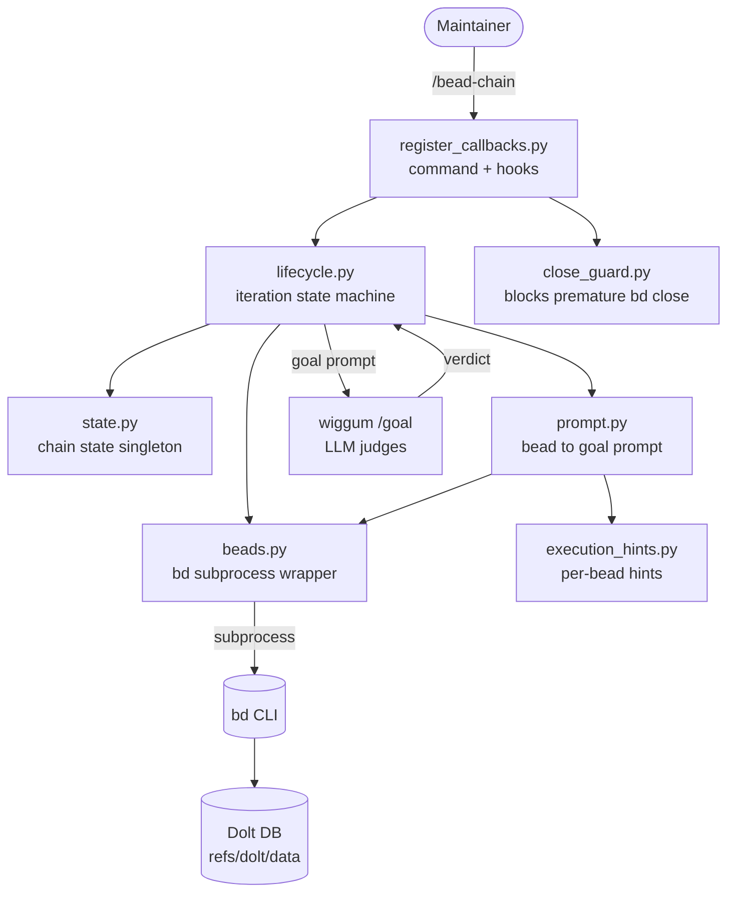
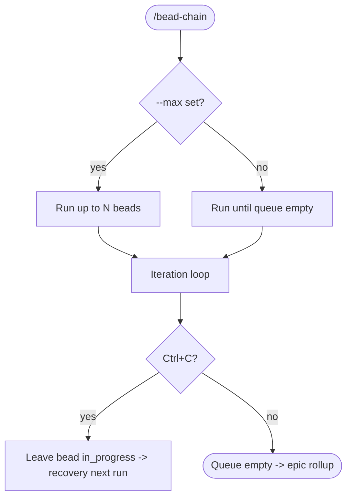

# bead-chain Architecture

Maintainer overview for **bead-chain** — a beads-driven `/goal` variant that
chains your `bd ready` queue into wiggum's goal loop, one bead at a time. This is
a **Code Puppy plugin** (not a standalone service): it registers a slash command
and host hooks, shells out to the `bd` CLI, and delegates LLM-judged completion
to wiggum's `/goal` mode.

---

## Quick Start for Maintainers

- **Clone / locate:** the plugin lives in your Code Puppy plugins directory
  (`~/.code_puppy/plugins/bead_chain`). It is loaded automatically when Code
  Puppy starts.
- **Run it:** from any repo that uses `bd`, type `/bead-chain` (optionally
  `/bead-chain --max=N`). Stop with `Ctrl+C`.
- **Test it:** `python -m pytest -q` (the suite is self-contained and mocks the
  `bd` subprocess — no live `bd` needed).
- **Lint it:** `ruff check --fix .` then `ruff format .` (project standard is
  ruff's default `E`+`F`, which includes F401 — there is no `pyproject.toml`).
- **Where to look first:** `register_callbacks.py` (entry point + wiring) →
  `lifecycle.py` (the iteration state machine) → `beads.py` (the `bd`
  subprocess wrapper). See the [Directory Guide](#directory-guide) below.

---

## Tech Stack

| Layer | Choice | Why this choice |
|-------|--------|-----------------|
| Language | Python 3.10+ (`str | None` unions) | Matches the Code Puppy host runtime. |
| Host integration | Code Puppy / wiggum plugin API (slash command + hooks) | bead-chain is a plugin, not a server — it rides the host's command/hook lifecycle. |
| Goal execution | wiggum `/goal` mode | bead-chain is a queue driver; it delegates the work-and-judge loop rather than reimplementing it. |
| Issue tracker | `bd` (beads) CLI via subprocess | Single source of truth for beads; bead-chain never touches the DB directly. |
| Persistence | Dolt DB behind `bd` (synced on `refs/dolt/data`) | bead state is git-compatible and shareable; owned by `bd`, not bead-chain. |
| Testing | pytest | Mocks the `bd` subprocess for hermetic, fast tests. |
| Lint / format | ruff (default `E`+`F`) | No CI/config file; ruff's defaults are the de-facto standard here. |

---

## System Diagram

---

## Features at a Glance

| Feature | What it does | Docs link |
|---------|--------------|-----------|
| Bead Chaining | Runs the probe → claim → drive → judge → close loop until the queue drains. | [BeadChaining](Features/BeadChaining.md) |
| Recovery Mode | Resumes a stranded `in_progress` bead after a crash/cancel. | [RecoveryMode](Features/RecoveryMode.md) |
| Work-Time Blocker Gate | Rechecks blockers at claim time; reverts blocked strands to `open`. | [WorkTimeBlockerGate](Features/WorkTimeBlockerGate.md) |
| Epic Affinity | Prefers the next ready sibling under the same parent epic. | [EpicAffinity](Features/EpicAffinity.md) |
| Blocking Bug Priority | Jumps ready bugs with dependents to the front of the queue. | [BlockingBugPriority](Features/BlockingBugPriority.md) |
| Close Guard | Blocks agent-initiated `bd close` while the chain is active. | [CloseGuard](Features/CloseGuard.md) |
| Epic Rollup | Auto-closes eligible epics once per session at drain. | [EpicRollup](Features/EpicRollup.md) |
| Bug Discovery Protocol | Embeds file-don't-close bug handling into every goal prompt. | [BugDiscoveryProtocol](Features/BugDiscoveryProtocol.md) |
| Goal Prompt Enrichment | Injects memories, lint warnings, acceptance criteria, related context. | [GoalPromptEnrichment](Features/GoalPromptEnrichment.md) |

---

## Key Flows

- [Chain Iteration Loop](Flows/ChainIterationLoop.md) — the master probe→close cycle.
- [Next-Bead Selection Waterfall](Flows/NextBeadSelectionWaterfall.md) — how the next bead is chosen.
- [Bead Claim & Blocker Recheck](Flows/BeadClaimAndBlockerRecheck.md) — atomic claim with blocker safety.
- [Stranded Bead Recovery](Flows/StrandedBeadRecovery.md) — startup recovery of in-progress work.
- [Session-End Epic Rollup](Flows/SessionEndEpicRollup.md) — drain-time epic auto-close.
- [Goal Prompt Construction](Flows/GoalPromptConstruction.md) — assembling the `/goal` prompt.

---

## External Dependencies

| Dependency | Used for | Failure Impact |
|------------|----------|----------------|
| `bd` (beads) CLI | All bead reads/writes (ready, show, claim, close, epic rollup). | Hard stop — bead-chain can do nothing without `bd`; calls raise `BeadsError`. |
| Dolt DB (behind `bd`) | Durable bead state synced on `refs/dolt/data`. | Local-only state if unsynced; bead-chain itself never pushes (session-close does). |
| wiggum `/goal` mode | Executes and LLM-judges each bead. | No work gets driven; chaining cannot proceed past claim. |
| Code Puppy host (plugin API) | Slash-command registration + hook lifecycle. | Plugin never loads; `/bead-chain` unavailable. |

---

## Directory Guide

| Path | Responsibility |
|------|----------------|
| `__init__.py` | Package marker / docstring. |
| `register_callbacks.py` | Entry point: `/bead-chain` command, hook registration, CLI flag parsing, turn-cancel handling. |
| `lifecycle.py` | Iteration state machine: single-in-progress enforcement, close-on-success, next-bead pick, epic rollup, gate probe. |
| `beads.py` | `bd` subprocess transport: run/retry, JSON parse, ready/show/claim/close, blocker queries, epic close-eligible. |
| `prompt.py` | Formats a bead into a `/goal` prompt (memories, lint, acceptance criteria, related context, design, recovery/triage preambles). |
| `close_guard.py` | Detects and blocks agent-initiated `bd close` / `--status=closed`. |
| `state.py` | Singleton dataclass holding `active`, `current_bead`, `completed_count`. |
| `execution_hints.py` | Extracts and applies per-bead execution hints from metadata. |
| `tests/` | pytest suite (mocks the `bd` subprocess). |
| `docs/` | User-facing how-to guides. |
| `notes/` | Maintainer working artifacts: ADRs (`decisions/`), analysis, triage/spikes. |
| `__docs/` | This FlowDoc maintainer documentation set. |

---

## API Surface

bead-chain exposes **no HTTP API**. It is a terminal plugin whose surface is one
slash command plus host hooks. The table below documents that integration
surface in place of REST endpoints.

| Method | Path | Purpose | Doc |
|--------|------|---------|-----|
| Command | `/bead-chain [--max=N]` | Start (or cap) a chaining session. | [BeadChaining](Features/BeadChaining.md) |
| Hook | shell pre-exec (close guard) | Block agent-initiated `bd close` while active. | [CloseGuard](Features/CloseGuard.md) |
| Hook | interactive-turn cancel | Detect `Ctrl+C` and leave the bead `in_progress`. | [StrandedBeadRecovery](Flows/StrandedBeadRecovery.md) |

### API Conventions

Since there is no HTTP tier, the cross-cutting "conventions" that every
integration point shares are the **`bd` subprocess contract**:

- **Auth scheme:** none at the plugin layer; `bd` inherits the local user's repo
  + Dolt credentials.
- **Error envelope:** every `bd` invocation flows through `_run_bd`; failures
  raise `BeadsError`. Non-fatal call sites soft-fail (warn, never strand the
  chain).
- **Versioning:** bead-chain targets the installed `bd` (currently 1.0.5) and
  defends against version drift (e.g. rechecking blockers even if `bd ready`
  leaks one).
- **Pagination:** none — list calls (`bd ready`, `bd list`) return full JSON
  arrays parsed by `_parse_json_list`.
- **Timeout/retry:** 30s timeout, 3 attempts with 0.5s/1.0s backoff on timeout
  only (not on errors).

---

## Views & Pages

bead-chain has **no web views or pages**. Its only user touchpoint is the
terminal: the `/bead-chain` command and the streamed `/goal` output. The
"navigation" below is the command's option surface rather than a routed UI.

| Route | View | Purpose | Doc |
|-------|------|---------|-----|
| `/bead-chain` | Chain session (terminal) | Drive the queue until empty. | [BeadChaining](Features/BeadChaining.md) |
| `/bead-chain --max=N` | Capped chain session | Stop after N beads. | [BeadChaining](Features/BeadChaining.md) |

### Navigation Structure

**Shared Layouts:** N/A — this is a terminal plugin with no shared UI layout.
The closest analog is the shared `/goal` prompt scaffold produced by
`prompt.format_bead_as_goal`, reused for every bead.

---

## See Also

- [`__docs/index.md`](index.md) — this documentation set's index.
- [`__docs/_FlowDocGuide.md`](_FlowDocGuide.md) — the authoring contract for every doc.
- [`__docs/_Manifest.md`](_Manifest.md) — the full inventory + progress counters.
- [Repo README](../README.md) — the project front page.
- [AGENTS.md](../AGENTS.md) — `bd` issue-tracker instructions.
