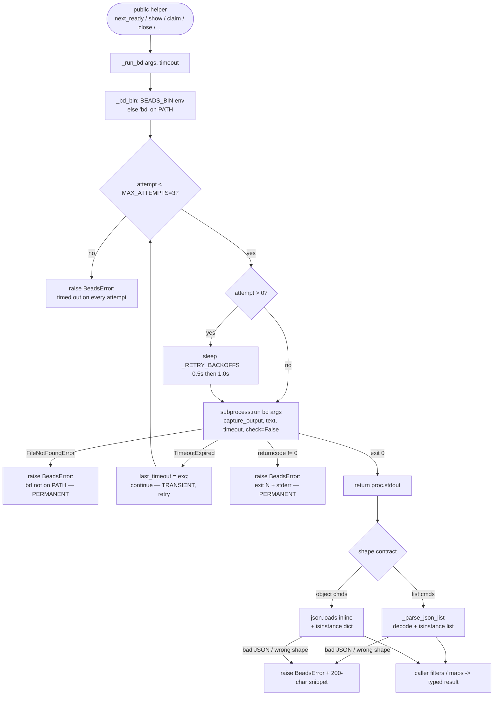

# BdSubprocessTransport

## What Is It

The single, thin layer through which **all** of bead-chain talks to beads:
every read and every mutation shells out to the `bd` CLI as a child process,
captures its stdout, and parses bd's `--json` output. There is **no** Python
beads API import anywhere in the plugin — `beads.py` is a stdlib-only
(`subprocess` + `json`) wrapper, and one private chokepoint,
`beads.py:_run_bd`, is the only place a `bd` process is ever spawned. Every
public helper (`next_ready`, `show`, `claim`, `close`, `check_gates`,
`memories`, …) is built on top of it.

## Why This Approach

beads is distributed as a **Go binary**, not a Python package. Its *stable,
documented contract* is the CLI plus the `--json` flag on each command — not an
importable module. Coupling bead-chain to an in-process beads library would
mean (a) pinning a Python beads dependency that may not exist for the user's
`bd` version, (b) breaking whenever beads bumps its internal API, and (c)
forcing version lockstep between the plugin and the binary. Shelling out keeps
the plugin **dependency-free** and lets a user on *any* `bd` version run the
chain — bd's JSON is the wire format and the version boundary at the same time.

Concentrating every spawn in one function (`_run_bd`) buys three things that the
rest of the module gets for free:

- **One retry policy.** Transient `subprocess.TimeoutExpired` blips (sqlite lock
  contention from concurrent agents, cold-cache opens, the daemon flushing) are
  retried up to `MAX_ATTEMPTS` times with `_RETRY_BACKOFFS` delays. A single 30s
  blip stranding the whole chain is far worse than one retry.
- **One error taxonomy.** Permanent failures — bd missing (`FileNotFoundError`)
  and real bd errors (non-zero exit: "bead not found", "already closed") — are
  surfaced *immediately* as `BeadsError` and are **never** retried, because
  retrying just delays the truth.
- **One test seam.** Tests stub `beads._run_bd` with a lambda returning a fixed
  payload (or a recording stub), so the entire module can be exercised without a
  real `bd` on `PATH`.

## How It Works

`_run_bd(*args, timeout=DEFAULT_TIMEOUT)` is the heart. It resolves the binary
via `_bd_bin()` (honoring the `BEADS_BIN` env override, else `DEFAULT_BD_BIN =
"bd"` on `PATH`), then loops up to `MAX_ATTEMPTS` (3) times:

1. Before any retry (`attempt > 0`) it sleeps `_RETRY_BACKOFFS[delay_idx]`, where
   `delay_idx = min(attempt - 1, len(_RETRY_BACKOFFS) - 1)` — so a future bump to
   `MAX_ATTEMPTS` without extending the backoff tuple just reuses the last delay.
2. It runs `subprocess.run([bd, *args], capture_output=True, text=True,
   timeout=timeout, check=False)`.
3. `FileNotFoundError` → raise `BeadsError("...not found on PATH...")` (permanent,
   no retry).
4. `subprocess.TimeoutExpired` → stash it in `last_timeout` and `continue` to the
   next attempt (the *only* retried case).
5. `proc.returncode != 0` → raise `BeadsError("...failed (exit N): <stderr>")`
   (permanent, no retry).
6. Otherwise → return `proc.stdout`.

If every attempt times out, it raises `BeadsError("...timed out after {timeout}s
on each of {MAX_ATTEMPTS} attempts")` chained from `last_timeout`.

Output parsing is split into shared helpers so the JSON-shape contract lives in
one place too: `_parse_json_list(raw, context)` enforces "decode + must be a
list" for the list-returning queries (`bd ready`, `bd list …`), while object
returners like `show` and `memories` parse inline and assert dict shape. All
parse failures become `BeadsError` carrying a 200-char snippet of the offending
output.



### Concrete example

A user with `bd` installed at a non-standard path exports an override, and the
chain asks for the next ready bead:

```bash
export BEADS_BIN=/opt/homebrew/bin/bd
```

`next_ready()` calls `_run_bd("ready", _exclude_type_arg(), "--json")`, which
spawns:

```text
/opt/homebrew/bin/bd ready --exclude-type=epic,milestone,gate,molecule --json
```

bd answers with a JSON array (trimmed to the fields bead-chain reads):

```json
[
  {
    "id": "bead_chain-mol-bps.19",
    "title": "FlowDoc maintainer: Concept: BdSubprocessTransport",
    "issue_type": "task",
    "status": "open",
    "priority": 2,
    "parent": "bead_chain-mol-bps"
  }
]
```

`_run_bd` returns that stdout, `_parse_json_list(raw, "bd ready --json")` decodes
and validates the list, and `next_ready` returns the first element that isn't a
leaked container type (defence-in-depth via `is_excluded_type`).

Now the unhappy paths, all routed through the same function:

- **Transient lock.** The first `subprocess.run` raises `TimeoutExpired`.
  `_run_bd` sleeps `0.5s`, retries; the second succeeds. The caller never sees the
  blip.
- **Real bd error.** `bd close bead_chain-xyz` exits non-zero with
  `error: issue has open child issue(s)`. `_run_bd` raises immediately —
  `BeadsError("`/opt/homebrew/bin/bd close bead_chain-xyz` failed (exit 1):
  error: issue has open child issue(s)")` — no retry, so the caller (e.g.
  `close_guard`) reacts to the truth at once.
- **bd missing.** `BEADS_BIN` points at a deleted binary →
  `FileNotFoundError` → `BeadsError("`...` not found on PATH — is beads
  installed?")`, again with no retry.

### Implementation references

| Responsibility | File:Symbol |
|----------------|-------------|
| Module contract — "shell out, never import beads" | `beads.py` (module docstring) |
| Default per-call timeout (seconds) | `beads.py:DEFAULT_TIMEOUT` (`30.0`) |
| Default binary name when no override | `beads.py:DEFAULT_BD_BIN` (`"bd"`) |
| Max spawn attempts (initial + retries) | `beads.py:MAX_ATTEMPTS` (`3`) |
| Pre-retry backoff delays | `beads.py:_RETRY_BACKOFFS` (`(0.5, 1.0)`) |
| Binary resolution + `BEADS_BIN` override | `beads.py:_bd_bin` |
| The sole subprocess chokepoint (spawn + retry + error taxonomy) | `beads.py:_run_bd` |
| Shared error type for all transport failures | `beads.py:BeadsError` |
| List-shape JSON parse + validate | `beads.py:_parse_json_list` |
| `--exclude-type=...` arg builder (server-side filter) | `beads.py:_exclude_type_arg` |
| Read example — top ready bead | `beads.py:next_ready` |
| Read example — full record (object shape) | `beads.py:show` |
| Read example — object-not-list payload | `beads.py:memories` |
| Mutation — claim | `beads.py:claim` |
| Mutation — revert to open | `beads.py:revert_to_open` |
| Mutation — close (optional `--reason`) | `beads.py:close` |
| Aggregate read — gate check summary | `beads.py:check_gates` |
| Aggregate read — lint warnings | `beads.py:lint_warnings` |
| Test seam — stub/record `_run_bd` | `tests/test_excluded_container_types.py:_patch_run_bd` / `:_capture_run_bd` |

## Where Used

Every beads-touching surface in the plugin rides this transport — nothing talks
to `bd` any other way:

- [BeadChaining](../Features/BeadChaining.md) — the core loop's `next_ready` /
  `claim` / `close` calls are all `_run_bd` invocations.
- [ChainIterationLoop](../Flows/ChainIterationLoop.md) — each iteration's bead
  pick + claim is a transport round-trip.
- [NextBeadSelectionWaterfall](../Flows/NextBeadSelectionWaterfall.md) — the
  waterfall's `next_ready` / `next_ready_in_epic` / `next_blocking_bug` /
  `next_in_progress` queries are all transport reads.
- [BeadClaimAndBlockerRecheck](../Flows/BeadClaimAndBlockerRecheck.md) —
  `claim`, `open_blocker_ids`, and `revert_to_open` are transport calls.
- [StrandedBeadRecovery](../Flows/StrandedBeadRecovery.md) —
  `list_recoverable_strands` and `revert_to_open` ride the transport.
- [SessionEndEpicRollup](../Flows/SessionEndEpicRollup.md) —
  `close_eligible_epics` / `has_epic_in_progress` are transport reads + writes.
- [GoalPromptConstruction](../Flows/GoalPromptConstruction.md)
- [BugDiscoveryProtocol](../Features/BugDiscoveryProtocol.md) — the agent's `bd create` filing and the `next_blocking_bug` query both ride this transport. — `show`,
  `memories`, and `lint_warnings` enrich the goal prompt via the transport.
- [ExecutionHints](ExecutionHints.md) — `_resolve_metadata` re-fetches missing
  `metadata` via `beads.show`, i.e. another `_run_bd` call.
- [ContainerTypeExclusion](ContainerTypeExclusion.md) — the server-side
  `--exclude-type` arg is assembled by `_exclude_type_arg` and passed into
  `_run_bd`.
- [CloseGuard](../Features/CloseGuard.md) — guards the `close` mutation that
  ultimately runs through `_run_bd`.

## Conventions

> [!IMPORTANT]
> - **One door in, one door out.** Every `bd` invocation goes through
>   `_run_bd`. Never call `subprocess.run` (or import a beads Python API)
>   anywhere else — new helpers compose `_run_bd` + a parse helper.
> - **`--json` always, parse via the shared helpers.** Read commands pass
>   `--json` and route list output through `_parse_json_list`; object output is
>   decoded inline with an `isinstance(dict)` check. Treat bd's JSON as the
>   contract, not its human text.
> - **Resolve the binary, don't hardcode `"bd"`.** Use `_bd_bin()` so the
>   `BEADS_BIN` override keeps working for non-standard installs.
> - **Retry transient, surface permanent.** Only `TimeoutExpired` is retried.
>   `FileNotFoundError` and non-zero exits are permanent — raise `BeadsError`
>   immediately so callers react to the truth.
> - **Tune via the module constants.** `DEFAULT_TIMEOUT`, `MAX_ATTEMPTS`, and
>   `_RETRY_BACKOFFS` are the knobs. The `delay_idx = min(attempt - 1, len-1)`
>   clamp means you can raise `MAX_ATTEMPTS` without touching `_RETRY_BACKOFFS`.
> - **Raise `BeadsError`, let callers choose.** The transport never decides
>   between soft-fail and escalate; it raises a single typed error and the
>   caller (prompt layer soft-fails a nice-to-have; the loop escalates a claim
>   failure).

## Anti-Patterns

> [!CAUTION]
> - **Don't import a beads Python library.** That re-introduces a version-locked
>   dependency the binary contract was chosen to avoid. bd's CLI + `--json` is
>   the boundary.
> - **Don't spawn `bd` outside `_run_bd`.** A second spawn site duplicates the
>   retry/error/test logic (violates DRY) and bypasses `BEADS_BIN`, retries, and
>   the `BeadsError` taxonomy.
> - **Don't retry non-zero exits.** "bead not found" / "already closed" are
>   permanent; retrying just delays the error and can mask a real state bug.
> - **Don't add env-var knobs for the timeout/retry "just in case."** YAGNI —
>   they're module constants today; promote them to env vars only when a real
>   need lands (a ~5-line follow-up).
> - **Don't parse bd's human-readable output.** Add `--json` and a shape check;
>   scraping prose breaks on the next bd cosmetic change.
> - **Don't catch and swallow `BeadsError` inside the transport.** Let it
>   propagate — the decision to soft-fail (prompt enrichment) vs. escalate
>   (claim/close) belongs to the caller, not the wrapper.

## Related

- [BeadChaining](../Features/BeadChaining.md)
- [CloseGuard](../Features/CloseGuard.md)
- [ChainIterationLoop](../Flows/ChainIterationLoop.md)
- [NextBeadSelectionWaterfall](../Flows/NextBeadSelectionWaterfall.md)
- [BeadClaimAndBlockerRecheck](../Flows/BeadClaimAndBlockerRecheck.md)
- [StrandedBeadRecovery](../Flows/StrandedBeadRecovery.md)
- [EpicRollup](../Features/EpicRollup.md) — the rollup feature whose `epic close-eligible` / `close` calls ride this transport.
- [SessionEndEpicRollup](../Flows/SessionEndEpicRollup.md)
- [GoalPromptConstruction](../Flows/GoalPromptConstruction.md)
- [ExecutionHints](ExecutionHints.md)
- [ContainerTypeExclusion](ContainerTypeExclusion.md)
- [QueueDriverNotGoalEngine](QueueDriverNotGoalEngine.md)
- [SessionCloseDurability](SessionCloseDurability.md)
- [Concepts Index](index.md)
- [Architecture](../Architecture.md)
- [FlowDoc Manifest](../_Manifest.md)
