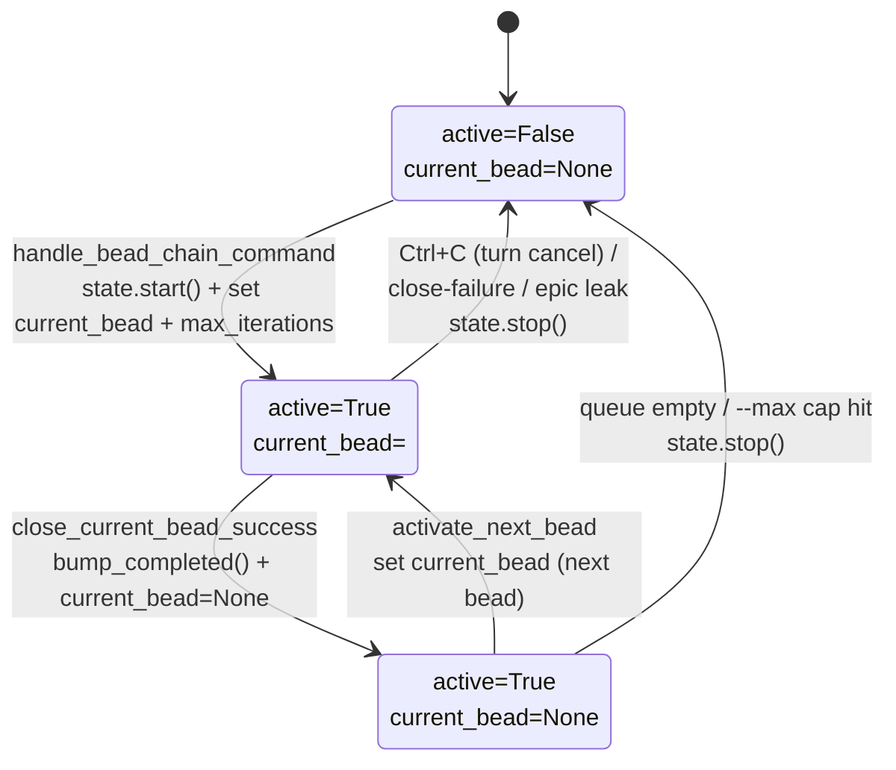

# ChainStateSingleton

## What Is It

A single, process-wide `BeadChainState` dataclass instance — created once as the
module-level `_STATE` in `state.py` and handed out by `get_state()` — that holds
the **entire** runtime state of a bead-chain run: whether the chain is engaged
(`active`), the **full dict** of the bead it's currently chewing on
(`current_bead`), how many beads it has closed this run (`completed_count`), and
an optional safety cap (`max_iterations`). It is a deliberately *dumb data box*:
it carries the four fields plus three trivial mutators (`start`, `stop`,
`bump_completed`) and one read-only convenience property (`current_bead_id`).
**All** behavior — claiming, closing, picking the next bead, recovery — lives in
`register_callbacks.py` and `lifecycle.py`, never here.

## Why This Approach

bead-chain's control flow is spread across three event hooks that fire at
different moments and share no call stack: the `/bead-chain` command handler that
*starts* a run, the interactive-turn-end hook that *advances* it bead-to-bead,
and the interactive-turn-cancel hook that *halts* it on Ctrl+C. These callbacks
need a shared answer to "are we engaged, and on which bead?" that survives
between turns. A function-local variable can't — each hook is a fresh call — so
the state has to live somewhere durable for the lifetime of the process.

The chosen answer is a **module-level singleton**, mirroring wiggum's own
tiny-singleton pattern (`code_puppy.plugins.wiggum.state`). The two singletons
coexist and complement each other: bead-chain owns *which bead* and *whether the
chain is engaged*; wiggum owns *whether a `/goal` pass is still running*. The
turn-end hook reads `wiggum_state.is_active()` to know when wiggum has finished a
bead's goal loop, then consults its own `state.is_active()` to know whether to
advance the chain. Keeping bead-chain's slice of that picture in a matching
singleton keeps the two layers symmetrical and easy to reason about.

Holding the **full bead dict** (not just the id) is a deliberate trade: callers
like `close_current_bead_success` and `activate_next_bead` need to peek at the
just-closed bead's parent epic for epic-affinity routing, and at its
`issue_type` for the container-leak guard, **without** paying a round-trip to
`bd show`. Code that genuinely only needs the id uses the `current_bead_id`
property, so the richer field doesn't leak complexity onto simple callers.

Splitting data (here) from behavior (in the hook/lifecycle modules) keeps this
file under a screen, side-effect-free, and trivial to reset between tests — every
state-touching test just pokes `get_state()` fields directly in a fixture.

## How It Works

The concept is one dataclass plus a handful of module-level functions:

| Member | Kind | Meaning |
|--------|------|---------|
| `active` | `bool` field (default `False`) | Is a chain run engaged right now? |
| `current_bead` | `dict[str, Any] \| None` field (default `None`) | The full `bd ready`/`bd show` dict for the bead being worked, or `None` between beads. |
| `completed_count` | `int` field (default `0`) | How many beads this run has successfully closed. |
| `max_iterations` | `int \| None` field (default `None`) | Optional `--max=N` safety cap; `None` means run until the queue drains. |
| `current_bead_id` | read-only `@property` | `str(current_bead["id"])` or `None` — surgical accessor for id-only callers. |
| `start()` | method | Sets `active=True`, clears `current_bead`, **resets `completed_count` to 0** so each run reports its own tally. |
| `stop()` | method | Sets `active=False`, clears `current_bead`, and **clears `max_iterations`** so the next run starts uncapped unless re-armed. |
| `bump_completed()` | method | `completed_count += 1`; returns the new total (used for the `#N completed this run` log line). |
| `get_state()` | module fn | Returns the one `_STATE` instance. |
| `is_active()` | module fn | Thin shortcut for `_STATE.active`. |
| `start()` / `stop()` | module fns | Thin shortcuts delegating to `_STATE.start()` / `_STATE.stop()`. |

The singleton's `active` flag transitions exactly along this lifecycle:



### Concrete example

A user runs `/bead-chain --max=2`. Walking the singleton through the run:

1. **Start.** `handle_bead_chain_command` checks `state.is_active()` (False, so
   it proceeds), probes for a ready bead, then calls `state.start()`. Now
   `active=True`, `completed_count=0`, `current_bead=None`. It records the cap
   via `state.get_state().max_iterations = 2`, claims the bead, and stores the
   full dict: `state.get_state().current_bead = bead`.

   At this point the singleton reads:

   ```json
   {
     "active": true,
     "current_bead": {
       "id": "bead_chain-abc",
       "issue_type": "task",
       "status": "in_progress",
       "title": "First bead",
       "parent": "bead_chain-mol-xyz"
     },
     "completed_count": 0,
     "max_iterations": 2
   }
   ```

   `state.get_state().current_bead_id` returns `"bead_chain-abc"`.

2. **Advance.** wiggum finishes the goal loop; the turn-end hook sees
   `wiggum_state.is_active() == False` and calls `close_current_bead_success()`.
   That reads `current_bead`/`current_bead_id`, closes the bead, calls
   `bump_completed()` (→ `completed_count=1`), and sets `current_bead = None`.

3. **Cap check.** `activate_next_bead` reads the singleton:
   `max_iterations=2`, `completed_count=1`, so `completed_count + 1 (=2) > 2` is
   **False** — under the cap, keep going. It picks bead #2, claims it, and stores
   it in `current_bead`.

4. **Cap hit.** After bead #2 closes (`completed_count=2`), the next
   `activate_next_bead` finds `completed_count + 1 (=3) > 2` — **True** — so it
   emits ` bead-chain: --max=2 cap reached` and calls `state.stop()`. The
   singleton returns to `active=False`, `current_bead=None`, and crucially
   `max_iterations=None` again, so a later bare `/bead-chain` runs uncapped.

If the user had pressed Ctrl+C mid-bead instead, `_on_interactive_turn_cancel`
reads `current_bead_id` for the "left in_progress" message, then calls
`state.stop()` — the bead stays `in_progress` in bd for the next run's recovery
tier, but the singleton resets to idle.

### Implementation references

| Responsibility | File:Symbol |
|----------------|-------------|
| State dataclass (the four fields) | `state.py:BeadChainState` |
| Id-only convenience accessor | `state.py:BeadChainState.current_bead_id` |
| Engage (reset tally, clear bead) | `state.py:BeadChainState.start` |
| Disengage (clear bead + cap) | `state.py:BeadChainState.stop` |
| Completed tally increment | `state.py:BeadChainState.bump_completed` |
| The one process-wide instance | `state.py:_STATE` |
| Singleton accessor | `state.py:get_state` |
| Active-flag shortcut | `state.py:is_active` |
| Module-level start/stop shortcuts | `state.py:start` / `state.py:stop` |
| Start a run, set `current_bead` + `max_iterations` | `register_callbacks.py:handle_bead_chain_command` |
| Advance / cancel guards reading `is_active()` | `register_callbacks.py:_on_interactive_turn_end` / `register_callbacks.py:_on_interactive_turn_cancel` |
| Read just-closed bead, `bump_completed`, clear | `lifecycle.py:close_current_bead_success` |
| `--max` cap check + set next `current_bead` | `lifecycle.py:activate_next_bead` |
| Coexisting wiggum singleton (goal-loop active?) | `code_puppy.plugins.wiggum.state` (imported as `wiggum_state`) |

## Where Used

- [BeadChaining](../Features/BeadChaining.md) — the core feature; the singleton
  *is* the per-run memory that lets its three hooks coordinate the claim →
  `/goal` → close → next loop across turns.
- [ChainIterationLoop](../Flows/ChainIterationLoop.md) — the turn-end loop reads
  `state.is_active()` / `wiggum_state.is_active()` each turn and advances the
  singleton bead-to-bead.
- [BeadClaimAndBlockerRecheck](../Flows/BeadClaimAndBlockerRecheck.md)
- [StrandedBeadRecovery](../Flows/StrandedBeadRecovery.md) — reads
  `current_bead` / `current_bead_id` when the cancel hook leaves a bead
  stranded for the next run. —
  `activate_next_bead` stores each newly-claimed bead in `current_bead` after
  the blocker/gate guards pass.
- [SessionEndEpicRollup](../Flows/SessionEndEpicRollup.md) — the drain pass that
  fires when the queue empties reads `completed_count` for the final
  "Closed N this run" tally before `state.stop()`.
- [RecoveryMode](../Features/RecoveryMode.md) — on Ctrl+C / close-failure the
  singleton stops while the bead stays `in_progress`; `current_bead_id` feeds
  the "left in_progress" hand-off message.
- [QueueDriverNotGoalEngine](QueueDriverNotGoalEngine.md) — the single
  `current_bead` slot is the mechanical embodiment of the one-bead-at-a-time
  serial contract.
- [ExecutionHints](ExecutionHints.md) — hints are applied right after the bead
  is stored in `current_bead`, on the same path in both activation sites.
- [GoalPromptConstruction](../Flows/GoalPromptConstruction.md) — the
  `current_bead` dict held here is the exact record that flow formats into the
  `/goal` prompt, immediately after it's stored.

## Conventions

> [!IMPORTANT]
> - **There is exactly one instance — always reach it through `get_state()`.**
>   Never construct a second `BeadChainState()`; the module owns the singleton
>   so every hook sees the same state.
> - **Keep `state.py` a dumb data box.** New *behavior* belongs in
>   `register_callbacks.py` or `lifecycle.py`. Only add a field/method here when
>   it is genuinely state, not logic.
> - **Set `current_bead`, read `current_bead_id`.** To change the active bead,
>   assign the full bd dict to `current_bead`; callers that only need the id read
>   the property. This keeps the rich-dict trade-off surgical.
> - **`start()` resets the tally; `stop()` clears the cap.** Each `/bead-chain`
>   run reports its own `completed_count`, and `max_iterations` never leaks from
>   one run into the next unless re-armed via `--max=N`.
> - **Read `wiggum_state.is_active()` for the goal loop, `state.is_active()` for
>   the chain.** They answer different questions; the turn-end hook needs both.

## Anti-Patterns

> [!CAUTION]
> - **Don't stash a second copy of "current bead" anywhere.** A local cache that
>   drifts from `current_bead` reintroduces exactly the cross-turn coordination
>   bug the singleton exists to prevent.
> - **Don't put close/claim/recovery logic in `state.py`.** It must stay
>   side-effect-free; behavior here would make the data box untestable and
>   couple it to `bd`.
> - **Don't reach into `_STATE` directly.** Import-time binding of the instance
>   defeats the `get_state()` indirection that tests rely on to inspect/reset
>   state cleanly.
> - **Don't forget `current_bead` can be `None` mid-loop.** Between a successful
>   close and the next activation the slot is cleared; use `current_bead_id`
>   (which returns `None` safely) rather than indexing `current_bead["id"]`.
> - **Don't conflate `state.stop()` with bead status.** Stopping the chain does
>   **not** revert or close the in-flight bead — on cancel it stays
>   `in_progress` on purpose for the next run's recovery tier.

## Related

- [BeadChaining](../Features/BeadChaining.md)
- [ChainIterationLoop](../Flows/ChainIterationLoop.md)
- [BeadClaimAndBlockerRecheck](../Flows/BeadClaimAndBlockerRecheck.md)
- [SessionEndEpicRollup](../Flows/SessionEndEpicRollup.md)
- [RecoveryMode](../Features/RecoveryMode.md)
- [QueueDriverNotGoalEngine](QueueDriverNotGoalEngine.md)
- [ExecutionHints](ExecutionHints.md)
- [GoalPromptConstruction](../Flows/GoalPromptConstruction.md)
- [GoalPromptEnrichment](../Features/GoalPromptEnrichment.md) — reads
  `current_bead` from this singleton to build the `/goal` prompt.
- [NextBeadSelectionWaterfall](../Flows/NextBeadSelectionWaterfall.md) — reads
  `current_bead` (the `just_closed` source) and `max_iterations` from this box.
- [StrandedBeadRecovery](../Flows/StrandedBeadRecovery.md) — the cancel hook
  reads `current_bead_id` here when it leaves a bead stranded.
- [Concepts Index](index.md)
- [Architecture](../Architecture.md)
- [FlowDoc Manifest](../_Manifest.md)
