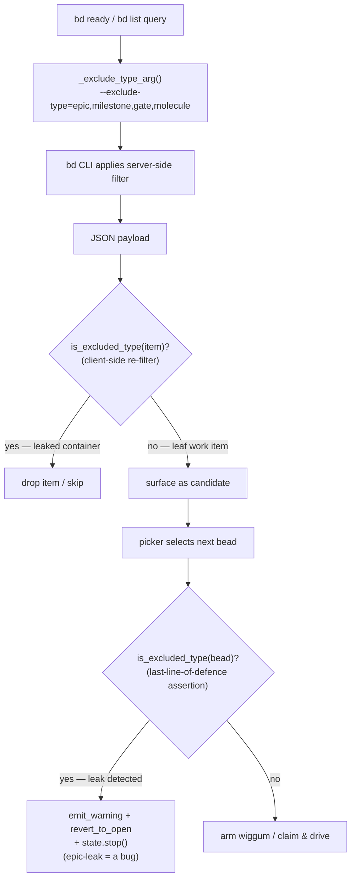

# ContainerTypeExclusion

## What Is It

A defence-in-depth filter that keeps **container / handle** bead types —
`epic`, `milestone`, `gate`, `molecule` — out of every queue bead-chain drives.
Container beads are *anatomy*, not *work*: they organise or gate other issues
but have nothing to actually do. bead-chain only ever activates **leaf work
items** (`task`, `bug`, `chore`, `feature`, …); the exclusion is enforced
*twice* — once server-side as a `--exclude-type=...` flag on every `bd ready` /
`bd list` query, and again client-side via a `is_excluded_type()` re-filter on
the returned payload — because the server-side flag has been observed to leak
epics through in the wild.

## Why This Approach

The coverage audit (gap `formulas#1`, the synthesis's #1 finding) traced a whole
family of chain **stalls** to a single hole. Before the fix, `EXCLUDED_TYPES`
was just `("epic",)`, so three other container/handle types — `milestone`,
`gate`, `molecule` — could surface on `bd ready` and be picked as the "next
bead." bead-chain would arm wiggum at a container, the agent would do nothing
closable, and then `bd close` would fail with `cannot close epic: N open child
issue(s)` (or the equivalent for a handle) — which `close_guard` turns into a
hard chain **halt** after wasted token spend.

Two design choices fell out of that:

1. **Widen the tuple, not the logic.** All four container types share one
   property — "purely organisational/handle, never doable" — so they belong in
   one tuple (`EXCLUDED_TYPES`), consumed by one arg-builder
   (`_exclude_type_arg`) and one predicate (`is_excluded_type`). Adding a future
   container type is a **one-line edit** to the tuple. (DRY / open-closed.)
2. **Filter twice — belt *and* suspenders.** The server-side
   `--exclude-type=...` flag *should* be sufficient, but bd version drift and
   JSON-casing differences have leaked epics through in production. So every
   query that builds the flag *also* re-filters its result through
   `is_excluded_type()`. Even if every server-side filter failed open, a
   container can never reach `/goal` as drivable work.

The predicate is deliberately **fail-open on shape, fail-closed on type**: a
`None` / non-dict / mis-shaped bead is treated as *not* excluded (so a busted
record surfaces for a human to handle rather than vanishing silently), while the
`issue_type` match is **case-insensitive** so an upstream bd that suddenly emits
`"Epic"` instead of `"epic"` doesn't start leaking.

## How It Works

`EXCLUDED_TYPES = ("epic", "milestone", "gate", "molecule")` is the single
source of truth (`beads.py:EXCLUDED_TYPES`). Two helpers consume it:

- **`_exclude_type_arg()`** joins the tuple into the literal CLI string
  `--exclude-type=epic,milestone,gate,molecule`, which every queue function
  passes to `bd`.
- **`is_excluded_type(bead)`** lowercases the bead's `issue_type` field and
  returns `True` if it is in `EXCLUDED_TYPES`.

Every read path that could surface a container applies **both** layers, and
every *activation* boundary asserts the invariant one last time before arming
wiggum:



### Concrete example

`next_ready()` runs the query with the exclusion flag baked in:

```text
bd ready --exclude-type=epic,milestone,gate,molecule --json
```

Suppose bd version drift leaks a `milestone` through the server-side flag
anyway, so the payload is:

```json
[
  {"id": "bead_chain-mol-bps", "issue_type": "milestone", "parent": null, "labels": ["flowdoc"]},
  {"id": "bead_chain-x3g", "issue_type": "task", "parent": "bead_chain-2p3", "labels": ["docs"]}
]
```

`next_ready()` iterates the list and calls `is_excluded_type()` on each item.
For the first, `str(bead.get("issue_type", "")).strip().lower()` is
`"milestone"`, which is in `EXCLUDED_TYPES`, so it is **skipped**. The second is
`"task"` — not excluded — so it is returned as the next drivable bead:

```json
{"id": "bead_chain-x3g", "issue_type": "task", "parent": "bead_chain-2p3", "labels": ["docs"]}
```

Had the picker *somehow* still handed a container to the activation boundary
(`lifecycle.activate_next_bead` / `register_callbacks._on_interactive_turn_end`
/ `lifecycle.close_current_bead`), the last-line-of-defence
`if is_excluded_type(bead):` assertion fires: it emits a " ... an upstream
filter leaked an epic into the chain — this is a bug" warning, **reverts** an
in-flight epic back to open (so it doesn't sit corruptingly `in_progress`), and
**stops** the chain for inspection rather than wasting tokens driving a
container.

### Implementation references

| Responsibility | File:Symbol |
|----------------|-------------|
| Container/handle type tuple (single source of truth) | `beads.py:EXCLUDED_TYPES` (`("epic", "milestone", "gate", "molecule")`) |
| Build the `--exclude-type=...` CLI arg | `beads.py:_exclude_type_arg` |
| Case-insensitive client-side predicate | `beads.py:is_excluded_type` |
| Top ready bead query (server + client filter) | `beads.py:next_ready` |
| Status query core (server + client filter) | `beads.py:_list_by_status` |
| In-progress / stranded queries (inherit filter) | `beads.py:list_in_progress`, `beads.py:list_recoverable_strands` |
| Per-epic ready query (server + client filter) | `beads.py:next_ready_in_epic` |
| Activation-boundary assertion (revert epic + stop) | `lifecycle.py:activate_next_bead` |
| Close-time assertion (refuse + revert + stop) | `lifecycle.py:close_current_bead` |
| Turn-start assertion (refuse early) | `register_callbacks.py:_on_interactive_turn_end` |

## Where Used

- [Bead Chaining](../Features/BeadChaining.md) — the core feature; its
  next-bead queries are exactly the ones this exclusion guards.
- [Close Guard](../Features/CloseGuard.md) — the stall this exclusion prevents
  is the `cannot close epic` failure the close-guard family would otherwise hit.
- [Next-Bead Selection Waterfall](../Flows/NextBeadSelectionWaterfall.md) —
  every tier of the picker filters containers out via this concept.
- [Bead Claim And Blocker Recheck](../Flows/BeadClaimAndBlockerRecheck.md) — the
  activation boundary re-asserts the invariant here before claiming.
- [Stranded Bead Recovery](../Flows/StrandedBeadRecovery.md) — the recovery
  query (`list_recoverable_strands`) excludes containers too, so a stranded epic
  is reverted rather than re-driven.

## Conventions

> [!IMPORTANT]
> - **Widen `EXCLUDED_TYPES`, never the logic.** A new purely-organisational /
>   handle type is a *one-line* tuple edit — `_exclude_type_arg` and
>   `is_excluded_type` pick it up automatically (the same one-tuple-edit pattern
>   as `RECURRING_MOL_TYPES` and `RECOVERABLE_STATUSES`). DRY.
> - **Always filter on BOTH sides.** Pass `_exclude_type_arg()` to the `bd`
>   query *and* re-filter the payload with `is_excluded_type()`. The server-side
>   flag has leaked epics in prod; the client-side pass is what makes the
>   invariant ironclad.
> - **Keep the type match case-insensitive.** `is_excluded_type` lowercases
>   `issue_type` so an upstream bd emitting `"Epic"` can't start leaking.
> - **Treat an activation-boundary leak as a bug, loudly.** If
>   `is_excluded_type(bead)` is ever `True` at an activation/close boundary,
>   warn, revert the bead to open, and stop the chain — don't silently drop it.

## Anti-Patterns

> [!CAUTION]
> - **Don't trust the server-side `--exclude-type` flag alone.** It has been
>   observed to leak epics through (bd version drift, JSON casing). Removing the
>   client-side `is_excluded_type` re-filter re-opens the stall hole.
> - **Don't add a per-type `if issue_type == "epic" / "milestone" / ...` ladder.**
>   That duplicates the contract across call sites and rots; route everything
>   through the one tuple + the two helpers.
> - **Don't drive a container bead "just to close it."** A `bd close` on an epic
>   fails with `cannot close epic: N open child issue(s)` and halts the chain.
>   Drive the *children*, never the container.
> - **Don't make `is_excluded_type` fail-closed on shape.** A `None` / non-dict
>   bead must be treated as *not* excluded so a mis-shaped record surfaces for a
>   human rather than vanishing silently.

## Related

- [Bead Chaining](../Features/BeadChaining.md)
- [Close Guard](../Features/CloseGuard.md)
- [Next-Bead Selection Waterfall](../Flows/NextBeadSelectionWaterfall.md)
- [Session-End Epic Rollup](../Flows/SessionEndEpicRollup.md) — closes epic
  *containers* at drain (the one place bead-chain acts on a container without
  driving it as work).
- [Recurring Molecule Protection](RecurringMoleculeProtection.md)
- [Bd Subprocess Transport](BdSubprocessTransport.md) — `_exclude_type_arg`'s
  flag is passed into `_run_bd`, the single bd-spawn chokepoint.
- [Queue Driver Not Goal Engine](QueueDriverNotGoalEngine.md)
- [Concepts Index](index.md)
- [Architecture](../Architecture.md)
- [FlowDoc Manifest](../_Manifest.md)
