# QueueDriverNotGoalEngine

## What Is It

The foundational Single-Responsibility boundary of the whole plugin:
**bead-chain is a *queue driver*, not a *goal engine*.** It owns exactly one
job — repeatedly pick the next ready `bd` bead and hand the wheel to a thing
that already knows how to *do work and judge completion* (wiggum's `/goal`
mode). It deliberately does **not** own: running the LLM work/judge loop,
deciding when a bead is "done", persisting/syncing bead state, or grooming the
dependency graph. Everything bead-chain does is queue mechanics —
probe → claim → arm → observe → close → repeat — sitting *around* a goal engine
it delegates to and never reimplements.

> [!NOTE]
> "Queue driver" is the load-bearing phrase. It appears verbatim in
> `README.md` ("This plugin is a *queue driver*, not a goal engine"),
> `register_callbacks.py` module docstring ("**not** a goal engine — it's a
> queue driver"), `AGENTS.md`, and ADR 0001's rationale. This doc is the
> canonical write-up of that boundary; sibling concepts cite it when they
> justify *not* owning something.

## Why This Approach

A goal engine (work, self-correct, and LLM-judge "is this done yet?") is a
hard, opinionated, slow-moving problem — and wiggum's `/goal` mode already
solves it well. Reimplementing that loop inside bead-chain would duplicate the
most complex subsystem in the host, fork the judging behavior, and couple queue
mechanics to model/judge internals that change underneath us. So bead-chain
draws a SRP line: **one axis = "what runs next", a different axis = "is the
running thing finished".** bead-chain owns the first; the goal engine owns the
second.

Concretely, three responsibilities are pushed *out* of the driver by this
boundary:

- **Completion judgment → wiggum's LLM judges.** bead-chain never decides a bead
  is done; it observes `wiggum_state.is_active()` going `False` and *infers*
  "the judges signed off (or the user cancelled)". It cannot and does not grade
  work itself. `close_guard.py` even blocks *agents* from running `bd close` so
  the judges stay the only legitimate closer.
- **Durability / cross-machine sync → session-close.** A queue driver pushing
  `bd dolt push` would have to own sync *policy* (which remote, what cadence,
  pull-on-start). That is a different axis than draining a queue, so it lives in
  the `AGENTS.md` session-close protocol instead — the decision recorded in
  [ADR 0001](../../notes/decisions/0001-dolt-push-lives-in-session-close.md)
  and documented as [SessionCloseDurability](SessionCloseDurability.md).
- **Graph hygiene / grooming → `bd` and humans.** bead-chain reads the
  `bd ready` frontier and *filters* container/handle types out of it
  (`ContainerTypeExclusion`); it does not restructure dependencies, re-prioritize
  the backlog, or repair the graph. The coverage audit
  (`notes/analysis/bead-chain-coverage/GAPS.md`) explicitly frames "not owning
  sync / graph hygiene as a whole" as *the* queue-driver SRP stance, not a gap.

The payoff: bead-chain stays small (seven focused modules), testable (the `bd`
subprocess is mocked; no live goal loop needed), and resilient to drift in both
the goal engine and the `bd` CLI underneath it.

## How It Works

bead-chain wraps the goal engine in a thin observe-and-advance shell. It
*arms* wiggum (`wiggum_state.start(goal_prompt, mode="goal")`), then on every
interactive turn it runs **after** wiggum (hooks registered lazily so wiggum's
continuation choice happens first) and simply checks who is in control:

- `wiggum_state.is_active() == True` → the goal engine is still cooking →
  bead-chain returns `None` and yields the turn.
- `wiggum_state.is_active() == False` **and** there is a current bead → the goal
  engine finished this bead (judges passed or cancel) → bead-chain closes the
  bead and advances the queue.

```mermaid
flowchart TD
    start([/bead-chain]) --> claim["claim next ready bead<br/>(queue-driver job)"]
    claim --> arm["wiggum_state.start&#40;prompt, mode=goal&#41;<br/>HAND OFF THE WHEEL"]
    arm --> turn{"each turn:<br/>wiggum_state.is_active&#40;&#41;?"}
    turn -->|"True — goal engine cooking"| yield["return None<br/>(driver stays out of the way)"]
    yield --> turn
    turn -->|"False — judges decided"| close["close_current_bead_success&#40;&#41;<br/>(only AFTER engine signs off)"]
    close --> next{"another ready bead?"}
    next -->|yes| claim
    next -->|"no (drain)"| rollup["rollup_completed_epics&#40;&#41;<br/>then state.stop&#40;&#41;"]
    rollup --> done([queue empty — Good boy! ])

    subgraph engine["GOAL ENGINE — owned by wiggum, NOT bead-chain"]
        work["do work · self-correct · LLM-judge done?"]
    end
    arm -.delegates.-> engine
    engine -.flips is_active&#40;&#41; False when judged.-> turn

    subgraph notowned["explicitly NOT the driver's job"]
        sync["bd dolt push / sync<br/>→ session-close (ADR 0001)"]
        grade["grade completion<br/>→ wiggum LLM judges"]
        groom["graph hygiene / re-prioritize<br/>→ bd + humans"]
    end
```

### Concrete example

A maintainer types `/bead-chain`. `handle_bead_chain_command` probes
`bd ready`, claims `bead_chain-mol-bps.16`, formats it into a goal prompt, and
calls `wiggum_state.start(goal_prompt, mode="goal")` — then **returns the prompt
string and gets out of the way**. For the next several turns wiggum's goal loop
writes the doc, runs lint, iterates on judge feedback. On each of those turns
`_on_interactive_turn_end` fires *after* wiggum, sees `is_active() == True`, and
returns `None` — bead-chain does nothing but yield. When the LLM judges finally
sign off, wiggum stops itself (`is_active()` flips `False`); now
`_on_interactive_turn_end` sees a current bead + an inactive engine, calls
`close_current_bead_success()` (which runs `bd close`), and calls
`activate_next_bead()` to claim the next ready bead and re-arm wiggum. When
`bd ready` finally returns empty, the drain branch runs
`rollup_completed_epics()` and `state.stop()` — and that's *all* it does: no
push, no pull, no graph repair. At no point did bead-chain judge the work,
persist to Dolt directly, or restructure the backlog.

### Where the boundary is enforced in code

| Responsibility (and who owns it) | Behavior | Where (`file:symbol`) |
|----------------------------------|----------|-----------------------|
| Delegate the work loop (driver) | Builds the goal prompt and hands control to the goal engine | `register_callbacks.py:handle_bead_chain_command` → `wiggum_state.start(goal_prompt, mode="goal")` |
| Stay out of the way while engine runs (driver) | Returns `None` whenever the goal engine is mid-loop | `register_callbacks.py:_on_interactive_turn_end` (`if wiggum_state.is_active(): return None`) |
| Hooks register late so engine runs first (driver) | Lazily appends our hook after wiggum's so we observe its verdict | `register_callbacks.py:_ensure_hooks_registered` |
| Claim + re-arm the engine per bead (driver) | Picks the next ready bead, claims it, re-arms goal mode | `lifecycle.py:activate_next_bead` → `wiggum_state.start(...)` |
| Close *only after* the engine signs off (boundary) | Runs `bd close` once wiggum is inactive and a bead is current | `lifecycle.py:close_current_bead_success` |
| Grading completion is NOT the driver's (delegated) | Blocks agent-issued `bd close` — judges are the only legitimate closer | `close_guard.py:detect_premature_close` (message: "The bead will be closed automatically once the LLM judges sign off") |
| Storage is owned by `bd`, not the driver (delegated) | All bead reads/writes shell out to the `bd` CLI; never touches Dolt directly | `beads.py:_run_bd` (single subprocess chokepoint) |
| Drive leaves, not containers (filter, not groom) | Filters `epic/milestone/gate/molecule` out of the frontier instead of restructuring it | `beads.py:EXCLUDED_TYPES`, `beads.py:_exclude_type_arg` |
| Drain does nothing but courtesy rollup + stop (boundary) | No push/pull/export/import at queue end | `lifecycle.py:activate_next_bead` (drain branch: `rollup_completed_epics()` → `state.stop()`) |
| Sync/durability is NOT the driver's (delegated) | `bd dolt push` lives in session-close, gated + soft-fail | `AGENTS.md` "Session Completion — Dolt Sync Step"; `notes/decisions/0001-dolt-push-lives-in-session-close.md` |

> [!NOTE]
> bead-chain has **no goal-loop code of its own**. It imports
> `code_puppy.plugins.wiggum.state as wiggum_state` and drives that. The only
> thing resembling "goal logic" here is *reading* `wiggum_state.is_active()` —
> a one-bit observation of someone else's engine.

## Where Used

This boundary is the reason these features/flows are shaped the way they are:

- [Bead Chaining](../Features/BeadChaining.md) — the probe→claim→arm→observe→close
  loop *is* the queue driver; it delegates the work/judge half to the goal engine.
- [Close Guard](../Features/CloseGuard.md) — exists precisely because completion
  judgment belongs to the goal engine's LLM judges, not to the agent or the driver.
- [Chain Iteration Loop](../Flows/ChainIterationLoop.md) — every turn is an
  "is the engine still active?" observation, never a "have I finished this bead?"
  decision.
- [Goal Prompt Construction](../Flows/GoalPromptConstruction.md) — the handoff
  payload: the driver's only contribution to the work is *framing* it for the
  engine, then stepping back.
- [Session-End Epic Rollup](../Flows/SessionEndEpicRollup.md) — the drain branch
  does courtesy rollup and stops; it pointedly does *not* sync (that's
  session-close's job).

## Conventions

> [!IMPORTANT]
> - **Delegate the work/judge loop; never reimplement it.** Arm wiggum with
>   `wiggum_state.start(prompt, mode="goal")` and observe `is_active()`. Do not
>   add work-execution or completion-grading logic to bead-chain.
> - **The LLM judges are the only legitimate closer.** bead-chain runs `bd close`
>   *only* after the engine goes inactive (`close_current_bead_success`);
>   `close_guard` blocks every other path. Never grade a bead yourself.
> - **Run after the engine.** Register hooks lazily (`_ensure_hooks_registered`)
>   so wiggum's continuation choice resolves first and we observe a settled
>   `is_active()`.
> - **Filter the frontier; don't groom the graph.** Exclude container types
>   (`EXCLUDED_TYPES`) so only leaf work reaches the engine. Re-prioritizing or
>   restructuring dependencies is `bd`/human territory.
> - **A drain is not a session boundary.** At queue-empty do courtesy rollup +
>   `state.stop()` and nothing else. Durability/sync lives in session-close
>   (see [SessionCloseDurability](SessionCloseDurability.md)).
> - **Keep storage behind `bd`.** Every read/write goes through the `bd`
>   subprocess (`_run_bd`); never read or write the Dolt DB directly.

## Anti-Patterns

> [!CAUTION]
> - **Don't reimplement the goal loop.** Adding work-execution, retry-on-failure,
>   or "is this done?" grading into bead-chain forks the most complex subsystem in
>   the host and couples queue mechanics to judge internals. Delegate.
> - **Don't let the driver (or the agent) decide completion.** Inferring "done"
>   from anything other than `wiggum_state.is_active()` flipping `False`, or
>   sneaking a `bd close` past `close_guard`, bypasses the judges — the exact
>   thing this boundary forbids.
> - **Don't push/pull/export/import on drain.** Making the drain branch run
>   `bd dolt push` drags sync *policy* into the queue driver — the SRP violation
>   ADR 0001 rejected as alternative (a).
> - **Don't act on `execution_mode`/`execution_parallel_group`.** bead-chain is
>   serial and always `mode="goal"`; honoring alternate run modes would violate
>   the queue-driver contract (see [ExecutionHints](ExecutionHints.md)).
> - **Don't groom the graph from here.** Re-prioritizing the backlog or repairing
>   dependencies is `bd`'s/the human's job; the driver only *reads and filters*
>   the ready frontier.
> - **Don't register hooks at import time.** That can land bead-chain *before*
>   wiggum, so you'd observe `is_active()` before the engine decided — breaking
>   the whole observe-after-engine contract.

## Related

- [SessionCloseDurability](SessionCloseDurability.md) — the durability axis this
  boundary pushes *out* of the driver into session-close (ADR 0001).
- [ContainerTypeExclusion](ContainerTypeExclusion.md) — "filter the frontier, don't
  drive containers" is this boundary applied to the `bd ready` queue.
- [ExecutionHints](ExecutionHints.md) — sibling concept; cites the queue-driver
  contract when refusing to honor parallel/alternate run modes.
- [BdSubprocessTransport](BdSubprocessTransport.md) — how "storage is owned by
  `bd`, not the driver" is implemented (single `_run_bd` chokepoint).
- [StrandedBeadRecovery](../Flows/StrandedBeadRecovery.md) — re-drives crashed
  work but never owns durability; the driver-not-engine boundary applied to
  recovery.
- [BugDiscoveryProtocol](../Features/BugDiscoveryProtocol.md) — "file, don't
  close" is this boundary applied to defects: the driver instructs, the judges
  (not the agent) close.
- [Bead Chaining](../Features/BeadChaining.md)
- [Close Guard](../Features/CloseGuard.md)
- [Chain Iteration Loop](../Flows/ChainIterationLoop.md)
- [Goal Prompt Construction](../Flows/GoalPromptConstruction.md)
- [Session-End Epic Rollup](../Flows/SessionEndEpicRollup.md)
- [Concepts Index](index.md)
- [Architecture](../Architecture.md)
- [FlowDoc Manifest](../_Manifest.md)
- ADR 0001 — `notes/decisions/0001-dolt-push-lives-in-session-close.md`
