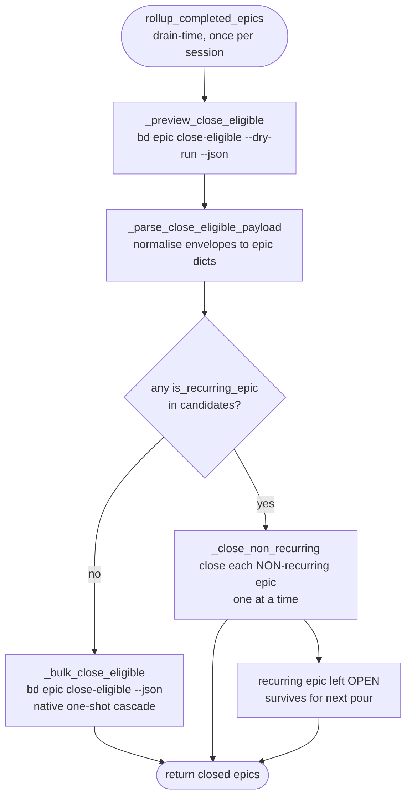

# RecurringMoleculeProtection

## What Is It

A guard in bead-chain's epic-rollup path that **refuses to auto-close the epic
of a recurring molecule** (today: a `patrol` monitor) even when all of its
current children are complete. Closing such an epic would kill the recurrence —
the whole point of a patrol molecule is to be re-poured and run again, so its
epic must outlive any one batch of children. A sibling half of the same concept
keeps ephemeral **wisps** off the queue entirely, so a recurring-monitor
by-product never gets driven as if it were real code work.

## Why This Approach

The coverage audit (gap `formulas#2`, bead `bead_chain-wot`) found that
bead-chain's once-per-session rollup (`bd epic close-eligible`) would happily
sweep up a poured `patrol` molecule's epic the moment its children finished,
defeating the recurrence. The obvious fix — "tell `bd` to skip this epic" —
**isn't possible**: `bd epic close-eligible` has *no* exclude flag (verified on
real `bd` 1.0.5; it accepts only `--dry-run`). So instead of asking `bd` to
skip, bead-chain **looks before it leaps**:

1. **Preview** the eligible set non-destructively with `--dry-run`.
2. **Inspect** each candidate with a local predicate (`is_recurring_epic`).
3. **Partition**: if *any* candidate is recurring, bypass `bd`'s bulk cascade
   and close only the safe (non-recurring) epics one at a time; otherwise take
   the fast path and let `bd` cascade natively.

This preserves the existing once-per-session, anti-over-close behaviour
(`bead_chain-tfn`) for the common case while making recurring epics survivable,
and it stays a *read-then-decide* design rather than mutating `bd`'s behaviour.

Detection is deliberately **fail-safe**: a missing/unknown marker means "not
recurring," so an ordinary epic still rolls up exactly as before — bead-chain
only *withholds* closure when a recurring marker is positively present.

## How It Works

There are two independent signals, **either** of which protects an epic
(`beads.py:is_recurring_epic`):

1. **`mol-type` field** — a value in `RECURRING_MOL_TYPES = ("patrol",)`, matched
   case-insensitively against any of `_MOL_TYPE_KEYS = ("mol_type", "mol-type",
   "molecule_type")`, checked both at top level **and** inside a nested
   `metadata` dict (`beads.py:_mol_type_matches`). This is *forward-compat*:
   `bd` 1.0.5 does **not** surface `mol-type` on `bd show` /
   `epic close-eligible --json` (verified the hard way), so this path is dormant
   until a future `bd` starts emitting it.
2. **Label marker** — one of the epic's `labels` (case-insensitive) is in
   `RECURRING_EPIC_LABELS = ("patrol", "mol-type:patrol", "recurring")`. **This
   is the signal that actually fires today**: tag a poured patrol molecule's
   epic with a `patrol` (or `recurring`) label and rollup leaves it open for the
   next pour.

The rollup decision flow (`beads.py:close_eligible_epics`):



### Concrete example

Two epics are eligible at drain time: `patrol-1` (a poured patrol monitor,
labelled `patrol`) and `mol-r6b` (an ordinary epic whose children all closed).

`_preview_close_eligible()` runs `bd epic close-eligible --dry-run --json`,
which emits dry-run envelopes:

```json
[
  {"epic": {"id": "patrol-1", "labels": ["patrol"]}, "eligible_for_close": true},
  {"epic": {"id": "mol-r6b", "labels": ["audit"]}, "eligible_for_close": true}
]
```

`_parse_close_eligible_payload` unwraps each `{"epic": {...}}` envelope (via
`_normalise_closed_epic`) into plain epic dicts so `is_recurring_epic` can see
their `labels`. Because `is_recurring_epic({"id": "patrol-1", "labels":
["patrol"]})` is `True`, the fast path is bypassed and `_close_non_recurring`
runs: it closes `mol-r6b` individually and **skips** `patrol-1`, leaving it open.
The returned list contains only the safe close:

```json
[{"id": "mol-r6b", "labels": ["audit"]}]
```

Had neither epic been recurring, the fast path `_bulk_close_eligible()` would
have run `bd epic close-eligible --json` once and returned whatever `bd`
reported closed — on `bd` 1.0.5 that is the bare-id shape
`{"closed": ["mol-r6b"], "count": 1}`, which `_normalise_closed_epic` coerces to
`{"id": "mol-r6b"}`.

### The wisp half

The other leakage vector is **ephemeral wisps** (heartbeat / ping / patrol /
recovery wisp-types). `bd ready` and `bd list` exclude ephemeral issues **by
default** — they only surface under the explicit `--include-ephemeral` flag.
bead-chain never passes that flag in any queue path (`beads.py:next_ready`,
`beads.py:_list_by_status` via `beads.py:_exclude_type_arg`), so a wisp can
never reach `/goal` as drivable work. The regression suite asserts this
contract structurally (no helper opts into `--include-ephemeral`) plus an E2E
proof against a real `bd`.

### Implementation references

| Responsibility | File:Symbol |
|----------------|-------------|
| Recurring mol-type values | `beads.py:RECURRING_MOL_TYPES` (`("patrol",)`) |
| Candidate `mol-type` field names | `beads.py:_MOL_TYPE_KEYS` |
| Protective label contract | `beads.py:RECURRING_EPIC_LABELS` |
| mol-type field matcher (top-level + metadata) | `beads.py:_mol_type_matches` |
| Detection predicate | `beads.py:is_recurring_epic` |
| Preview-then-partition orchestrator | `beads.py:close_eligible_epics` |
| Non-destructive dry-run preview | `beads.py:_preview_close_eligible` |
| Native bulk cascade (fast path) | `beads.py:_bulk_close_eligible` |
| Per-epic safe close (partition path) | `beads.py:_close_non_recurring` |
| JSON shape normaliser | `beads.py:_parse_close_eligible_payload` / `beads.py:_normalise_closed_epic` |
| Drain-time caller (soft-fails) | `lifecycle.py:rollup_completed_epics` |
| Wisp exclusion (default, no `--include-ephemeral`) | `beads.py:next_ready`, `beads.py:_list_by_status`, `beads.py:_exclude_type_arg` |

## Where Used

- [Epic Rollup](../Features/EpicRollup.md) — the feature this protection guards;
  rollup auto-closes eligible epics *except* recurring ones.
- [Session-End Epic Rollup](../Flows/SessionEndEpicRollup.md) — the drain-time
  flow that calls `lifecycle.rollup_completed_epics` → `beads.close_eligible_epics`.
- [Container Type Exclusion](ContainerTypeExclusion.md) — sibling concept; the
  wisp half here is the ephemeral counterpart to container-type exclusion from
  the ready queue.

## Conventions

> [!IMPORTANT]
> - **Tag recurring epics with a label**, not a hope. On `bd` 1.0.5 the
>   `mol-type` field is invisible, so the *label* contract is load-bearing: a
>   poured patrol molecule's epic MUST carry one of `RECURRING_EPIC_LABELS`
>   (`patrol`, `recurring`, or `mol-type:patrol`) to survive rollup.
> - **Adding a new recurring type is a one-line tuple edit** — extend
>   `RECURRING_MOL_TYPES` and/or `RECURRING_EPIC_LABELS`, mirroring how
>   `EXCLUDED_TYPES` is extended. Keep them small and case-insensitive.
> - **Detection must stay fail-safe.** Unknown / missing / non-dict input is
>   "not recurring," so ordinary epics keep rolling up. Only *withhold* closure
>   when a recurring marker is positively present.
> - **Always preview before closing.** `close_eligible_epics` must run the
>   `--dry-run` preview first so `is_recurring_epic` gets a chance to veto the
>   bulk cascade.

## Anti-Patterns

> [!CAUTION]
> - **Don't assume `bd epic close-eligible` can exclude an epic.** It has no
>   exclude flag (only `--dry-run`). Re-introducing a "just pass `--exclude`"
>   shortcut will silently re-close patrol epics.
> - **Don't run the bulk cascade when a recurring epic is eligible.** `bd`'s
>   native cascade is all-or-nothing; calling it with a patrol epic in the
>   eligible set sweeps the patrol epic up too. Use the per-epic partition path.
> - **Don't pass `--include-ephemeral`** on any `bd ready` / `bd list` query.
>   That re-opens the wisp-leakage hole and a recurring monitor's vapor would be
>   driven as real work.
> - **Don't trust a `mol-type` field to be present.** `bd` 1.0.5 doesn't emit
>   it; relying on it alone (without the label fallback) leaves every patrol
>   epic unprotected today.

## Related

- [Epic Rollup](../Features/EpicRollup.md)
- [Session-End Epic Rollup](../Flows/SessionEndEpicRollup.md)
- [Container Type Exclusion](ContainerTypeExclusion.md)
- [Session Close Durability](SessionCloseDurability.md)
- [Concepts Index](index.md)
- [Architecture](../Architecture.md)
- [FlowDoc Manifest](../_Manifest.md)
