# SessionCloseDurability

## What Is It

The deliberate policy decision about **where cross-machine durability of bead
state lives**: in the **session-close protocol** (`AGENTS.md`), right after
`git push` — and explicitly **not** inside bead-chain's drain loop. Every `bd`
mutation bead-chain makes (claim, close, revert-to-open, epic rollup) writes
only to a **local, git-ignored Dolt database** (`.beads/embeddeddolt/`). A plain
`git push` carries `refs/heads/*` only; it does **not** carry the bead state,
which travels under `refs/dolt/data` and is moved by a separate command,
`bd dolt push`. SessionCloseDurability is the rule that says: the human/CI
session-close step owns running that `bd dolt push`, gated on a configured Dolt
remote and soft-failing, and bead-chain stays 100% sync-agnostic.

## Why This Approach

The coverage audit (`notes/analysis/bead-chain-coverage/08-data-layer.md`, gaps
#1 and #2 — both rated **P1**) found a **seam**, not a code defect: *nobody* in
the documented end-to-end loop actually ran `bd dolt push`. bead-chain's drain
path (`lifecycle.py` `activate_next_bead` tail: `rollup_completed_epics()` →
`emit_success` → `state.stop()`) does no sync, and the `AGENTS.md` "Session
Completion" workflow ran only `git pull --rebase` / `git push` / `git status` —
none of which moves `refs/dolt/data`. On a single persistent dev box this is
harmless (the local Dolt DB is authoritative), but on a **fresh clone, CI, a
second machine, or a disposable agent**, every claim/close/revert from a run was
stranded locally and invisible to other actors.

ADR 0001 (`notes/decisions/0001-dolt-push-lives-in-session-close.md`, bead
`bead_chain-uo4` / FB-4, under epic `bead_chain-2p3`) resolves the seam by
putting the sync step **in session-close, option (b)**, because:

- **Single Responsibility.** bead-chain is a *queue driver*, not a sync engine
  (the boundary codified in `queue-driver-not-goal-engine.md`). Pushing on drain
  would force the driver to own sync *policy* it has no business owning: which
  remote, what cadence (every bead? once per drain?), and whether to
  `bd dolt pull` on start. Durability is a different axis than queue-draining.
- **The home already exists.** Durability and hand-off already live in the
  session-close protocol, beside `git push`. Adding `bd dolt push` there puts
  one durability concern next to the other, instead of scattering it.
- **A drain is not a session boundary.** You may run several chains in one
  session; pushing on every drain is premature or redundant. Pushing once at
  session-close matches the `git push` cadence already in the protocol.
- **CI/disposable is solved at the right layer.** Rather than special-casing the
  queue driver, those environments are treated as *additional callers* of the
  same session-close responsibility in their own teardown — the fix generalizes
  instead of accreting branches in `lifecycle.py`.

Rejected alternatives: **(a)** bead-chain pushes on successful drain — rejected
as primary (wrong cadence, violates the queue-driver boundary; kept only as a
*possible future safety net*, YAGNI for now); **(c)** document local-only with
no change — rejected (leaves a known P1 footgun the moment a remote is
configured).

## How It Works

Two refs, two commands, two layers:

```mermaid
flowchart TD
    subgraph chain["bead-chain (queue driver — sync-agnostic)"]
        claim["bd update --claim"]
        close["bd close"]
        revert["bd update --status=open (revert)"]
        rollup["rollup_completed_epics()<br/>lifecycle.py"]
    end
    claim --> LOCAL[(Local Dolt DB<br/>.beads/embeddeddolt/<br/>git-ignored)]
    close --> LOCAL
    revert --> LOCAL
    rollup --> LOCAL

    LOCAL -.->|drain end:<br/>NO push, NO pull,<br/>NO export/import| STOP([state.stop&#40;&#41; — work is LOCAL-ONLY])

    subgraph sc["Session-Close protocol (AGENTS.md — owns durability)"]
        gp["git push<br/>(carries refs/heads/* = CODE only)"]
        gate{"bd dolt remote list<br/>non-empty?"}
        push["bd dolt push<br/>(carries refs/dolt/data = BEAD STATE)"]
        warn["WARN: bead state local-only<br/>(soft-fail, do not halt)"]
        info["INFO: no remote — skip<br/>(soft-skip)"]
    end
    STOP --> gp
    gp --> gate
    gate -->|yes| push
    push -->|ok| REMOTE[(Git remote<br/>refs/heads/* + refs/dolt/data)]
    push -->|error| warn
    gate -->|no| info
    gp --> REMOTE
```



The session-close step, verbatim from `AGENTS.md`, runs **immediately after
`git push` succeeds**:

```bash
# AFTER `git push` succeeds:
if [ -n "$(bd dolt remote list 2>/dev/null)" ]; then
  bd dolt push || echo "WARN: bd dolt push failed — bead state is local-only this session"
else
  echo "INFO: no Dolt remote configured — skipping bd dolt push (bead state stays local)"
fi
```

It is **gated** (only attempts the push when `bd dolt remote list` prints a
configured remote) and **soft-fails** (a push error logs a WARN and does *not*
halt session-close — mirroring the soft-fail stance of
`lifecycle.rollup_completed_epics` and `lifecycle.probe_resolved_gates`).

### Concrete example

A disposable CI agent runs `/bead-chain`, which claims `bead_chain-mol-bps.18`,
drives it through wiggum's `/goal`, and the LLM judges close it. The chain
drains: `bd ready` returns empty, `activate_next_bead` calls
`rollup_completed_epics()`, emits *"no more ready beads… Good boy!"*, and calls
`state.stop()`. At this instant the claim+close are written **only** to
`.beads/embeddeddolt/` on the CI box — `git for-each-ref refs/dolt` on the
remote is still empty.

If CI then runs the session-close teardown and a Dolt remote *is* configured,
`git push` ships the code on `refs/heads/main`, and `bd dolt push` ships the
claim/close on `refs/dolt/data` — now machine B sees `mol-bps.18` as closed. If
CI **skips** session-close (or exits before it), the close is stranded locally
and `mol-bps.18` looks `open`/`in_progress` to every other actor until *some*
later session-close runs `bd dolt push`. That is documented, expected behavior —
not a bug, and not something bead-chain silently relies on.

### Where the boundary is enforced in code

| Concern | Behavior | Where (`file:symbol` / location) |
|---------|----------|----------------------------------|
| Local-only bead writes | All mutations shell out to `bd`; the only persistence is the local Dolt DB | `beads.py:_run_bd` (single spawn chokepoint) feeding `beads.claim`, `beads.close`, `beads.revert_to_open`, `beads.close_eligible_epics` |
| Drain end does NOT sync | Tail of the iteration loop is `rollup → emit → stop`, with no push/pull/export/import | `lifecycle.py:activate_next_bead` (drain branch: `rollup_completed_epics()` → `emit_success` → `state.stop()`) |
| Rollup is courtesy, not sync | Epic rollup soft-fails and never touches `refs/dolt/data` | `lifecycle.py:rollup_completed_epics` → `beads.close_eligible_epics` |
| Interrupted chain leaves state local | Ctrl+C / cancel stops the chain with the bead still `in_progress`, no sync | `register_callbacks.py:_on_interactive_turn_cancel` |
| Durability lives elsewhere | Gated, soft-fail `bd dolt push` after `git push` | `AGENTS.md` → "Session Completion — Dolt Sync Step" |
| Recorded policy | The SRP rationale and rejected alternatives | `notes/decisions/0001-dolt-push-lives-in-session-close.md` (ADR 0001) |
| Sync wire format reference | Architecture row: "bead-chain itself never pushes (session-close does)" | `__docs/Architecture.md` (External Dependencies → Dolt DB row) |

> [!NOTE]
> `.beads/issues.jsonl` is a **passive export**, not the wire protocol. On this
> repo `export.auto = false` and no JSONL exists, so it is **not** a sync
> fallback either — the local Dolt DB is the only copy until `bd dolt push`
> runs. Never treat JSONL as the source of truth, and never `bd import` during
> normal operation.

## Where Used

- [Session-End Epic Rollup](../Flows/SessionEndEpicRollup.md)
- [StrandedBeadRecovery](../Flows/StrandedBeadRecovery.md) — flips bead status
  on recovery/revert but, like this concept, never pushes bead state. — the drain-time
  flow whose mutations (`rollup_completed_epics`) are exactly the local-only
  writes that SessionCloseDurability later ships via `bd dolt push`.
- [Bead Chaining](../Features/BeadChaining.md) — the core loop whose every
  claim/close lands in the local Dolt DB and depends on session-close for
  cross-machine visibility.
- [Recovery Mode](../Features/RecoveryMode.md) — relies on interrupted/`in_progress`
  beads persisting locally; SessionCloseDurability documents that such state is
  local-only until the next session-close push.

## Conventions

> [!IMPORTANT]
> - **Sync lives in session-close, never in the drain path.** Add `bd dolt push`
>   *after* `git push` in the `AGENTS.md` session-close workflow — do not add
>   push/pull/export/import to `lifecycle.py`.
> - **Gate on a configured remote.** Only attempt the push when
>   `bd dolt remote list` is non-empty; otherwise log INFO and skip.
> - **Soft-fail, never halt.** A failed `bd dolt push` logs a WARN and lets
>   session-close finish — bead state being local-only for one session is far
>   less bad than blocking the hand-off.
> - **A drain is not a session boundary.** Multiple chains may run per session;
>   push once at session-close, matching the `git push` cadence.
> - **CI/disposable agents own their own teardown.** Any environment that does
>   not run the `AGENTS.md` session-close must invoke the same gated, soft-fail
>   `bd dolt push` in its teardown — it is just another caller at the same layer.
> - **Document, don't silently rely on, interrupted-chain behavior.** A Ctrl+C
>   chain is local-only until the next session-close push; say so explicitly.

## Anti-Patterns

> [!CAUTION]
> - **Don't push on drain.** Making bead-chain run `bd dolt push` when a chain
>   drains drags sync *policy* (which remote, cadence, pull-on-start) into the
>   queue driver — the exact SRP violation ADR 0001 rejected (alternative (a)).
> - **Don't assume `git push` carries bead state.** It moves `refs/heads/*`
>   only. The Dolt DB is git-ignored (`.beads/.gitignore` → `embeddeddolt/`);
>   bead state travels on `refs/dolt/data` via `bd dolt push` exclusively.
> - **Don't treat `.beads/issues.jsonl` as the wire protocol or a sync
>   fallback.** It is a passive export (and disabled here); `bd import` during
>   normal operation will fight the Dolt source of truth.
> - **Don't hard-fail session-close on a push error.** Halting strands the rest
>   of the hand-off; warn and continue.
> - **Don't reach for third-party Dolt hosting before the default
>   `refs/dolt/data` remote.** The git-compatible protocol on your existing git
>   remote is the intended path.

## Related

- [Queue Driver, Not Goal Engine](QueueDriverNotGoalEngine.md) — the SRP boundary
  that makes "bead-chain doesn't own sync" a deliberate stance.
- [Bd Subprocess Transport](BdSubprocessTransport.md) — every bead mutation that
  becomes local-only state flows through the `bd` CLI shell-out documented there.
- [Recurring Molecule Protection](RecurringMoleculeProtection.md) — sibling
  drain-time concept; shares the "a drain is not a session boundary" + soft-fail
  posture.
- [Session-End Epic Rollup](../Flows/SessionEndEpicRollup.md)
- [Bead Chaining](../Features/BeadChaining.md)
- [Recovery Mode](../Features/RecoveryMode.md)
- [Concepts Index](index.md)
- [Architecture](../Architecture.md)
- [FlowDoc Manifest](../_Manifest.md)
- ADR 0001 — `notes/decisions/0001-dolt-push-lives-in-session-close.md`
