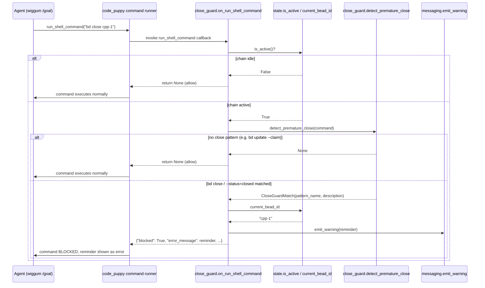

# CloseGuard

## What It Does

While bead-chain is actively driving a bead, CloseGuard intercepts every
agent-issued shell command and **blocks** any attempt to close that bead by hand
(`bd close …` or `bd update … --status=closed`), replacing the command's output
with a reminder that the LLM judges are the only legitimate closer.

## Why It Exists

bead-chain delegates the *completion verdict* to wiggum's `/goal` LLM judges: a
bead is closed only once the judges agree the goal is satisfied, via the
plugin's own `beads.close` call. If the agent doing the work shells out to
`bd close cpp-1` mid-run, it short-circuits that contract — the bead closes with
**no verdict at all**, and the chain advances as if the work were graded when it
never was. That is the precise failure mode the whole
[QueueDriverNotGoalEngine](../Concepts/QueueDriverNotGoalEngine.md) boundary
exists to prevent: grading completion is delegated, not the driver's job, so the
driver must also stop *anyone else* from grading by fiat. CloseGuard is the
enforcement arm of that boundary — without it the "judges decide" rule is a
suggestion an over-eager agent can ignore in a single shell call.

The detector is intentionally **lenient about which bead** is being closed:
while the chain is active the agent has no business closing *any* bead — that's
the chain's job — so matching `bd close` at all is sufficient, no id comparison
needed.

## How It Works

### User Perspective

The user never invokes CloseGuard directly. They (or the agent) see it only when
something tries to close a bead during a `/bead-chain` run. The offending shell
command does not execute; instead the agent receives a warning verbatim as the
command's error output (the source prefixes the first line with a stop-sign
emoji, shown here as `[stop]`):

```
[stop] bead-chain blocked `bd close`.
  Direct `bd close` bypasses the LLM judges.
  bead-chain is currently driving bead bead_chain-mol-bps.6 through
  wiggum's /goal mode. The bead will be closed automatically once the LLM
  judges sign off — do NOT close it yourself.
  Keep working on the task. If you believe the bead is complete, summarize
  what you did and let the judges decide.
```

When the chain is **idle**, the guard is invisible — `bd close` runs normally.

### System Perspective

CloseGuard registers a `run_shell_command` callback
(`register_callbacks.py:407`) that fires *before* any agent shell command runs.
The hook (`close_guard.on_run_shell_command`) is a cheap no-op unless **both**
gates hold: `state.is_active()` is true (a chain is running) **and**
`detect_premature_close(command)` returns a match. The detector first does a
substring pre-filter (`"bd" not in command` → bail, skip all regex), then tries
two compiled regexes — `_BD_CLOSE_RE` for `bd close …` and
`_BD_UPDATE_STATUS_CLOSED_RE` for `bd update … --status=closed`. Both are
anchored to a shell **command boundary** (`_COMMAND_BOUNDARY`) so a `bd close`
buried inside a quoted string (`echo "run: bd close cpp-1"`) is *not* a false
positive. On a match the hook reads the current bead id from
`state.get_state().current_bead_id`, builds the reminder, calls `emit_warning`,
and returns a `{"blocked": True, …}` dict — code_puppy's command runner surfaces
`error_message` to the agent and never executes the command. bead-chain's own
`bd close` calls in `beads.py` use `subprocess.run` directly, bypass the command
runner entirely, and therefore never trip this hook.



## Key Data Shapes

The detector returns a frozen `CloseGuardMatch` dataclass (two `str` fields) on
a hit, or `None` otherwise:

```json
{
  "pattern_name": "bd close",
  "description": "Direct `bd close` bypasses the LLM judges."
}
```

The `--status=closed` variant carries different field values:

```json
{
  "pattern_name": "bd update --status=closed",
  "description": "Setting status=closed on a bead bypasses the LLM judges."
}
```

When the hook blocks a command it returns this dict to the command runner (the
runner reads `error_message` and surfaces it to the agent as the command's
failure output):

```json
{
  "blocked": true,
  "reasoning": "Premature close attempted (bd close)",
  "error_message": "[stop] bead-chain blocked `bd close`.\n  Direct `bd close` bypasses the LLM judges.\n  bead-chain is currently driving bead cpp-1 through wiggum's /goal mode. The bead will be closed automatically once the LLM judges sign off — do NOT close it yourself.\n  Keep working on the task. If you believe the bead is complete, summarize what you did and let the judges decide."
}
```

To **allow** a command the hook returns `null` (Python `None`) — the runner
treats an absent/`None` result as "no objection, proceed."

## API Surface

> [!NOTE]
> bead-chain is a terminal Code Puppy plugin with **no HTTP endpoints**. This
> feature's "surface" is an in-process callback plus pure functions, not routes
> — so the `-> Endpoint doc` column is N/A by design (see the Endpoints note in
> the [FlowDoc Manifest](../_Manifest.md)).

| Method | Path | Purpose | -> Endpoint doc |
|--------|------|---------|-----------------|
| `hook` | `close_guard.on_run_shell_command(context, command, cwd=None, timeout=60) -> dict[str, Any] \| None` | The `run_shell_command` callback: no-op unless active + close detected, else returns a blocking dict | N/A — no HTTP surface |
| `call` | `close_guard.detect_premature_close(command) -> CloseGuardMatch \| None` | Pure detector: regex-match `bd close` / `bd update --status=closed`, return a match or `None` | N/A — no HTTP surface |
| `register` | `register_callbacks.register_callback("run_shell_command", _on_run_shell_command)` | Wires the hook into code_puppy's shell command runner at module import | N/A — plugin registration |
| `call` | `state.is_active() -> bool` | Cheap active-chain gate read; hook bails immediately when `False` | N/A — in-process state |
| `read` | `state.get_state().current_bead_id -> str \| None` | Bead id woven into the reminder message (falls back to `"the active bead"`) | N/A — in-process state |
| `emit` | `code_puppy.messaging.emit_warning(reminder)` | Surfaces the teachable reminder to the user/agent | N/A — messaging bus |

## Implementation Map

| Responsibility | File path | Symbol |
|----------------|-----------|--------|
| The `run_shell_command` hook: gate on active + detection, build reminder, return blocking dict | `close_guard.py` | `on_run_shell_command` |
| Pure detector: pre-filter on `"bd"`, then try both close regexes | `close_guard.py` | `detect_premature_close` |
| Frozen result type carrying `pattern_name` + `description` | `close_guard.py` | `CloseGuardMatch` |
| Shell command-boundary anchor (start / `&&` / `\|\|` / `;` / `\|`) shared by both regexes | `close_guard.py` | `_COMMAND_BOUNDARY` |
| Optional path-prefix matcher so `/usr/local/bin/bd` and `./bd` are caught | `close_guard.py` | `_BD_INVOCATION` |
| Compiled regex matching `bd close …` (any flags/id) | `close_guard.py` | `_BD_CLOSE_RE` |
| Compiled regex matching `bd update <id> … --status[= ]closed` within one command | `close_guard.py` | `_BD_UPDATE_STATUS_CLOSED_RE` |
| Registers the hook eagerly at module scope | `register_callbacks.py` | `register_callback("run_shell_command", _on_run_shell_command)` |
| Active-chain gate the hook checks first | `state.py` | `is_active` |
| Current bead id woven into the reminder | `state.py` | `BeadChainState.current_bead_id` |
| Warning surfaced to the agent | `code_puppy.messaging` | `emit_warning` |

## Configuration

> [!NOTE]
> CloseGuard has no runtime config keys, env vars, or toggles — its behavior is
> fixed by module-level regex constants. The table below documents those
> constants (the only knobs a maintainer would edit) with their literal values
> and effect. The verbatim regex source lives in the code block below the table
> (pipes break Markdown table cells, so the patterns are shown there in full).

The module-level constants, verbatim from `close_guard.py`:

```python
_COMMAND_BOUNDARY = r"(?:^|&&|\|\||;|\|)\s*"
_QUOTED_SEGMENT_RE = re.compile(r'''(?:'[^']*'|"(?:\.|[^"\])*")''', re.DOTALL)
_BD_INVOCATION = r"(?:\S*/)?bd"
_BD_CLOSE_RE = re.compile(
    rf"{_COMMAND_BOUNDARY}{_BD_INVOCATION}\s+close\b", re.MULTILINE
)
_BD_UPDATE_STATUS_CLOSED_RE = re.compile(
    rf"{_COMMAND_BOUNDARY}{_BD_INVOCATION}\s+update\b[^|;&]*?"
    r"--status[=\s]+closed\b",
    re.MULTILINE,
)
```

`detect_premature_close` runs the command through `_blank_quoted` (which
replaces every quoted run with equal-length whitespace) **before** the two
regexes scan it. That is what keeps `re.MULTILINE` safe: real newlines outside
quotes still act as separators, but a newline *inside* a quoted argument can no
longer satisfy `_COMMAND_BOUNDARY` (fix for `bead_chain-21d`).

| Key | Role | Effect |
|-----|------|--------|
| `_COMMAND_BOUNDARY` | shared boundary anchor | A bd token must follow start-of-string or one of `&&`, `\|\|`, `;`, `\|` — a plain space does **not** count, so quoted occurrences don't match |
| `_QUOTED_SEGMENT_RE` / `_blank_quoted` | quote-stripping pre-pass | Blanks single- and double-quoted string literals (quotes included) to equal-length whitespace so text inside an argument can never satisfy a command boundary — even at an embedded line start |
| `_BD_INVOCATION` | shared bd matcher | Accepts an optional path prefix (`/usr/local/bin/`, `./`, `$BEADS_BIN/`) but the basename must be exactly `bd` |
| `_BD_CLOSE_RE` | close detector | Matches any `bd close …` regardless of trailing flags or bead id |
| `_BD_UPDATE_STATUS_CLOSED_RE` | status-close detector | Matches `bd update <id> --status=closed` / `--status closed` *within the same command* (the `[^\|;&]` clamp prevents blaming a later chained command) |
| `"bd" substring pre-filter` | hard-coded in `detect_premature_close` | Skips all regex work when the command can't possibly invoke bd |
| close reason (bead-chain's own closes) | `beads.close` via `subprocess.run` | bead-chain's legitimate closes bypass the command runner, so the hook never fires on them |

## Edge Cases

> [!WARNING]
> **Legitimate `bd update` calls are NOT blocked.** `bd update <id> --claim` and
> `bd update <id> --status=in_progress` are the chain's normal claim/arm path —
> only `--status=closed` matches `_BD_UPDATE_STATUS_CLOSED_RE`. Don't "fix" the
> regex to catch all `bd update` or you'll deadlock the chain's own claims.

> [!WARNING]
> **bd tokens inside a quoted string never trip the guard — single- *or*
> multi-line.** `_blank_quoted` strips quoted string literals before the scan,
> so `echo "remember to bd close cpp-1"` and a `git commit -m` body whose text
> begins a line with `bd close` both run fine. The regexes still use
> `re.MULTILINE`, but it now only matters for *unquoted* newline-separated
> commands (where a bare newline really is a shell separator), so a genuine
> `bd close` on its own line outside quotes is still caught. This fixes the
> former false positive `bead_chain-21d` (see Related).

> [!WARNING]
> **Env-var-prefixed invocations slip through.** `FOO=bar bd close cpp-1` is
> *not* blocked: the `bd` is preceded by a space, not a boundary token. This is
> an accepted YAGNI trade-off (documented in the module) — env-prefixed `bd`
> invocations blur quoted-text vs. real commands and aren't a pattern agents
> reach for in practice. If that ever changes, widen `_COMMAND_BOUNDARY`.

> [!IMPORTANT]
> **bead-chain's own closes must never be blocked — and aren't.** The plugin
> closes beads through `beads.close`, which calls `subprocess.run` directly and
> never traverses code_puppy's command runner. The hook therefore only ever sees
> *agent-issued* shell commands, so the chain can always close the bead the
> judges signed off on.

> [!CAUTION]
> **The guard is inert when the chain is idle.** `on_run_shell_command` returns
> `None` immediately if `state.is_active()` is false, so a manual `bd close`
> outside a `/bead-chain` run is allowed. CloseGuard protects the *in-flight*
> contract only — it is not a general-purpose `bd close` lock.

## Error Scenarios

| Trigger | Behavior | User sees |
|---------|----------|-----------|
| Agent runs `bd close <id>` while chain active | `detect_premature_close` returns a `CloseGuardMatch`; hook emits warning and returns `{"blocked": True, ...}` | `[stop]` reminder ("Direct `bd close` bypasses the LLM judges"); command does not execute |
| Agent runs `bd update <id> --status=closed` while active | `_BD_UPDATE_STATUS_CLOSED_RE` matches; hook blocks identically | `[stop]` reminder ("Setting status=closed … bypasses the LLM judges"); command blocked |
| Agent runs `/usr/local/bin/bd close <id>` while active | `_BD_INVOCATION` path prefix matches; blocked | Same `[stop]` reminder; command blocked |
| Agent runs `bd update <id> --claim` / `--status=in_progress` | No close pattern matches → `detect_premature_close` returns `None` | Command runs normally (claim/arm proceeds) |
| Any `bd close` issued while chain is **idle** | `state.is_active()` is `False` → hook returns `None` before detection | Command runs normally |
| Command has no `"bd"` substring | Pre-filter short-circuits → `None` | Command runs normally (no regex cost) |
| `bd close` appears only inside a quoted string (single- or multi-line) | `_blank_quoted` blanks the quoted run before the scan → no match → `None` | Command runs normally (false-positive avoided) |
| A close command starts a *line* inside a quoted multi-line arg (e.g. a commit message body) | Quoted run is blanked first, so the embedded line start is no longer a boundary → `None` | Command runs normally — `bead_chain-21d` regression fixed |
| A genuine `bd close` on its own line *outside* quotes (bare-newline separator) | `re.MULTILINE` boundary matches the real line start → `CloseGuardMatch` | `[stop]` reminder; command blocked (true positive preserved) |
| `current_bead_id` is `None` at block time | Reminder falls back to the literal `"the active bead"` | `[stop]` reminder phrased with "the active bead" instead of an id |

## Testing

CloseGuard is built for testability: `detect_premature_close`,
`CloseGuardMatch`, and the two regexes are **pure, side-effect-free, and import
nothing from code_puppy**, so they can be exercised standalone, and
`on_run_shell_command` has exactly two observable gates (`state.is_active()` and
the detector) that are trivial to drive.

> [!WARNING]
> **There is currently no dedicated `tests/test_close_guard.py`.** The detector
> and hook are referenced by sibling suites (e.g.
> `tests/test_excluded_container_types.py` and
> `tests/test_formula_epic_rollup_e2e.py` both note that ids/strings must not
> accidentally trip the `close_guard` regex) but the guard's own match/allow
> matrix is not yet directly covered. This is a real gap worth a follow-up bead.

To verify behavior manually:

```python
from bead_chain.close_guard import detect_premature_close

assert detect_premature_close("bd close cpp-1").pattern_name == "bd close"
assert detect_premature_close("bd update cpp-1 --status=closed") is not None
assert detect_premature_close("bd update cpp-1 --claim") is None
assert detect_premature_close('echo "bd close cpp-1"') is None  # quoted, allowed
```

End to end, start a `/bead-chain` run and have the active agent attempt
`bd close <id>`: the command should be blocked with the `[stop]` reminder and the bead
should remain open until the judges sign off.

## Related

- [QueueDriverNotGoalEngine](../Concepts/QueueDriverNotGoalEngine.md) — the SRP
  boundary CloseGuard enforces: grading completion is delegated to the judges,
  so the driver blocks everyone else from grading by fiat.
- [ContainerTypeExclusion](../Concepts/ContainerTypeExclusion.md) — keeping
  containers off `bd ready` prevents the un-closable-bead stall that CloseGuard
  would otherwise have to turn into a halt.
- [RecoveryMode](RecoveryMode.md) — the close-time guard backstops a recovered
  bead until the LLM judges grade it.
- [NextBeadSelectionWaterfall](../Flows/NextBeadSelectionWaterfall.md) — names
  the close-time guard (`close_guard.py`) as the final backstop when a blocked
  bead slips through selection.
- [EpicRollup](EpicRollup.md) — bead-chain's *own* legitimate closes (epics at
  drain) go through `beads.close`/`subprocess.run` and bypass this hook.
- Fixed bug `bead_chain-21d` — former `re.MULTILINE` false-positive: a close
  command at the start of a line inside a quoted multi-line argument (e.g. a
  commit message) was wrongly blocked. Fixed by blanking quoted string literals
  (`_blank_quoted`) before the boundary scan.
- [Features Index](index.md)
- [Architecture](../Architecture.md)
- [FlowDoc Manifest](../_Manifest.md)
