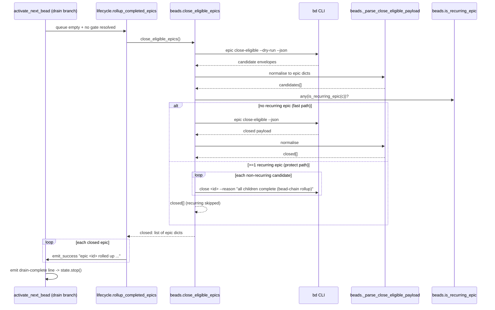

# EpicRollup

## What It Does

When bead-chain's ready queue finally drains, it runs **one** courtesy sweep
that auto-closes any epic whose children are now all complete — closing the
*container* once the work it grouped is finished, while deliberately leaving
recurring (`patrol`) molecule epics open so their monitoring keeps recurring.

## Why It Exists

An epic is a container, not work bead-chain ever drives (see
[ContainerTypeExclusion](../Concepts/ContainerTypeExclusion.md)). Once every
child of an epic closes, the epic *should* close too — otherwise the bd board
fills with permanently-open epics whose work is long done, and `bd ready`
keeps reporting "no ready work" while a stale epic still claims to be active.
bead-chain is the natural place to do that cleanup because it is the agent that
just finished draining the queue.

The naive implementation — call `bd epic close-eligible` after **every** child
close — caused the over-close bug `bead_chain-tfn`: bd's `close-eligible` runs
a server-side *cascade* (closing A's last child makes parent epic B eligible,
which makes B's parent C eligible, …). Fired per-bead, that cascade can sweep
up *unrelated* epics that merely happen to have no open children at that
instant. The fix is to run rollup **once per session**, at drain, limiting the
cascade to a single bounded pass — trading one-shot cascade depth for data
safety.

A second hazard is recurring molecules (`bead_chain-wot`): a poured `patrol`
molecule is a *recurring* monitor whose epic becoming eligible does **not**
mean it should die — closing it would defeat the recurrence. `bd epic
close-eligible` has no exclude flag, so rollup **previews** the eligible set
with `--dry-run` first and refuses to close any epic flagged recurring,
closing only the safe ones (see
[RecurringMoleculeProtection](../Concepts/RecurringMoleculeProtection.md)).

## How It Works

### User Perspective

The user never invokes this feature directly. They see its *effect* at the very
end of a `/bead-chain` run: once no claimable child bead is left (even after the
gate probe), the chain prints zero or more
`epic <id> rolled up (all children complete) — <title>` lines, then the final
`bead-chain: no more ready beads. Closed <n> this run. Good boy!` line, and
stops. Epics that grouped finished work disappear from the open list; any
`patrol`/`recurring`-tagged epic stays open on purpose for its next pour.

### System Perspective

Rollup is delegated **entirely** to `bd` — bead-chain does no id parsing, no
child counting, no eligibility math of its own (id structure is opaque to it;
two- and three-segment formula ids roll up identically). The lifecycle wrapper
`rollup_completed_epics` (`lifecycle.py:322`) is called from exactly one site:
the drain branch of `activate_next_bead` (`lifecycle.py:617`), reached only when
`pick_next_bead` returns `None` twice — once on the first probe, and again after
`probe_resolved_gates()` re-opened nothing. It calls `close_eligible_epics`
(`beads.py:786`), which: (1) previews the eligible set with
`bd epic close-eligible --dry-run --json`; (2) if **no** candidate is recurring,
takes the fast path and runs bd's native one-shot cascade
`bd epic close-eligible --json`; (3) if **any** candidate is recurring, bypasses
the bulk cascade and closes each *non*-recurring epic individually via
`bd close <id> --reason …`, skipping the protected ones. Every step soft-fails:
a flaky/old/missing `bd epic` logs a warning and the chain still ends cleanly,
because rollup is cleanup, not bead-chain's core mission.



## Key Data Shapes

This feature consumes `bd epic close-eligible` JSON and produces a list of
**normalised epic dicts** (`list[dict[str, Any]]`) — every entry guaranteed to
have at least an `id` key regardless of which bd shape was emitted.

The **dry-run preview** envelope (bd surfaces the full record incl. `labels`,
which `is_recurring_epic` needs):

```json
{
  "epic": {
    "id": "bead_chain-mol-bps",
    "title": "FlowDoc maintainer: discover & scaffold",
    "issue_type": "epic",
    "labels": ["docs", "flowdoc"]
  },
  "eligible_for_close": true
}
```

The **bd 1.0.4 bulk-close** shape — bare string ids under `closed` (the one the
`bead_chain-tfn`/`bdboard-rzxb` parser fix had to learn to read; the old
`isinstance(item, dict)` filter dropped every string and closed epics
*silently*):

```json
{ "closed": ["bead_chain-mol-bps", "bead_chain-2p3"], "count": 2, "schema_version": 1 }
```

After `_parse_close_eligible_payload` / `_normalise_closed_epic`, every shape
flattens to the same return element (string ids become `{"id": ...}`; nested
`{"epic": {...}}` envelopes are unwrapped to the inner dict):

```json
{ "id": "bead_chain-mol-bps", "title": "FlowDoc maintainer: discover & scaffold" }
```

The only fields any downstream code reads are `id` and `title` (for the log
line) and, on candidates, `labels` / `metadata` / the `mol_type`-family field
(for `is_recurring_epic`).

## API Surface

> [!NOTE]
> bead-chain is a terminal Code Puppy plugin with **no HTTP endpoints**. This
> feature's "surface" is in-process Python plus `bd` subprocess invocations, not
> routes — so the `-> Endpoint doc` column is N/A by design (see the Endpoints
> note in the [FlowDoc Manifest](../_Manifest.md)).

| Method | Path | Purpose | -> Endpoint doc |
|--------|------|---------|-----------------|
| `call` | `lifecycle.rollup_completed_epics() -> None` | Once-per-session wrapper: invoke the close path, log each closed epic, soft-fail on `BeadsError` | N/A — no HTTP surface |
| `call` | `beads.close_eligible_epics() -> list[dict[str, Any]]` | Preview → partition (fast cascade vs per-epic close) → return closed epic dicts | N/A — no HTTP surface |
| `call` | `beads.is_recurring_epic(bead) -> bool` | Detect a recurring (`patrol`) epic that must NOT be auto-closed | N/A — no HTTP surface |
| `call` | `beads.close(bead_id, *, reason=None) -> None` | Close a single epic (protect path) with the rollup reason note | N/A — no HTTP surface |
| `shell` | `bd epic close-eligible --dry-run --json` | Non-destructive preview of the eligible set | N/A — `bd` subprocess |
| `shell` | `bd epic close-eligible --json` | Fast path: bd's native one-shot cascade close | N/A — `bd` subprocess |
| `shell` | `bd close <id> --reason "all children complete (bead-chain rollup)"` | Protect path: close one non-recurring epic at a time | N/A — `bd` subprocess |

## Implementation Map

| Responsibility | File path | Symbol |
|----------------|-----------|--------|
| Once-per-session wrapper called from the drain branch; logs closed epics; soft-fails on `BeadsError` | `lifecycle.py` | `rollup_completed_epics` |
| Sole call site of the rollup (drain branch: `pick_next_bead` None twice) | `lifecycle.py:617` | `activate_next_bead` |
| Top-level orchestration: preview → partition → fast cascade or per-epic close | `beads.py` | `close_eligible_epics` |
| Non-destructive preview (`epic close-eligible --dry-run --json`) | `beads.py` | `_preview_close_eligible` |
| Fast path: destructive native one-shot cascade (`epic close-eligible --json`) | `beads.py` | `_bulk_close_eligible` |
| Protect path: close each non-recurring candidate individually, swallow per-epic failures | `beads.py` | `_close_non_recurring` |
| Tolerant JSON normaliser shared by preview + live close | `beads.py` | `_parse_close_eligible_payload` |
| Filter: is an entry a usable closed-epic (non-empty str or dict)? | `beads.py` | `_is_closed_epic` |
| Coerce any shape (str id / dict / `{"epic": {...}}`) into a flat `{"id": ...}` dict | `beads.py` | `_normalise_closed_epic` |
| Recurrence predicate (two signals: `mol_type` field + recurring labels) | `beads.py` | `is_recurring_epic` |
| Helper: does a dict carry a recurring `mol_type`-family field? | `beads.py` | `_mol_type_matches` |
| Single-epic close shelling `bd close <id> --reason …` | `beads.py` | `close` |

## Configuration

| Key | Default | Effect |
|-----|---------|--------|
| `RECURRING_MOL_TYPES` | `("patrol",)` | Mol-type values (case-insensitive) that mark an epic as recurring and exempt from auto-close; one-line extend for new recurring types |
| `_MOL_TYPE_KEYS` | `("mol_type", "mol-type", "molecule_type")` | Field names checked (top-level + nested under `metadata`) for a recurring mol-type — forward-compat for a bd that emits the type directly |
| `RECURRING_EPIC_LABELS` | `("patrol", "mol-type:patrol", "recurring")` | Labels (case-insensitive) that protect an epic — the signal that actually fires today, since bd 1.0.x does not surface `mol_type` on `epic close-eligible --json` |
| close reason (protect path) | `"all children complete (bead-chain rollup)"` | The `--reason` note attached to each individually-closed epic |
| rollup cadence | once per session (hard-coded call site) | Rollup runs only in the drain branch of `activate_next_bead`, never per-bead — the `bead_chain-tfn` mitigation |

## Edge Cases

> [!WARNING]
> **Rollup runs once per session, NOT per child close.** A parent epic whose
> last child closed mid-session may close one session *later* than you expect:
> bd's cascade is limited to a single pass per drain so it can't sweep unrelated
> epics. The next session's drain rolls up the newly-eligible parent. This is
> the deliberate `bead_chain-tfn` trade-off (data safety over cascade depth).

> [!WARNING]
> **Recurring epics are detected by label today, not by `mol_type`.** bd 1.0.x
> does not surface a `mol_type` field on `epic close-eligible --json`, so a
> `patrol` molecule's epic is only protected if it carries a `patrol`,
> `recurring`, or `mol-type:patrol` **label**. An untagged patrol epic *will*
> roll up. Tag the poured molecule's epic to keep it open.

> [!WARNING]
> **Unparseable-but-successful bd output is silent success, not failure.** If an
> old bd prints non-JSON even under `--json`, the rollup *still happened* server
> side — `_parse_close_eligible_payload` just returns `[]`, so the close
> occurred but nothing is logged. Verify a specific epic with `bd show <id>`,
> not by the absence of a rollup line.

> [!WARNING]
> **Id structure is opaque — never parse it.** Two-segment (`bdboard-isk`) and
> three-segment formula (`bdboard-mol-isk`) epic ids roll up identically because
> bead-chain delegates all eligibility to bd. A misguided `id.split("-")` filter
> would re-introduce `bead_chain-0kx` (formula epics never rolling up) — the
> regression suite guards against exactly this.

> [!CAUTION]
> **A drain is not a session boundary for durability.** This feature closes
> epics but never pushes/pulls/exports bead state — `bd dolt push` lives in
> session-close, not in the drain path (see
> [SessionCloseDurability](../Concepts/SessionCloseDurability.md) and
> [QueueDriverNotGoalEngine](../Concepts/QueueDriverNotGoalEngine.md)). The only
> mutation rollup performs is closing eligible epics.

## Error Scenarios

| Trigger | Behavior | User sees |
|---------|----------|-----------|
| `bd epic close-eligible` raises `BeadsError` (bd missing, non-zero exit, timeout exhausted) | `rollup_completed_epics` catches it and returns; the chain still drains and `state.stop()` runs | `bead-chain: epic rollup failed (continuing): <exc>` then the normal drain-complete line |
| Empty / non-JSON / unexpected-shape payload (even under `--json`) | `_parse_close_eligible_payload` returns `[]`; treated as silent success | No rollup lines; drain-complete line still prints |
| Fast path: nothing eligible | `_bulk_close_eligible` returns `[]` (idempotent no-op) | Drain-complete line only |
| Protect path: one epic's individual `close` raises `BeadsError` | `_close_non_recurring` swallows it and `continue`s; the rest still close | Other epics report rolled up; the failed one stays open for the next session |
| A `patrol` epic is in the eligible set but carries a recurring marker | Bulk cascade is bypassed; the patrol epic is skipped, only safe epics close | Recurring epic stays open; safe epics report rolled up |
| A `patrol` epic carries **no** recurring marker | `is_recurring_epic` returns `False`; it rolls up like any epic | The patrol epic is closed (then re-poured tags it next time) |
| Blank / whitespace id in the `closed` list | `_is_closed_epic` drops it; no phantom epic dict | Nothing — that entry is silently ignored |

## Testing

The parsing and partition logic is pure-stdlib (no code_puppy imports), so the
unit suites run standalone (`python3 -m pytest tests/`):

- `tests/test_close_eligible_parsing.py` — every tolerated bd JSON shape (1.0.4
  string ids, bare dict list, `{"epic": {...}}` envelope), empty/non-JSON silent
  no-ops, and blank-id dropping (the `bdboard-rzxb` silent-rollup fix).
- `tests/test_formula_epic_rollup.py` — two- and three-segment (formula) epic
  ids survive every shape untouched; guards against a structural `id.split`
  regression (`bead_chain-0kx`).
- `tests/test_recurring_epic_rollup.py` — `is_recurring_epic` detection (label +
  `mol_type` field, case-insensitive, bad-input safety) and the partition
  behaviour (fast bulk cascade when nothing recurring; per-epic close with the
  patrol epic skipped; per-epic close-failure isolation).
- `tests/test_over_close_bug.py` — the once-per-session cadence mitigation
  (`bead_chain-tfn`): rollup is not fired per child close.

End-to-end proofs spin up a real embedded Dolt db via `bd init` (~30s each, run
explicitly):

- `tests/test_rollup_e2e.py` — final-child close rolls up AND *reports* the epic
  in the same pass against a real bd.
- `tests/test_formula_epic_rollup_e2e.py` — a three-segment formula epic id
  rolls up like a standard epic against a real bd.

Run the whole suite with `pytest -q` (245 tests).

## Related

- [SessionEndEpicRollup](../Flows/SessionEndEpicRollup.md) — the flow that
  narrates, step by step, how this feature fires at drain.
- [RecurringMoleculeProtection](../Concepts/RecurringMoleculeProtection.md) —
  the preview-then-partition guard that keeps `patrol` epics open.
- [ContainerTypeExclusion](../Concepts/ContainerTypeExclusion.md) — why epics
  are containers bead-chain closes here but never *drives* as work.
- [SessionCloseDurability](../Concepts/SessionCloseDurability.md) — why this
  drain-time feature closes epics but never pushes bead state.
- [QueueDriverNotGoalEngine](../Concepts/QueueDriverNotGoalEngine.md) — the SRP
  boundary: a drain is not a session boundary.
- [BdSubprocessTransport](../Concepts/BdSubprocessTransport.md) — the transport
  behind the `epic close-eligible` / `close` spawns.
- [ChainIterationLoop](../Flows/ChainIterationLoop.md) — the outer loop whose
  drain pass triggers this feature.
- [NextBeadSelectionWaterfall](../Flows/NextBeadSelectionWaterfall.md) — returns
  `None` (empty queue), the precondition that hands control to rollup.
- [CloseGuard](CloseGuard.md) — the contrast case: rollup's epic closes go
  through `beads.close`/`subprocess.run` and so bypass the agent-close guard.
- [Features Index](index.md)
- [Architecture](../Architecture.md)
- [FlowDoc Manifest](../_Manifest.md)
