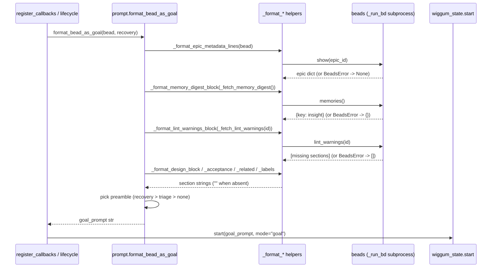

# GoalPromptEnrichment

## What It Does

Turns a bare `bd ready`-shaped bead record into a richly-framed `/goal` prompt:
on top of the bead's title and description it injects the project's persistent
memories, parent-epic context, labels, design rationale, acceptance criteria,
template-lint warnings, non-gating related-context edges, a situational
preamble (recovery / triage), and the always-appended bug-discovery protocol —
so the working agent (and the LLM judges) start *warm* instead of cold.

## Why It Exists

A `bd ready` bead dict on its own is thin: a title, a description, a priority.
Agents spawned by bead-chain are stateless and disposable, so without
enrichment each one started **blind** — it never saw the acceptance criteria it
would be graded against (gap FB-2), the project's hard-won gotchas (gap FB-6),
the template sections `bd lint` knows are missing (gap FB-5), the bead's design
rationale or labels (gap FB-7), or the provenance/causal edges that explain why
the bead exists (gap FB-11). GoalPromptEnrichment closes those gaps by folding
every high-signal, low-cost context source bd already exposes into one prompt,
while keeping the whole assembly **read-only and crash-proof**: every
enrichment soft-fails to an empty string, so a minimal bead — or a bd build
missing a subcommand — still produces a valid prompt and never stalls the
chain.

## How It Works

### User Perspective

The user runs `/bead-chain` and watches it engage. They never call the
enricher directly; they see its *output* — the multi-section goal prompt the
working agent receives — and the surrounding status lines (`BEAD-CHAIN
ENGAGED!`, `bead-chain claimed <id> — <title>`, or `Recovering stranded
in_progress bead <id> ...`). The visible payoff is that each spawned agent
already "knows" the project: it cites prior memories, grades itself against the
shown acceptance criteria, and respects the bug-discovery protocol without the
user re-explaining any of it.

### System Perspective

Immediately after a bead is claimed (or recognised as a recovery strand) and
execution hints are applied, the caller invokes
`prompt.format_bead_as_goal(bead, recovery=...)`. The function extracts the
bead's identity fields with literal fallbacks, then calls a sequence of pure
`_format_*` helpers — each fed either a slice of the bead dict or the result of
a soft-failing `bd` fetch (`show` for epic context, `memories` for the digest,
`lint_warnings` for the lint block). It selects a mutually-exclusive preamble
(recovery beats triage beats none), concatenates everything in a fixed order,
and returns the string to the caller, which hands it to
`wiggum_state.start(goal_prompt, mode="goal")`. No source file or bead dict is
ever mutated; the only impure calls are read-only `bd` round-trips that degrade
to no-ops on `BeadsError`.



## Key Data Shapes

The enricher consumes one `bd ready --json` / `bd show --json` bead record. The
fields it actually reads:

```json
{
  "id": "bead_chain-mol-bps.9",
  "title": "FlowDoc maintainer: Feature: GoalPromptEnrichment",
  "description": "Write __docs/Features/GoalPromptEnrichment.md ...",
  "issue_type": "task",
  "priority": 2,
  "parent": "bead_chain-mol-bps",
  "labels": ["discover", "docs", "flowdoc"],
  "design": "Optional ADR / design-rationale text (omitted when unset)",
  "acceptance_criteria": "When you believe this is done: ...",
  "dependencies": [
    {
      "type": "related",
      "depends_on_id": "bead_chain-2zx",
      "title": "render acceptance_criteria"
    }
  ]
}
```

The epic-context enrichment fetches a second record via `show(epic_id)` and
reads only two fields:

```json
{
  "title": "FlowDoc maintainer: discover & scaffold, then spawn one bead per doc",
  "description": "DISCOVERY + FAN-OUT (one bead). ..."
}
```

The memory digest consumes the `bd memories` shape — a flat `{key: insight}`
map:

```json
{
  "flowdoc-bd-subprocess-transport": "beads.py is a stdlib-only ...",
  "docs-renamed-to-notes": "docs/ was renamed to notes/ ..."
}
```

The output is a single `str` (the assembled goal prompt) — there is no
structured response object.

## API Surface

> [!NOTE]
> bead-chain is a terminal Code Puppy plugin with **no HTTP endpoints**. The
> "API surface" of this feature is an in-process Python call, not a route, so
> the `-> Endpoint doc` column is N/A by design (see the Endpoints note in the
> [FlowDoc Manifest](../_Manifest.md)).

| Method | Path | Purpose | -> Endpoint doc |
|--------|------|---------|-----------------|
| `call` | `prompt.format_bead_as_goal(bead, *, recovery=False) -> str` | Assemble the enriched `/goal` prompt for one bead | N/A — no HTTP surface |
| `call` | `prompt.is_triaged_bug(bead) -> bool` | Decide whether the triage-verification preamble applies | N/A — no HTTP surface |

## Implementation Map

| Responsibility | File path | Symbol |
|----------------|-----------|--------|
| Top-level prompt assembly + preamble selection | `prompt.py` | `format_bead_as_goal` |
| Parent-epic metadata lines (`- Parent epic: ...` + excerpt) | `prompt.py` | `_format_epic_metadata_lines` |
| Soft-failing `bd show` epic fetch | `prompt.py` | `_fetch_epic_context` |
| First-paragraph excerpt truncation | `prompt.py` | `_first_paragraph_excerpt` |
| Persistent-memories digest block | `prompt.py` | `_format_memory_digest_block` |
| Soft-failing `bd memories` fetch | `prompt.py` | `_fetch_memory_digest` |
| Labels metadata line | `prompt.py` | `_format_labels_line` |
| Design rationale block | `prompt.py` | `_format_design_block` |
| Acceptance-criteria block | `prompt.py` | `_format_acceptance_criteria_block` |
| Template-lint-warnings block | `prompt.py` | `_format_lint_warnings_block` |
| Soft-failing `bd lint` fetch | `prompt.py` | `_fetch_lint_warnings` |
| Related-context (non-gating edge) block | `prompt.py` | `_format_related_context_block` |
| Shape-agnostic edge type / target readers | `prompt.py` | `_edge_type`, `_edge_target_id` |
| Triaged-bug detection | `prompt.py` | `is_triaged_bug` |
| Parent-epic id extraction | `beads.py` | `extract_parent_epic_id` |
| Read-only `bd` fetches behind enrichment | `beads.py` | `show`, `memories`, `lint_warnings` |
| Caller — chain start (first bead) | `register_callbacks.py:280` | `handle_bead_chain_command` |
| Caller — mid-chain hand-off (every later bead) | `lifecycle.py:718` | `activate_next_bead` |

## Configuration

| Key | Default | Effect |
|-----|---------|--------|
| `_EPIC_EXCERPT_LIMIT` | `280` | Max chars of the parent-epic description excerpt injected into the prompt |
| `_MEMORY_DIGEST_MAX_ENTRIES` | `12` | Max number of `bd memories` entries surfaced in the `## Persistent Memories` block |
| `_MEMORY_EXCERPT_LIMIT` | `280` | Max chars per memory excerpt |
| `_CONTEXT_EDGE_GLOSSES` | 6-entry ordered map | Which dependency edge types appear in `## Related Context`, their human gloss, and display order |
| `TRIAGE_MARKER` | `"[bead-chain:triaged]"` | Sentinel in a bug's description that flips it onto the triage-verification preamble |
| `_RECOVERY_PREAMBLE` | constant text | Prepended when `recovery=True` |
| `_TRIAGE_VERIFY_PREAMBLE` | constant text | Prepended when the bead is a triaged bug (and not in recovery) |
| `_BUG_DISCOVERY_PROTOCOL` | constant text | Appended to **every** prompt, regardless of preamble |

## Edge Cases

> [!WARNING]
> **Malformed bead dict still renders.** Every identity field has a literal
> fallback (`<unknown>`, `(no title)`, `(no description)`, `task`, `?`), so a
> garbage record produces a valid (if sparse) prompt rather than a traceback.

> [!WARNING]
> **bd build missing a subcommand.** If this bd lacks `lint` or `memories`,
> `_fetch_lint_warnings` / `_fetch_memory_digest` swallow the `BeadsError` and
> return `[]` / `{}` — the corresponding block is simply omitted and the prompt
> is byte-for-byte unchanged. The chain never stalls on a missing feature.

> [!WARNING]
> **Recovery wins over triage.** A bead that is *both* a stranded
> `in_progress` bug *and* carries the triage marker gets the recovery preamble
> only — "assess current state" deliberately subsumes "verify a prior fix".

> [!WARNING]
> **Only non-gating edges are surfaced.** `_format_related_context_block` folds
> in just the six glossed context edge types; gating/structural edges
> (`blocks`, `parent-child`) are excluded by design so prompt enrichment can
> never accidentally alter readiness semantics.

> [!WARNING]
> **Heading de-dup.** If a bead's `design` / `acceptance_criteria` field text
> already leads with its own heading, the formatter emits it as-is instead of
> stacking a second `## Design` / `## Acceptance Criteria` header.

## Error Scenarios

| Trigger | Behavior | User sees |
|---------|----------|-----------|
| `bd show <epic_id>` raises `BeadsError` (epic missing / timeout / bad JSON) | `_fetch_epic_context` returns `None`; epic line degrades to bare `- Parent epic: <id>` | A parent-epic line with no title/excerpt |
| `bd memories` raises / unsupported | `_fetch_memory_digest` returns `{}`; memory block omitted | No `## Persistent Memories` section |
| `bd lint <id>` raises / unsupported | `_fetch_lint_warnings` returns `[]`; lint block omitted | No `## Template Lint Warnings` section |
| Bead has no `acceptance_criteria` | `_format_acceptance_criteria_block` returns `""` | No acceptance section (the FB-2 gap if the field is genuinely empty) |
| Bead `dependencies` is non-list / only gating edges | `_format_related_context_block` returns `""` | No `## Related Context` section |
| Bead `labels` non-list / all blank | `_format_labels_line` returns `[]` | No `- Labels:` metadata line |
| All memory excerpts truncate to nothing | `_format_memory_digest_block` returns `""` | No memory section despite memories existing |

## Testing

Covered by the prompt-shape unit suite under `tests/` (all pure-function,
no live bd needed — the impure fetches are monkeypatched):

- `tests/test_prompt_acceptance_criteria.py` — `## Acceptance Criteria` block
  presence/absence and heading de-dup (FB-2).
- `tests/test_prompt_design_labels.py` — `## Design` block and `- Labels:`
  metadata line (FB-7).
- `tests/test_prompt_lint_warnings.py` — `## Template Lint Warnings` block and
  `_fetch_lint_warnings` soft-fail (FB-5).
- `tests/test_prompt_memory_digest.py` — `## Persistent Memories` digest, entry
  capping, excerpt truncation, and `_fetch_memory_digest` soft-fail (FB-6).
- `tests/test_prompt_related_context.py` — `## Related Context` edge filtering,
  gloss ordering, de-dup, and gating-edge exclusion (FB-11).

Run the lot with `pytest -q` (the whole repo suite is 245 tests). To eyeball a
real prompt, call `format_bead_as_goal(bead)` with a hand-built dict in a REPL —
the function is pure given its (mockable) `bd` fetches.

## Related

- [GoalPromptConstruction](../Flows/GoalPromptConstruction.md) — the flow that
  narrates this feature's assembly step by step.
- [RecoveryMode](RecoveryMode.md) — supplies the `recovery=True` path and the
  `_RECOVERY_PREAMBLE`.
- [BugDiscoveryProtocol](BugDiscoveryProtocol.md) — the always-appended
  `_BUG_DISCOVERY_PROTOCOL` and the triage-verification preamble.
- [BeadChaining](BeadChaining.md) — the umbrella feature that drives one
  enriched prompt per bead.
- [BdSubprocessTransport](../Concepts/BdSubprocessTransport.md) — the transport
  behind the `show` / `memories` / `lint_warnings` enrichment fetches.
- [ExecutionHints](../Concepts/ExecutionHints.md) — applied immediately before
  this feature builds the prompt.
- [ChainStateSingleton](../Concepts/ChainStateSingleton.md) — holds the
  `current_bead` whose dict feeds the enricher.
- [BeadClaimAndBlockerRecheck](../Flows/BeadClaimAndBlockerRecheck.md) — the
  claim step that runs just before enrichment.
- [EpicAffinity](EpicAffinity.md) — the other consumer of
  `extract_parent_epic_id`: it routes selection to a sibling under the same epic.
- [Features Index](index.md)
- [Architecture](../Architecture.md)
- [FlowDoc Manifest](../_Manifest.md)
