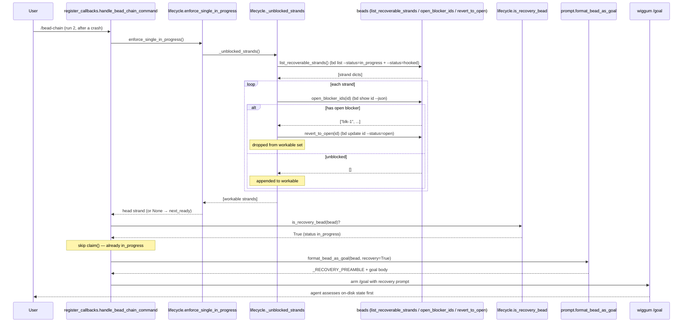

# RecoveryMode

## What It Does

When a previous `/bead-chain` run dies mid-bead — `Ctrl+C`, a runtime cancel, a
hard crash, or a `bd close` failure — it leaves a bead claimed but never
graded. On the next run, RecoveryMode detects that stranded `in_progress`
(or `hooked`) bead **before** any fresh work, and re-drives it with a *recovery
preamble* that tells the agent to assess what's already on disk instead of
redoing the work from scratch.

## Why It Exists

bead-chain's whole contract is *one bead at a time*, closed only by the LLM
judges. But the world isn't clean: a user presses `Ctrl+C`, a laptop sleeps, a
SIGKILL lands, or `bd close` itself errors. Each of those leaves a bead flipped
to `in_progress` with **real partial work on disk** but **no verdict**. That
bead is now invisible to `bd ready` (claimed beads are off the ready frontier),
so without a recovery rule it would be silently orphaned: the half-done changes
attach to no tracked work, and the next run would happily claim a *different*
bead on top of them.

RecoveryMode is the guarantee that partial work stays paired with its bead.
Rather than re-running it blindly (which would waste effort and risk
double-committing), it re-prompts the agent to *figure out what's already done
first* — the bead may already be satisfied, in which case the agent just
summarizes and lets the judges close it. It is the user-facing face of the
[StrandedBeadRecovery](../Flows/StrandedBeadRecovery.md) flow.

## How It Works

### User Perspective

The user does nothing to invoke RecoveryMode — it's automatic. The flow they
observe across two runs:

1. **Run 1, mid-bead:** they press `Ctrl+C` (or the process crashes). The chain
   stops and prints a recovery note:

   ```
   [link] bead-chain halted due to cancelled.
   [bookmark] Bead bead_chain-mol-bps.2 left in_progress — the next /bead-chain
   run will resume it with a recovery preamble so the agent assesses the current
   state before doing new work.
   ```

2. **Run 2, startup:** they type `/bead-chain` again. Before claiming anything
   new, the chain announces the recovery and re-arms the *same* bead, prepending
   the recovery preamble to the goal:

   ```
   Recovering stranded in_progress bead bead_chain-mol-bps.2 -- agent will
   assess current state before doing new work.
   ```

   The agent then sees ` RECOVERY MODE: a previous bead-chain run did not
   finish this bead. …` at the top of its goal and assesses on-disk state before
   touching anything.

If the stranded bead got **re-blocked** in the meantime, the user instead sees
it quietly reverted to `open` (sent back behind its blockers) rather than
re-driven — no recovery preamble, because it isn't workable yet.

### System Perspective

RecoveryMode is consulted at two sites, both reading the same recoverable set
(`beads.list_recoverable_strands`):

- **Startup** — `register_callbacks.handle_bead_chain_command`
  (`register_callbacks.py:169`) calls `lifecycle.enforce_single_in_progress()`
  (`lifecycle.py:138`) *before* `next_ready()`, so a strand from a prior run is
  resumed ahead of any fresh claim.
- **Every next-bead pick** — `lifecycle.pick_next_bead` (`lifecycle.py:460`)
  makes the stranded set **tier 0** of its four-tier waterfall, ahead of
  blocking bugs, epic affinity, and the global ready queue.

Both paths route through `lifecycle._unblocked_strands` (`lifecycle.py:88`),
which enumerates the recoverable set, fetches each strand's live blockers
(`beads.open_blocker_ids`), and **reverts + drops** any re-blocked strand
(`beads.revert_to_open`) so only workable strands survive. A surviving strand is
classified by `lifecycle.is_recovery_bead` (`lifecycle.py:64`); because it's
already `in_progress`, the chain **skips the claim** and arms `/goal` via
`prompt.format_bead_as_goal(bead, recovery=True)` (`prompt.py:613`), which
prepends `prompt._RECOVERY_PREAMBLE` (`prompt.py:47`). The upstream that creates
a strand in the first place is `register_callbacks._on_interactive_turn_cancel`
(`register_callbacks.py:360`), which deliberately leaves the in-flight bead
`in_progress` on cancel.



## Key Data Shapes

A strand element as returned by `bd list --status=in_progress --exclude-type=epic
--json` (the list `_list_by_status` parses; only `id`, `status`, `issue_type`
are load-bearing for recovery):

```json
{
  "id": "bead_chain-mol-bps.2",
  "status": "in_progress",
  "issue_type": "task",
  "title": "FlowDoc maintainer: Feature: RecoveryMode",
  "parent": "bead_chain-mol-bps"
}
```

A `bd show <id> --json` record as inspected by `open_blocker_ids` (only
`dependencies[].dependency_type` and `dependencies[].status` decide
recover-vs-revert):

```json
{
  "id": "bead_chain-mol-bps.2",
  "status": "in_progress",
  "issue_type": "task",
  "dependencies": [
    { "id": "bead_chain-bu5", "dependency_type": "blocks", "status": "open" },
    { "id": "bead_chain-x3g", "dependency_type": "waits-for", "status": "closed" }
  ]
}
```

The recovery preamble (`prompt._RECOVERY_PREAMBLE`, prepended verbatim to the
goal body when `recovery=True`):

```text
 RECOVERY MODE: a previous bead-chain run did not finish this bead.
You are picking up partial work — the bead is already claimed and in_progress.

Before doing any new work, assess the current state of the repo:
- What changes have already been made for this bead?
- Are tests and linters passing?
- Is the work effectively done?

If the bead is already satisfied by the current state, reply with a
summary of what's in place that meets the requirements. Do NOT redo
work — the LLM judges will verify and close the bead based on your
summary.

Otherwise, continue from where the previous run left off.

---
```

## API Surface

> [!NOTE]
> bead-chain is a terminal Code Puppy plugin with **no HTTP endpoints**.
> RecoveryMode's "surface" is in-process functions and a cancel callback, not
> routes — so the `-> Endpoint doc` column is N/A by design (see the Endpoints
> note in the [FlowDoc Manifest](../_Manifest.md)).

| Method | Path | Purpose | -> Endpoint doc |
|--------|------|---------|-----------------|
| `call` | `lifecycle.enforce_single_in_progress() -> dict[str, Any] \| None` | Startup recovery: return the head workable strand (or `None`), soft-failing on bd outage | N/A — no HTTP surface |
| `call` | `lifecycle.pick_next_bead(just_closed) -> dict[str, Any] \| None` | Mid-chain waterfall whose **tier 0** is recovery (workable strand wins over every other tier) | N/A — no HTTP surface |
| `call` | `lifecycle._unblocked_strands() -> list[dict[str, Any]]` | Build the workable strand set: enumerate recoverables, revert+drop blocked ones | N/A — internal helper |
| `call` | `lifecycle.is_recovery_bead(bead) -> bool` | Classify a picked bead as recovery (status ∈ `{in_progress, hooked}`, case-insensitive) | N/A — pure predicate |
| `call` | `beads.list_recoverable_strands() -> list[dict[str, Any]]` | Enumerate + de-dup every non-epic bead in a recoverable status | N/A — bd wrapper |
| `call` | `beads.open_blocker_ids(bead_id) -> list[str]` | Live blocker ids for a strand (`bd show <id> --json`); soft-fails to `[]` | N/A — bd wrapper |
| `call` | `beads.revert_to_open(bead_id) -> None` | Unwind a blocked strand back to `open` (`bd update <id> --status=open`) | N/A — bd wrapper |
| `call` | `prompt.format_bead_as_goal(bead, *, recovery=False) -> str` | Prepend `_RECOVERY_PREAMBLE` when `recovery=True` | N/A — pure formatter |
| `hook` | `register_callbacks._on_interactive_turn_cancel(prompt, *, reason="cancelled") -> None` | The upstream: `Ctrl+C`/cancel leaves the in-flight bead `in_progress` for next-run recovery | N/A — callback |

## Implementation Map

| Responsibility | File path | Symbol |
|----------------|-----------|--------|
| The set of statuses that count as recoverable in-flight work | `beads.py` | `RECOVERABLE_STATUSES` (`(IN_PROGRESS_STATUS, HOOKED_STATUS)`) |
| Enumerate + de-dup non-epic strands across every recoverable status | `beads.py` | `list_recoverable_strands` |
| DRY per-status query shared by `list_in_progress` / `list_recoverable_strands` | `beads.py` | `_list_by_status` |
| Head-of-list convenience (first in_progress strand) | `beads.py` | `next_in_progress` |
| Live work-time blocker ids for a strand (`bd show … --json`) | `beads.py` | `open_blocker_ids` |
| Unwind a blocked strand back to `open` | `beads.py` | `revert_to_open` |
| Classify a picked bead as recovery vs. fresh (case-insensitive) | `lifecycle.py` | `is_recovery_bead` / `_RECOVERY_STATUSES` |
| Build the workable strand set; revert+drop blocked strands | `lifecycle.py` | `_unblocked_strands` |
| Startup recovery: pick the head strand, leave extras `in_progress` | `lifecycle.py` | `enforce_single_in_progress` |
| Mid-chain tier-0 recovery branch of the selection waterfall | `lifecycle.py` | `pick_next_bead` |
| Activation: skip claim for recovery beads, arm `/goal` with `recovery=` | `lifecycle.py` | `activate_next_bead` |
| Close-failure path that *creates* a strand (leaves bead `in_progress`) | `lifecycle.py` | `close_current_bead_success` |
| Startup entry: call `enforce_single_in_progress` before `next_ready`, skip claim on recovery | `register_callbacks.py` | `handle_bead_chain_command` |
| Cancel/`Ctrl+C` upstream that parks the bead `in_progress` | `register_callbacks.py` | `_on_interactive_turn_cancel` |
| The preamble prepended to recovered beads' goals | `prompt.py` | `_RECOVERY_PREAMBLE` |
| Prepend the recovery preamble when `recovery=True` | `prompt.py` | `format_bead_as_goal` |

## Configuration

> [!NOTE]
> RecoveryMode has no runtime config keys, env vars, or feature toggles — it is
> always on. Its behavior is fixed by the module-level constants below (the only
> knobs a maintainer would edit). Adding a new recoverable status is a one-line
> edit to `RECOVERABLE_STATUSES`; everything downstream (`_list_by_status`,
> `_unblocked_strands`, `_RECOVERY_STATUSES`) derives from it.

| Key | Default | Effect |
|-----|---------|--------|
| `beads.IN_PROGRESS_STATUS` | `"in_progress"` | The canonical claimed-but-not-closed status; first member of `RECOVERABLE_STATUSES` and the status `bd update --claim` sets |
| `beads.HOOKED_STATUS` | `"hooked"` | A bead flipped out of the ready frontier mid-flight; second recoverable status (FB-12 / lifecycle#2) |
| `beads.RECOVERABLE_STATUSES` | `("in_progress", "hooked")` | The single source of truth for "what is a strand"; drives the enumeration queries and the recover-vs-fresh predicate |
| `lifecycle._RECOVERY_STATUSES` | `frozenset({"in_progress", "hooked"})` | Lower-cased copy of `RECOVERABLE_STATUSES` so `is_recovery_bead` can't drift from the recovery query |
| `beads.BLOCKING_DEP_TYPES` | `("blocks", "waits-for")` | Which dependency edges gate a strand from recovery (others are non-gating context) |
| `beads.SATISFIED_BLOCKER_STATUSES` | `frozenset({"closed"})` | Only a `closed` blocker is satisfied; `open`/`in_progress`/`blocked` all force a revert |
| `recovery=` flag | `False` | Passed to `format_bead_as_goal`; `True` ⇒ prepend `_RECOVERY_PREAMBLE` and skip `claim` |

## Edge Cases

> [!WARNING]
> **A re-blocked strand is reverted, not recovered.** The recovery query
> (`bd list --status=in_progress`) bypasses the ready frontier, so a bead
> claimed-while-ready and later re-blocked would otherwise be re-driven to
> completion and only trip at `bd close`. `_unblocked_strands` prevents this:
> any strand with open `blocks`/`waits-for` edges is reverted to `open` (back
> behind its blockers) and dropped from the workable set. This is the
> `bdboard-oals` fix — see [WorkTimeBlockerGate](WorkTimeBlockerGate.md).

> [!WARNING]
> **`hooked` beads are recoverable too — but only on the fixed build.** Older
> bead-chain queried only `--status=in_progress`, so a bead flipped to `hooked`
> mid-flight fell out of *both* `bd ready` and recovery and was stranded
> forever. `RECOVERABLE_STATUSES` now includes `hooked`; ensure you're on a
> build where `beads.py` lists both.

> [!IMPORTANT]
> **Recovery beads skip the claim — never re-claim them.** A recovery bead is
> already `in_progress`, so `activate_next_bead` / `handle_bead_chain_command`
> deliberately omit `claim(bead_id)` (`if not recovery: claim(...)`). Adding a
> re-claim is at best a no-op and at worst a bd error. The `recovery` flag also
> exempts the bead from the `revert_to_open` branch in the activation-time
> blocker guard (a blocked recovery bead is left `in_progress` for inspection,
> and the chain stops).

> [!IMPORTANT]
> **At most one strand should exist; extras drain one-at-a-time.** The
> one-bead-at-a-time discipline means there's normally exactly one strand. If a
> hard crash leaves several, `enforce_single_in_progress` recovers the **head**
> and leaves the rest `in_progress` — they're each picked up on subsequent
> iterations via the tier-0 branch. It never bulk-reverts the extras; every
> `in_progress` bead is real partial work paired with its bead.

> [!CAUTION]
> **`pinned` beads are intentionally NOT recoverable.** `RECOVERABLE_STATUSES`
> excludes `pinned` (and `blocked`): a human deliberately parked those out of
> the queue, so auto-recovering one would fight that intent. Don't add `pinned`
> to the recoverable set to "fix" a stuck bead — that's by design (see
> `beads.py` comments around `RECOVERABLE_STATUSES`).

> [!CAUTION]
> **Recovery beats the triage preamble, not the other way around.** When a
> recovery bead is *also* a triaged bug, `format_bead_as_goal` applies the
> recovery preamble (its branch is evaluated first) because "assess what's
> already done" subsumes "verify the inline fix." Don't reorder those branches.

## Error Scenarios

| Trigger | Behavior | User sees |
|---------|----------|-----------|
| Prior run cancelled mid-bead (`Ctrl+C`) | `_on_interactive_turn_cancel` stops the chain, leaves the bead `in_progress` | `[link] bead-chain halted …` + `[bookmark] Bead <id> left in_progress …` |
| Next run finds one workable strand | `enforce_single_in_progress` returns it; claim skipped; `recovery=True` | `Recovering stranded in_progress bead <id> -- agent will assess current state …` |
| Mid-chain pick finds a strand | `pick_next_bead` tier-0 returns it ahead of every other tier | `bead-chain: found stranded in_progress bead <id> -- recovering before picking new work.` |
| Strand has open `blocks`/`waits-for` | `_unblocked_strands` reverts it to `open` and drops it | `… is blocked by open issue(s) […] -- refusing to re-drive it and reverting to open …` then `reverted blocked <id> to open` |
| Revert of a blocked strand fails | Bead still dropped from this pass (never driven); next pass retries | `also couldn't revert <id> (still dropping it from this pass): <exc>` |
| More than one strand exists | Head recovered; extras left `in_progress` for later | `bead-chain: found <n> in_progress beads (residue from a hard crash …). Recovering <head> first; the rest …: <ids>` |
| `bd close` failed during prior run | `close_current_bead_success` leaves the bead `in_progress` and stops the chain | Bead is re-picked by recovery on the next run |
| `bd list` outage at startup | `enforce_single_in_progress` catches `BeadsError`, returns `None`, falls through to `next_ready` | `bead-chain: couldn't enumerate in_progress beads (<exc>); continuing without invariant check.` |
| `bd list` outage mid-chain | `BeadsError` from `_unblocked_strands` propagates → `activate_next_bead` stops the chain | `bd ready failed` + clean stop |
| `bd show` blip during blocker check | `open_blocker_ids` soft-fails to `[]` (treated unblocked); close-guard is the backstop | Strand recovered; close-time guard refuses to close if it really is blocked |
| Bead has empty/missing `status` | `is_recovery_bead` returns `False` (treated as fresh) | Bead is claimed normally, no preamble |

## Testing

RecoveryMode's units are pure or easily monkeypatched: `is_recovery_bead` is a
side-effect-free predicate, `list_recoverable_strands` / `open_blocker_ids` /
`revert_to_open` are thin `bd` wrappers, and `_unblocked_strands` /
`enforce_single_in_progress` / `pick_next_bead` have small, mockable seams.

Covering tests already in the suite:

- `tests/test_hooked_pinned_strands.py` — `RECOVERABLE_STATUSES` membership
  (`test_recoverable_statuses_include_in_progress_and_hooked`),
  `list_recoverable_strands` surfacing/de-duping hooked strands and dropping
  leaked containers, `is_recovery_bead` truth table (in_progress / hooked / open
  / case-insensitive), and `pick_next_bead` recovering a hooked strand
  (`test_pick_next_bead_recovers_hooked_strand`).
- `tests/test_pick_respects_blocks.py` — the revert-not-redrive contract:
  `test_blocked_stranded_in_progress_is_reverted_not_redriven`,
  `test_unblocked_stranded_in_progress_is_recovered`, and
  `test_enforce_single_evicts_blocked_recovery`.

To verify the predicate manually:

```python
from bead_chain.lifecycle import is_recovery_bead

assert is_recovery_bead({"status": "in_progress"}) is True
assert is_recovery_bead({"status": "HOOKED"}) is True   # case-insensitive
assert is_recovery_bead({"status": "open"}) is False
assert is_recovery_bead(None) is False
```

End to end: start `/bead-chain`, press `Ctrl+C` mid-bead, then run `/bead-chain`
again — the same bead id should be announced as recovered (not re-claimed) and
its goal should open with the ` RECOVERY MODE` preamble.

## Related

- [StrandedBeadRecovery](../Flows/StrandedBeadRecovery.md) — the end-to-end flow
  this feature is the user-facing face of (selection, revert, re-prompt).
- [NextBeadSelectionWaterfall](../Flows/NextBeadSelectionWaterfall.md) — the
  four-tier pick whose **tier 0** is RecoveryMode.
- [ChainIterationLoop](../Flows/ChainIterationLoop.md) — the outer loop whose
  cancel path (`_on_interactive_turn_cancel`) parks a bead for recovery.
- [GoalPromptConstruction](../Flows/GoalPromptConstruction.md) — renders the
  `_RECOVERY_PREAMBLE` this feature requests.
- [WorkTimeBlockerGate](WorkTimeBlockerGate.md) — the gate that reverts+drops a
  re-blocked strand instead of recovering it (the `bdboard-oals` fix).
- [BugDiscoveryProtocol](BugDiscoveryProtocol.md) — its triage preamble loses
  precedence to the recovery preamble when a bead is both.
- [BlockingBugPriority](BlockingBugPriority.md) — tier 1, the tier RecoveryMode
  (tier 0) outranks.
- [CloseGuard](CloseGuard.md) — the close-time backstop that refuses to close a
  recovered bead the judges haven't graded.
- [ContainerTypeExclusion](../Concepts/ContainerTypeExclusion.md) — why epics
  are filtered out of the recoverable set.
- [ChainStateSingleton](../Concepts/ChainStateSingleton.md) — holds
  `current_bead_id`, the field the cancel hook reads when it strands a bead.
- [BdSubprocessTransport](../Concepts/BdSubprocessTransport.md) — the transport
  behind the `bd list` / `bd show` / `bd update` spawns recovery makes.
- [SessionCloseDurability](../Concepts/SessionCloseDurability.md) — why an
  interrupted (recoverable) chain is local-only until the next session close.
- [QueueDriverNotGoalEngine](../Concepts/QueueDriverNotGoalEngine.md) — the SRP
  boundary: recovery re-drives a strand but never owns durability or grading.
- [BeadChaining](BeadChaining.md) — the queue driver whose cancel/close-failure
  paths strand a bead `in_progress` for this feature to resume next run.
- [GoalPromptEnrichment](GoalPromptEnrichment.md) — renders the
  `_RECOVERY_PREAMBLE` this feature requests for a recovered bead.
- [Features Index](index.md)
- [Architecture](../Architecture.md)
- [FlowDoc Manifest](../_Manifest.md)
