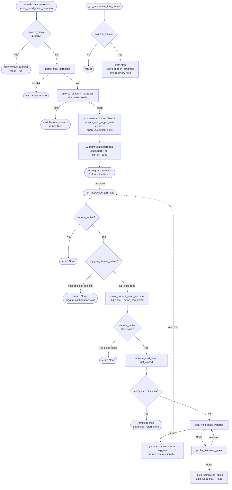

# ChainIterationLoop

## What Happens

The **ChainIterationLoop** is bead-chain's master cycle: the *probe → claim →
/goal → close → next* heartbeat that drains your `bd ready` queue one bead at a
time. It is **not** a goal engine — it is a queue driver that *delegates* the
LLM-judged completion decision to wiggum's `/goal` mode and only steps in at the
boundaries between beads (see
[QueueDriverNotGoalEngine](../Concepts/QueueDriverNotGoalEngine.md)).

The loop has three observable phases, all wired in `register_callbacks.py`:

1. **Engage (once).** `/bead-chain` →
   `register_callbacks.handle_bead_chain_command` probes for the first bead
   (recovery first, then `bd ready`), runs the activation gauntlet, arms wiggum
   goal mode, and *returns the goal prompt string* — the CLI runs that string as
   the user's prompt, kicking off iteration 1.
2. **Iterate (every turn).** wiggum's `interactive_turn_end` hook runs first
   each turn; bead-chain's `_on_interactive_turn_end` runs **after** it (the
   hooks are registered lazily so we always land behind wiggum). bead-chain reads
   `wiggum_state.is_active()`:
   - **wiggum still active** ⇒ the current bead's `/goal` isn't done ⇒ return
     `None`, let wiggum's continuation win.
   - **wiggum just stopped** ⇒ the bead is done (judges passed) ⇒ close it via
     `close_current_bead_success`, then `activate_next_bead(just_closed)` to pick
     + claim + arm the next one. The next bead's continuation dict is returned to
     the runner.
3. **Halt.** Either the queue empties (`activate_next_bead` returns `None`,
   stops the chain after a gate re-probe + epic rollup drain) or the user hits
   Ctrl+C (`_on_interactive_turn_cancel` stops the chain and leaves the in-flight
   bead `in_progress` for recovery next run).

> [!IMPORTANT]
> **Hook ordering is load-bearing.** bead-chain registers its turn-end hook
> *lazily*, on the first `/bead-chain` invocation
> (`register_callbacks._ensure_hooks_registered`), specifically so it appends
> **after** wiggum's hook (which loads at startup). That guarantees wiggum has
> already decided its fate for the turn by the time bead-chain checks
> `wiggum_state.is_active()`. Register eagerly at import time and the order
> flips — bead-chain would close beads a turn early. The `run_shell_command`
> close-guard hook, by contrast, *is* registered eagerly because it has no
> ordering dependency.

## Trigger

| Trigger | Entry point | Fires |
|---------|-------------|-------|
| User types `/bead-chain [--max=N]` | `register_callbacks.handle_bead_chain_command` (`register_callbacks.py:138`) | once, to engage the chain |
| Any interactive turn ends while the chain is active | `register_callbacks._on_interactive_turn_end` (`register_callbacks.py:289`) | every turn, after wiggum's hook |
| User cancels (Ctrl+C) while the chain is active | `register_callbacks._on_interactive_turn_cancel` (`register_callbacks.py:359`) | once per cancel |

The loop is gated on **two** singletons every turn:
`state.is_active()` (is bead-chain engaged?) and `wiggum_state.is_active()` (is
the current bead's `/goal` still cooking?). Both must be read in that order —
if bead-chain isn't active the hook is an immediate no-op; if wiggum is still
active bead-chain defers. See
[ChainStateSingleton](../Concepts/ChainStateSingleton.md).

## Outcome

- **Steady state:** one bead is `closed` per loop turn and the next is `claimed`
  + armed, with `state.completed_count` incremented and
  `state.current_bead` swapped to the new bead. The runner receives a
  continuation dict and runs the next bead's goal prompt.
- **Queue empty:** the chain runs the empty-queue gate re-probe
  (`probe_resolved_gates`) and, if nothing reopens, the session-end epic rollup
  drain (`rollup_completed_epics`), emits `no more ready beads … Good boy!`, and
  `state.stop()`s.
- **`--max=N` cap hit:** `activate_next_bead` stops *before* picking, emitting
  the cap message — no further bead is claimed.
- **Cancelled:** the chain stops; the in-flight bead stays `in_progress` so the
  next `/bead-chain` run recovers it with the recovery preamble.
- **Close failure / infra error:** the chain stops loudly, leaving the bead
  `in_progress`; nothing new is claimed on top of the un-closeable bead.

No source files are touched. The only persisted mutations are bd state
transitions (`bd update --claim`, `bd close`, `bd update --status=open`) — the
loop never pushes/pulls/exports bead state; durability is a session-close
concern ([SessionCloseDurability](../Concepts/SessionCloseDurability.md)).



## Step-by-Step

| # | What | Where (file:symbol) | Failure mode |
|---|------|---------------------|--------------|
| 1 | Refuse to double-engage; emit immediate `starting…` ack before any (slow) `bd` probe | `register_callbacks.py:handle_bead_chain_command` (`state.is_active()` guard) | Already active ⇒ emit `already running`, return `True` (no-op) |
| 2 | Parse `--max=N` / `--max N` before touching bd | `register_callbacks.py:_parse_max_iterations` | Missing/non-int/≤0 value ⇒ `_PARSE_ERROR` sentinel ⇒ warn + return `True`, nothing claimed |
| 3 | Probe for the first bead: recovery strand first, else `bd ready` head | `register_callbacks.py:handle_bead_chain_command` → `lifecycle.enforce_single_in_progress` → `beads.next_ready` | `BeadsError` ⇒ `can't reach bd` warn + return `True`; `None` ⇒ `No ready beads` + return `True` |
| 4 | Activation gauntlet on the first bead (container reject, blocker reject+revert, fan-out gate not applicable at startup), then lazily register hooks, `state.start()`, set `max_iterations` | `register_callbacks.py:handle_bead_chain_command` + `_ensure_hooks_registered` | Excluded type or open blocker ⇒ warn (+ revert if not recovery) + return `True` |
| 5 | Walk hierarchy top-down: claim parent epic, then claim child (skipped for recovery beads), apply execution hints, format goal prompt, arm wiggum, **return the prompt string** | `register_callbacks.py:handle_bead_chain_command` → `lifecycle.ensure_epic_in_progress` / `beads.claim` / `execution_hints.apply_execution_hints` / `prompt.format_bead_as_goal` / `wiggum_state.start` | `claim` `BeadsError` ⇒ warn + `state.stop()` + return `True`; epic claim + hints soft-fail (log only) |
| 6 | Each turn-end: bail if chain inactive | `register_callbacks.py:_on_interactive_turn_end` (`state.is_active()`) | Inactive ⇒ return `None` |
| 7 | Defer to wiggum while goal mode is live (we run after wiggum by registration order) | `register_callbacks.py:_on_interactive_turn_end` (`wiggum_state.is_active()`) | wiggum active ⇒ return `None`, its continuation wins |
| 8 | wiggum stopped ⇒ close the current bead and capture the just-closed dict for epic-affinity routing | `lifecycle.close_current_bead_success` → `beads.close` | Container leak ⇒ revert + stop; pinned mid-flight ⇒ respect pin, drop current, keep trotting; `bd close` `BeadsError` ⇒ leave `in_progress` + `state.stop()` |
| 9 | Bow out if the close step stopped the chain (don't claim on top of an un-closeable bead) | `register_callbacks.py:_on_interactive_turn_end` (`state.is_active()` recheck) | Chain stopped ⇒ return `None` |
| 10 | Pick + activate the next bead | `register_callbacks.py:_on_interactive_turn_end` → `lifecycle.activate_next_bead` | See rows 11-14 |
| 11 | Safety brake: stop before picking if `completed_count + 1 > max_iterations` | `lifecycle.activate_next_bead` (`state.max_iterations` check) | Cap reached ⇒ emit cap msg + `state.stop()` + return `None` |
| 12 | Run the four-tier waterfall to choose one bead | `lifecycle.pick_next_bead` (`lifecycle.py:460`) | `BeadsError` ⇒ `bd ready failed` warn + `state.stop()` + return `None` |
| 13 | On empty pick, re-probe gates once; if any resolved, re-run the waterfall | `lifecycle.probe_resolved_gates` → `beads.check_gates` | Still empty ⇒ fall to drain (row 14); gate check soft-fails to `False` |
| 14 | On final empty, run session-end epic rollup drain, emit `Good boy!`, stop | `lifecycle.rollup_completed_epics` → `beads.close_eligible_epics` | Rollup soft-fails (log + continue); chain stops cleanly either way |
| 15 | Activate the chosen bead: container/blocker/fan-out-gate gauntlet, claim (skip for recovery), apply hints, arm wiggum, return continuation dict | `lifecycle.activate_next_bead` → `ensure_epic_in_progress`/`claim`/`apply_execution_hints`/`format_bead_as_goal`/`wiggum_state.start` | Any reject ⇒ warn (+ revert if not recovery) + `state.stop()` + return `None` |
| 16 | Cancel path: stop the chain, leave the in-flight bead `in_progress`, emit recovery note | `register_callbacks.py:_on_interactive_turn_cancel` | Inactive ⇒ return early; no current bead ⇒ stop without recovery note |

## Data Transformations

The loop threads a small set of shapes from bd JSON → singleton state → wiggum:

- **`/bead-chain [--max=N]` command string → `int | None | _PARSE_ERROR`.**
  `_parse_max_iterations` tokenises the slash-command and extracts the cap. A
  valid positive int arms `state.max_iterations`; `None` means "no cap";
  `_PARSE_ERROR` aborts the engage.
- **`bd ready` / recovery `bd list` JSON → bead dict → `state.current_bead`.**
  The picked bead dict (full record, not just id) is stored on the singleton so
  later hops read `current_bead["parent"]` etc. without re-fetching. The
  `current_bead_id` property derives `str(current_bead["id"])` on demand.
- **just-closed bead dict → epic-affinity key (next iteration).**
  `close_current_bead_success` returns the bead it *intended* to close;
  `activate_next_bead` passes it to `pick_next_bead`, where
  `extract_parent_epic_id` reads `parent` (fallbacks `parent_id`/`epic_id`) to
  bias tier 2. See
  [NextBeadSelectionWaterfall](NextBeadSelectionWaterfall.md).
- **bead dict → goal prompt string.** `prompt.format_bead_as_goal(bead,
  recovery=...)` renders the bead (title, acceptance criteria, persistent
  memories, recovery preamble when applicable) into the `/goal` prompt. See
  [GoalPromptConstruction](GoalPromptConstruction.md).
- **chosen bead → runner continuation dict.** `activate_next_bead` returns the
  one object the CLI runner consumes to drive the next turn:

```json
{
  "prompt": "<the format_bead_as_goal output>",
  "clear_context": true,
  "delay": 0.5,
  "reason": "bead_chain"
}
```

A representative `state.current_bead` value (a `bd ready`/`bd show` element the
loop carries through a turn — the loop reads `id`, `issue_type`, `status`,
`title`, `parent`):

```json
{
  "id": "bead_chain-mol-bps.10",
  "issue_type": "task",
  "status": "in_progress",
  "priority": 2,
  "title": "FlowDoc maintainer: Flow: ChainIterationLoop",
  "parent": "bead_chain-mol-bps"
}
```

The engage path returns a **bare string** (the goal prompt) rather than a
continuation dict — that is the CLI's signal to run it as the user's prompt and
start iteration 1. Every subsequent turn returns either `None` (defer/stop) or
the continuation dict above (new bead).

## Performance Characteristics

- **Event-driven, one turn at a time.** There is no busy loop. The cycle is
  driven by code_puppy's interactive turn lifecycle: each `/goal` turn ends,
  fires `interactive_turn_end`, and bead-chain either defers (cheap, two
  in-memory singleton reads) or does one close + one pick.
- **The hot path is a no-op.** While a bead's `/goal` is still running, every
  turn-end is just `state.is_active()` + `wiggum_state.is_active()` → return
  `None`. Zero `bd` traffic, zero allocations of note. bead-chain only spends
  `bd` round-trips at bead **boundaries**.
- **Per-boundary `bd` cost.** A close+advance turn costs: 1 `bd close` (+ a
  `bd show` pin recheck), the waterfall's bounded probes (see
  [NextBeadSelectionWaterfall](NextBeadSelectionWaterfall.md) — typically ~2
  `bd list` + 1-2 `bd ready` + a `bd show` blocker recheck), an
  `ensure_epic_in_progress` check (`has_epic_in_progress` + optional `bd show`
  title + `claim`), and 1 `bd update --claim`. All short-circuiting.
- **Synchronous, single-threaded.** `_on_interactive_turn_end` is `async` (hook
  contract) but does no concurrency itself; the `bd` calls are blocking
  subprocess spawns on the calling thread.
- **Every spawn rides one chokepoint.** All `bd` calls funnel through
  `beads._run_bd` (`beads.py:280`) with `DEFAULT_TIMEOUT = 30.0` and retry
  backoff — see [BdSubprocessTransport](../Concepts/BdSubprocessTransport.md).
  The loop adds no caching beyond holding the current bead dict in memory.
- **No N+1 over the queue.** The loop processes exactly one bead per boundary;
  it never enumerates the whole queue per bead (the waterfall reads list heads).
- **Bounded run length.** `--max=N` caps total iterations; otherwise the loop
  runs until `bd ready` (+ gate re-probe) is genuinely empty.

## Failure Handling

- **wiggum-vs-cancel disambiguation.** When the turn-end hook sees wiggum
  inactive it *assumes success* — because `interactive_turn_cancel` fires on
  cancellation and would have already `state.stop()`ped the chain. So reaching
  the close branch with `state.is_active()` still `True` implies the judges
  passed, not a cancel.
- **Close failure stops, never orphans.** If `bd close` raises,
  `close_current_bead_success` leaves the bead `in_progress`, stops the chain,
  and emits the recovery note. The turn-end handler then rechecks
  `state.is_active()` and bows out *before* `activate_next_bead`, so no new bead
  is claimed on top of the un-closeable one.
- **Container leak self-heals.** An epic that somehow reaches `current_bead` is
  refused at close time and **reverted to open** (containers are filtered out of
  recovery, so leaving one stranded would corrupt status forever). At activation
  time a leaked container is refused and the chain stops. See
  [ContainerTypeExclusion](../Concepts/ContainerTypeExclusion.md).
- **Mid-flight pin is respected.** If a bead is `pinned` after claim but before
  close, `is_pinned` short-circuits close (force-closing would override a
  human's deliberate park): drop it as current, do **not** bump `completed`,
  keep trotting. `bd ready`/recovery both exclude `pinned`, so it can't loop.
- **Blocker / fan-out gate refusal at claim time.** `activate_next_bead` runs a
  belt-and-suspenders `open_blocker_ids` recheck and a `_has_fan_out_gate_issue`
  probe; either ⇒ revert (if not recovery) + stop. This is the bdboard-oals fix
  mirrored at the activation boundary. See
  [BeadClaimAndBlockerRecheck](BeadClaimAndBlockerRecheck.md).
- **Infra errors stop the loop, not the process.** A `BeadsError` from
  `pick_next_bead` is caught in `activate_next_bead`, which emits
  `bd ready failed`, `state.stop()`s, and returns `None`.
- **Courtesy steps soft-fail.** `probe_resolved_gates`, `rollup_completed_epics`,
  `ensure_epic_in_progress`, and `apply_execution_hints` all log-and-continue on
  `BeadsError` — losing a gate probe / rollup / status update / hint is far less
  bad than stalling the queue.
- **No retries in the loop itself.** Retry/backoff lives in `_run_bd`. The loop's
  only "retry" is the single post-gate-reprobe re-run of the waterfall.
- **Cancel leaves a clean recovery point.** `_on_interactive_turn_cancel` only
  halts the loop; the bead's `in_progress` status is the deliberate handoff to
  the next run's recovery tier. See
  [StrandedBeadRecovery](StrandedBeadRecovery.md).

## Key Log Messages

> [!NOTE]
> Several live log strings are emoji-prefixed in source (chain-link / bone /
> stop glyphs). Per the project's no-emoji-in-writes convention the prefixes are
> omitted here; the text shown is otherwise verbatim from the source.

| Log line | Where | Means |
|----------|-------|-------|
| `bead-chain starting…` | `register_callbacks.handle_bead_chain_command` (`emit_info`) | Engage acknowledged before the (possibly slow) bd probes run. |
| `bead-chain is already running.` | `handle_bead_chain_command` (`emit_info`) | Double-engage refused; the existing chain keeps running. |
| `No ready beads — bead-chain has nothing to fetch.` | `handle_bead_chain_command` (`emit_info`) | Startup probe found neither a recovery strand nor a `bd ready` head. |
| `bead-chain can't reach \`bd\`: <exc>` | `handle_bead_chain_command` (`emit_warning`) | The startup probe hit a `BeadsError`; the chain never engaged. |
| `BEAD-CHAIN ENGAGED!` | `handle_bead_chain_command` (`emit_success`) | First bead claimed + wiggum armed; iteration 1 is about to run. |
| `First bead: <id> — <title>` / `Safety cap: stopping after <N> bead(s).` | `handle_bead_chain_command` (`emit_info`) | Engage summary; the cap line only prints when `--max=N` was given. |
| `bead-chain closed <id> (#<n> completed this run)` | `lifecycle.close_current_bead_success` (`emit_success`) | A bead's `/goal` passed the judges and was closed; `completed_count` bumped. |
| `bead-chain couldn't close <id>: <exc>` + `Bead <id> left in_progress …` | `close_current_bead_success` (`emit_warning`) | `bd close` failed; bead stays `in_progress`, chain stops for inspection. |
| `bead-chain <claimed|recovered> <id> — <title>` | `lifecycle.activate_next_bead` (`emit_info`) | The next bead was claimed (or recovered) and armed for the next turn. |
| `bead-chain: --max=<N> cap reached (closed <n> bead(s) this run). Stopping. Good boy!` | `activate_next_bead` (`emit_success`) | The `--max=N` safety brake fired before picking another bead. |
| `bead-chain: no more ready beads. Closed <n> this run. Good boy!` | `activate_next_bead` (`emit_success`) | Queue drained (post gate re-probe + epic rollup); chain stopped cleanly. |
| `bead-chain stopping — \`bd ready\` failed: <exc>` | `activate_next_bead` (`emit_warning`) | A `BeadsError` during the pick stopped the loop. |
| `bead-chain halted due to <reason>.` + `Bead <id> left in_progress …` | `register_callbacks._on_interactive_turn_cancel` (`emit_warning` / `emit_system_message`) | Ctrl+C halted the loop; the in-flight bead is parked for recovery. |

## Common Issues

| Symptom | Likely cause | Fix |
|---------|--------------|-----|
| `/bead-chain` does nothing / "already running" | `state.active` is still `True` from a prior run that didn't stop cleanly | The chain auto-stops on empty queue / cap / cancel; if it's wedged, cancel the turn (Ctrl+C) to fire the cancel hook, then re-engage. |
| Chain closes a bead a turn early (or never) | bead-chain's turn-end hook is firing *before* wiggum's | Ensure hooks register lazily (`_ensure_hooks_registered` on first `/bead-chain`), so bead-chain lands after wiggum and reads a settled `wiggum_state.is_active()`. |
| Chain stops after one bead with a close warning | `bd close` raised (bd outage, permission, schema drift) | Read the `couldn't close <id>` warning; fix bd, then re-run — the recovery tier resumes the `in_progress` bead with the recovery preamble. |
| Loop ends immediately with `No ready beads` | The only items are container types (epic/milestone/gate/molecule) or all work is blocked/pinned | `bd ready` to inspect; containers are filtered by design ([ContainerTypeExclusion](../Concepts/ContainerTypeExclusion.md)), blocked beads need their blockers closed. |
| Chain won't advance past a pinned bead | The current bead was `pinned` mid-flight; close is refused to honor the park | Unpin it (`bd update <id> --unpin`) if it should proceed; otherwise the chain correctly drops it and moves on. |
| `--max` ignored | `--max` value was invalid (non-int / ≤0) so the engage was refused, OR the cap was hit and `stop()` reset it to `None` for the next run | Pass `--max=N` with a positive integer each run; the cap is intentionally not sticky across runs. |
| Queue "empty" but you expected work | Targets are held behind unresolved gates | The loop re-probes gates once on empty (`probe_resolved_gates`); if a gate is genuinely unresolved its target stays out of `bd ready` until it closes. See [SessionEndEpicRollup](SessionEndEpicRollup.md). |
| Same `in_progress` bead re-driven every run | A prior run was cancelled/crashed; the recovery tier keeps yielding it | Finish or `bd close <id>` the strand; tier 0 only yields while a recoverable strand exists ([StrandedBeadRecovery](StrandedBeadRecovery.md)). |

## Related

- [NextBeadSelectionWaterfall](NextBeadSelectionWaterfall.md) — the four-tier
  selector this loop calls (via `activate_next_bead`) to choose each next bead.
- [BeadClaimAndBlockerRecheck](BeadClaimAndBlockerRecheck.md) — the activation
  gauntlet (claim, blocker/fan-out recheck, epic claim, hint application, wiggum
  arming) that runs inside both the engage and iterate phases of this loop.
- [RecoveryMode](../Features/RecoveryMode.md) — the feature the cancel path
  feeds: a stranded bead is recovered on the next run.
- [StrandedBeadRecovery](StrandedBeadRecovery.md) — what happens to the
  in-flight bead when this loop is cancelled or a close fails; how the next run
  resumes it.
- [SessionEndEpicRollup](SessionEndEpicRollup.md) — the empty-queue drain
  (gate re-probe + once-per-session epic rollup) this loop runs before stopping.
- [EpicRollup](../Features/EpicRollup.md) — the feature that empty-queue drain triggers to auto-close completed epics.
- [GoalPromptConstruction](GoalPromptConstruction.md) — renders the bead this
  loop activates into the `/goal` prompt string handed to wiggum.
- [QueueDriverNotGoalEngine](../Concepts/QueueDriverNotGoalEngine.md) — the SRP
  boundary: every turn is an iteration of this loop, but the *completion*
  decision is wiggum's, never bead-chain's.
- [ChainStateSingleton](../Concepts/ChainStateSingleton.md) — the
  `state.active` / `current_bead` / `completed_count` / `max_iterations` box the
  loop reads and mutates each turn.
- [ContainerTypeExclusion](../Concepts/ContainerTypeExclusion.md) — why
  epics/milestones/gates/molecules never become a `current_bead` this loop drives.
- [BdSubprocessTransport](../Concepts/BdSubprocessTransport.md) — the transport
  behind every `bd` call this loop makes at a bead boundary.
- [SessionCloseDurability](../Concepts/SessionCloseDurability.md) — why this loop
  only transitions bead status and never pushes/pulls bead state.
- [RecurringMoleculeProtection](../Concepts/RecurringMoleculeProtection.md) —
  how the empty-queue rollup avoids closing recurring/patrol molecule epics.
- [ExecutionHints](../Concepts/ExecutionHints.md) — the `execution_*` metadata
  this loop applies to each bead before arming wiggum.
- [EpicAffinity](../Features/EpicAffinity.md) — uses the just-closed dict this
  loop captures to prefer a sibling under the same epic next iteration.
- [Flows Index](index.md)
- [Architecture](../Architecture.md)
- [FlowDoc Manifest](../_Manifest.md)
