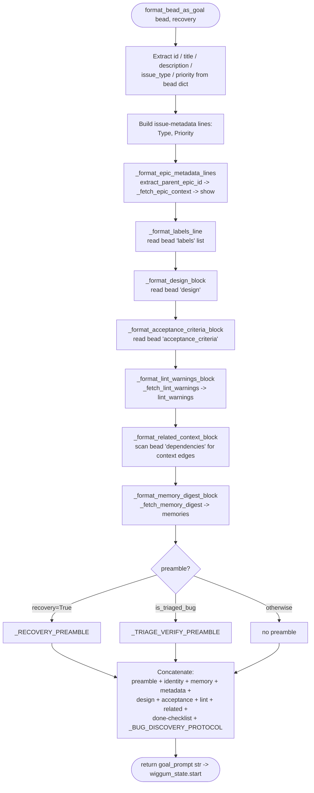

# GoalPromptConstruction

## What Happens

A single `bd ready`-shaped bead dict is turned into the multi-section `/goal`
prompt string that bead-chain hands to wiggum's `/goal` mode. The assembly
chooses a mutually-exclusive **preamble** (recovery / triage / none), then
concatenates the bead's identity (title + description), a project-wide
`## Persistent Memories` digest, an issue-metadata block (type, priority,
parent-epic context, labels), the bead's own `## Design` and
`## Acceptance Criteria` text, a `## Template Lint Warnings` block, a
`## Related Context` block of non-gating edges, the "when you believe this is
done" checklist, and finally the always-appended `BUG DISCOVERY PROTOCOL`.
Every enrichment soft-fails to an empty string, so a minimal bead still
produces a valid prompt and the impure `bd` round-trips can never crash the
chain.

## Trigger

`prompt.format_bead_as_goal(bead, recovery=recovery)` is called at exactly two
sites, both immediately *after* the bead has been claimed (or recognised as a
recovery strand) and execution hints applied, just before
`wiggum_state.start(goal_prompt, mode="goal")` arms the `/goal` loop:

- **Chain start** — `register_callbacks.py:handle_bead_chain_command`
  (`register_callbacks.py:280`) builds the prompt for the first bead.
- **Mid-chain hand-off** — `lifecycle.py:activate_next_bead`
  (`lifecycle.py:718`) builds it for every subsequent bead picked by the
  selection waterfall.

The `recovery` flag is computed upstream by `lifecycle.is_recovery_bead(bead)`
(true when the bead's `status` is already `in_progress`/`hooked`).

## Outcome

A single `str` — the fully-assembled goal prompt — returned to the caller,
which passes it to `wiggum_state.start(..., mode="goal")`. The bead dict and
the source files are never mutated (the formatter is read-only; the only `bd`
calls it makes are read-only `show` / `memories` / `lint` enrichments that
soft-fail to nothing).

## Step-by-Step

| # | What | Where (file:symbol) | Failure mode |
|---|------|---------------------|--------------|
| 1 | Pull `id`, `title`, `description`, `issue_type`, `priority` off the bead dict with safe defaults (`<unknown>`, `(no title)`, `(no description)`, `task`, `?`) | `prompt.py:format_bead_as_goal` | None — every field has a literal fallback, so a malformed dict still renders |
| 2 | Seed metadata lines `- Type: <issue_type>` and `- Priority: P<priority>` | `prompt.py:format_bead_as_goal` | None |
| 3 | Resolve parent epic id, then fetch its title + first-paragraph excerpt and append `- Parent epic: <id> — <title>` (+ `  > <excerpt>`) | `prompt.py:_format_epic_metadata_lines` → `beads.extract_parent_epic_id` → `prompt.py:_fetch_epic_context` → `beads.show` | `bd show` raises `BeadsError` → `_fetch_epic_context` returns `None` → falls back to bare `- Parent epic: <id>` |
| 4 | Append `- Labels: a, b, c` from the bead's `labels` list (stripped, empties dropped) | `prompt.py:_format_labels_line` | Missing / non-list / all-empty → `[]` (line omitted) |
| 5 | Render `## Design` block from the bead's `design` field (no double-heading if it already leads with one) | `prompt.py:_format_design_block` | Missing / empty / non-string → `""` |
| 6 | Render `## Acceptance Criteria` block from the bead's `acceptance_criteria` field | `prompt.py:_format_acceptance_criteria_block` | Missing / empty / non-string → `""` |
| 7 | Run `bd lint <id>` on the claim path and render `## Template Lint Warnings` with one bullet per missing section | `prompt.py:_format_lint_warnings_block` ← `prompt.py:_fetch_lint_warnings` → `beads.lint_warnings` | `bd lint` raises / unsupported → `_fetch_lint_warnings` returns `[]` → block is `""` |
| 8 | Render `## Related Context` from the bead's `dependencies` array, keeping only the six non-gating context edges (`discovered-from`, `caused-by`, `validates`, `related`, `relates-to`, `tracks`), de-duped and grouped by gloss order | `prompt.py:_format_related_context_block` (`prompt.py:_edge_type`, `prompt.py:_edge_target_id`, `prompt.py:_CONTEXT_EDGE_GLOSSES`) | No `dependencies` / only gating edges / non-list → `""` |
| 9 | Fetch `bd memories` and render the `## Persistent Memories` digest (≤ `_MEMORY_DIGEST_MAX_ENTRIES`, each excerpt ≤ `_MEMORY_EXCERPT_LIMIT`) | `prompt.py:_format_memory_digest_block` ← `prompt.py:_fetch_memory_digest` → `beads.memories` | `bd memories` raises / unsupported → `_fetch_memory_digest` returns `{}` → block is `""` |
| 10 | Pick the preamble: `recovery=True` → recovery preamble; else triaged bug → triage preamble; else none (recovery wins over triage) | `prompt.py:format_bead_as_goal` (`_RECOVERY_PREAMBLE`, `prompt.py:is_triaged_bug`, `_TRIAGE_VERIFY_PREAMBLE`) | `is_triaged_bug` is defensive (non-dict / missing fields → `False`) |
| 11 | Concatenate preamble + identity + memory + metadata + design + acceptance + lint + related + done-checklist + bug-discovery protocol into the final string | `prompt.py:format_bead_as_goal` (`_BUG_DISCOVERY_PROTOCOL`) | None — pure string join |
| 12 | Return the prompt to the caller, which arms wiggum's `/goal` mode | `register_callbacks.py:handle_bead_chain_command` / `lifecycle.py:activate_next_bead` → `wiggum_state.start` | None within the formatter |

## Data Transformations

Input is one `bd ready --json` (or `bd show --json`) bead record; output is the
goal-prompt string. The hops:

- **bead dict → identity header.** `bead["id"]`, `bead["title"]`,
  `bead["description"]` → the leading
  `Complete beads issue <id>: <title>\n\n<description>` lines.
- **`bead["parent"]` (or legacy `parent_id`/`epic_id`) → epic context.**
  `extract_parent_epic_id` yields the id; `show(epic_id)` returns the full
  epic record; `_first_paragraph_excerpt(epic["description"], limit=280)`
  trims it to a one-line `> excerpt`.
- **`bead["labels"]: list[str]` → `- Labels: a, b, c`.** Each entry
  `str(item).strip()`, empties dropped, comma-joined.
- **`bead["design"]: str` → `## Design` block.** Stripped; emitted as-is if it
  already starts with a `Design` heading, else prefixed with `## Design`.
- **`bead["acceptance_criteria"]: str` → `## Acceptance Criteria` block.** Same
  heading-dedup rule.
- **`bead["id"]` → `## Template Lint Warnings`.** `lint_warnings(id)` returns
  `list[str]` of missing section names → one `- <name>` bullet each.
- **`bead["dependencies"]: list[dict]` → `## Related Context`.** Each edge's
  type (`type` *or* `dependency_type`) and target (`depends_on_id` *or* `id`)
  are read shape-agnostically; only the six glossed context types survive,
  rendered `- <gloss> <target>[: <title>]`.
- **`bd memories` → `## Persistent Memories`.** `memories()` returns
  `dict[str, str]` (`{key: insight}`); first 12 entries, each excerpt trimmed
  to 280 chars, rendered `- key: excerpt`.
- **`recovery` flag + `is_triaged_bug(bead)` → preamble selection.** A boolean
  pair collapses to one of three constant strings (or none).

## Performance Characteristics

- **Synchronous, in-process.** The whole assembly runs on the calling thread
  inside the turn-end / command hook; there is no async or threading here.
- **Up to three `bd` subprocess round-trips per call.** `show` (epic context),
  `lint_warnings`, and `memories` each shell out via
  `beads.py:_run_bd` (the single subprocess chokepoint — see
  [BdSubprocessTransport](../Concepts/BdSubprocessTransport.md)). `show` only
  fires when the bead has a parent epic. Each call carries the transport's
  retry/timeout policy (`DEFAULT_TIMEOUT = 15.0`, `MAX_ATTEMPTS = 3`).
- **No N+1.** Exactly one `show` per prompt (the parent epic), not one per
  edge; `memories` and `lint` are one call apiece. The pure formatting helpers
  (`_format_*`) do no I/O.
- **Bounded output.** `_EPIC_EXCERPT_LIMIT = 280`,
  `_MEMORY_DIGEST_MAX_ENTRIES = 12`, and `_MEMORY_EXCERPT_LIMIT = 280` cap the
  enrichment so a long-lived bd DB or a verbose epic can't blow the LLM's
  context budget across a ten-bead chain.

## Failure Handling

- **Soft-fail everywhere on the impure path.** All three `bd` fetches catch
  `BeadsError` and degrade gracefully: `_fetch_epic_context` → `None` (bare
  `- Parent epic: <id>`), `_fetch_lint_warnings` → `[]` (no lint block),
  `_fetch_memory_digest` → `{}` (no memory block). A bd build lacking the
  `lint` or `memories` subcommand therefore leaves the prompt byte-for-byte
  unchanged rather than stalling the chain.
- **No retries here.** Retries live one layer down in `beads.py:_run_bd`
  (transient `TimeoutExpired` only). The formatter just consumes the typed
  result or the typed error.
- **Defensive shape checks.** `_format_labels_line`,
  `_format_related_context_block`, and `_format_memory_digest_block` guard
  `isinstance(..., (list, tuple))` / `isinstance(..., dict)` so a malformed
  record yields an empty block, not a traceback. `is_triaged_bug` returns
  `False` for non-dict / missing fields.
- **No compensation needed.** The flow is read-only and produces a value; there
  is nothing to roll back. The claim that *precedes* this flow is reverted by
  the caller on a *later* failure (see
  [BeadClaimAndBlockerRecheck](BeadClaimAndBlockerRecheck.md)), not by the
  formatter.

## Key Log Messages

The formatter itself is silent (it returns a string); the surrounding
arm-wiggum step emits these:

| Log line | Where | Means |
|----------|-------|-------|
| `Recovering stranded in_progress bead <id> -- agent will assess current state before doing new work.` | `register_callbacks.py:handle_bead_chain_command` (`emit_warning`) | `is_recovery_bead` was true, so `format_bead_as_goal(..., recovery=True)` will prepend `_RECOVERY_PREAMBLE`. |
| `execution hints: <hint>; <hint>` | `register_callbacks.py:handle_bead_chain_command` / `lifecycle.py:activate_next_bead` (`emit_info`) | Execution-hint metadata was applied just before the prompt was built (see [ExecutionHints](../Concepts/ExecutionHints.md)). |
| `BEAD-CHAIN ENGAGED!` + `First bead: <id> — <title>` | `register_callbacks.py:handle_bead_chain_command` (`emit_success`/`emit_info`) | The first goal prompt was built and wiggum's `/goal` mode armed. |
| `bead-chain claimed <id> — <title>` / `bead-chain recovered <id> — <title>` | `lifecycle.py:activate_next_bead` (`emit_info`) | A mid-chain goal prompt was built and handed off (`action` = claimed vs recovered). |

## Common Issues

| Symptom | Likely cause | Fix |
|---------|--------------|-----|
| No `## Persistent Memories` block despite memories existing | This `bd` build lacks the `memories` subcommand, or it errored → `_fetch_memory_digest` returned `{}` | Confirm `bd memories --json` works; the block is intentionally suppressed on any `BeadsError` so the chain never stalls on a missing subcommand. |
| Parent epic shows only `- Parent epic: <id>` with no title/excerpt | `bd show <epic_id>` raised `BeadsError` (epic not found, timeout, garbage JSON) → `_fetch_epic_context` returned `None` | Verify the epic id exists and `bd show <id> --json` returns valid JSON; the bare line is the deliberate degraded fallback. |
| LLM graded against criteria it never saw | The bead's `acceptance_criteria` was empty/missing, so `_format_acceptance_criteria_block` emitted `""` | Populate the bead's `acceptance_criteria` field; the block only renders when the field is a non-empty string (coverage-audit gap FB-2). |
| `## Related Context` missing an edge you expected | The edge's type isn't one of the six in `_CONTEXT_EDGE_GLOSSES`, or it's a gating edge (`blocks`/`parent-child`) | Only the six non-gating context types are surfaced by design; gating edges are deliberately excluded (gating behaviour is untouched — FB-11). |
| A triaged bug got the normal prompt, not the triage preamble | Bead's `issue_type` isn't `bug`, or its `description` lacks the `[bead-chain:triaged]` marker, or `recovery=True` won (recovery wins over triage) | Ensure the bug carries `TRIAGE_MARKER` in its description; recovery preamble intentionally subsumes triage when the bead is also stranded. |

## Related

- [GoalPromptEnrichment](../Features/GoalPromptEnrichment.md) — the user-facing
  feature this flow implements.
- [ChainIterationLoop](ChainIterationLoop.md) — the outer loop that calls this
  flow once per bead.
- [BeadClaimAndBlockerRecheck](BeadClaimAndBlockerRecheck.md) — runs
  immediately before this flow; the claim that precedes prompt construction.
- [StrandedBeadRecovery](StrandedBeadRecovery.md) — supplies the recovery beads
  that flip this flow into recovery-preamble mode.
- [NextBeadSelectionWaterfall](NextBeadSelectionWaterfall.md) — picks the bead
  whose dict this flow formats.
- [RecoveryMode](../Features/RecoveryMode.md) — the recovery-preamble behaviour.
- [BugDiscoveryProtocol](../Features/BugDiscoveryProtocol.md) — the
the always-appended `BUG DISCOVERY PROTOCOL` and triage-verification preamble.
- [BdSubprocessTransport](../Concepts/BdSubprocessTransport.md) — the transport
  behind the `show` / `memories` / `lint_warnings` enrichment fetches.
- [ExecutionHints](../Concepts/ExecutionHints.md) — applied just before this
  flow builds the prompt.
- [ChainStateSingleton](../Concepts/ChainStateSingleton.md) — holds the
  `current_bead` whose dict feeds this flow.
- [QueueDriverNotGoalEngine](../Concepts/QueueDriverNotGoalEngine.md) — the SRP
  boundary: this flow renders the prompt but never grades completion.
- [BeadChaining](../Features/BeadChaining.md) — the queue driver that calls this
  flow once per bead boundary to build the `/goal` prompt.
- [Flows Index](index.md)
- [Architecture](../Architecture.md)
- [FlowDoc Manifest](../_Manifest.md)
