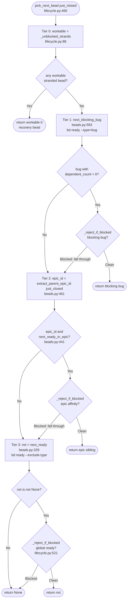

# NextBeadSelectionWaterfall

## What Happens

Between iterations, bead-chain has to answer exactly one question: *which
single bead do we drive next?* It answers with a strict **four-tier
waterfall** in `pick_next_bead` (`lifecycle.py:460`). The tiers are tried
highest-priority first, and the first tier that yields a non-blocked candidate
wins:

0. **Stranded recovery** — any non-container bead already `in_progress` /
   `hooked` from a crashed or cancelled prior run. Finishing in-flight work
   beats starting anything new.
1. **Blocking bug** — any ready `bug` with `dependent_count > 0`. Fixing it
   unblocks downstream work, so it cuts the line.
2. **Epic affinity** — if the `just_closed` bead had a parent epic that still
   has ready siblings, stay inside that epic. Coherent commits/PRs beat
   queue-order optimality ("finish what you start").
3. **Global ready queue** — whatever `bd ready` hands back next.

The defining trait is that **every tier is blocker-aware even though `bd ready`
already filters blockers server-side**. Tier 0 reverts+drops blocked strands
via `_unblocked_strands` (`lifecycle.py:88`); tiers 1-3 run a
belt-and-suspenders `_reject_if_blocked` recheck (`lifecycle.py:521`) backed by
a fresh `bd show`. This is the `bdboard-oals` fix carried into selection: the
chain respects work-time blocks at **pick time**, not just at close time. The
waterfall returns at most one bead (or `None`), and never a blocked or
container-typed one.

> [!IMPORTANT]
> **The tiers are not all equal on a blocked hit.** In tiers 1 and 2 a blocked
> candidate makes the tier *fall through* to the next tier (the
> `... and not _reject_if_blocked(...)` short-circuits). In tier 3 a blocked
> candidate makes the **whole waterfall return `None`** — there is no lower
> tier to fall through to, so a leaked-blocked global-ready bead ends the pick
> rather than driving anything.

## Trigger

`pick_next_bead` is the *mid-chain* selector. It is called by
`activate_next_bead` (`lifecycle.py:544`) on **every** iteration after the
first, with `just_closed` = the bead the LLM judges just closed (passed through
from `close_current_bead_success`, `lifecycle.py:close_current_bead_success`):

1. **Primary pick.** `activate_next_bead` calls `pick_next_bead(just_closed)`
   once (`lifecycle.py:574`), after the `--max=N` safety brake but before any
   claim.
2. **Gate re-probe retry.** If the primary pick returns `None`,
   `activate_next_bead` runs `probe_resolved_gates()` and, if any gate
   resolved, calls `pick_next_bead(just_closed)` a **second** time
   (`lifecycle.py:591`) — a now-satisfied gate may have just re-opened a
   target into `bd ready`.

> [!NOTE]
> The **chain-startup** path does *not* call `pick_next_bead`. Startup
> (`register_callbacks.handle_bead_chain_command`) runs
> `enforce_single_in_progress()` then a bare `next_ready()` for the very first
> bead — there is no `just_closed` yet, so no epic-affinity tier applies. The
> full four-tier waterfall only governs iterations 2..N. See
> [BeadClaimAndBlockerRecheck](BeadClaimAndBlockerRecheck.md).

## Outcome

`pick_next_bead` returns exactly one of:

- **A stranded recovery bead** (tier 0) — already `in_progress`/`hooked`,
  guaranteed unblocked (blocked strands were reverted+dropped). The caller will
  activate it `recovery=True` and skip the claim.
- **A blocking bug** (tier 1) — a fresh ready `bug` with `dependent_count > 0`
  and no open blockers.
- **An epic sibling** (tier 2) — a fresh ready bead under the same parent epic
  as `just_closed`, no open blockers.
- **A global ready bead** (tier 3) — the head of `bd ready`, no open blockers.
- **`None`** — the queue is genuinely empty *or* the only global-ready
  candidate was found blocked at recheck (tier 3 rejection). The caller then
  runs the gate re-probe, and failing that, the session-end drain
  ([SessionEndEpicRollup](SessionEndEpicRollup.md)).

No source files are touched. The only mutation the waterfall itself performs is
inside tier 0: a blocked stranded bead is reverted `in_progress`→`open` via
`revert_to_open` so it re-enters the queue behind its blockers. Everything else
is read-only `bd ready` / `bd list` / `bd show` traffic.



## Step-by-Step

| # | What | Where (file:symbol) | Failure mode |
|---|------|---------------------|--------------|
| 1 | Tier 0: enumerate recoverable strands (`in_progress` + `hooked`), revert+drop any with open blockers, keep the rest | `lifecycle.py:_unblocked_strands` → `beads.py:list_recoverable_strands` (`bd list --status=in_progress/hooked --exclude-type=epic,milestone,gate,molecule --json`) | `BeadsError` from `bd list` propagates to `activate_next_bead`, which stops the chain; a failed `revert_to_open` is logged but the bead is still dropped this pass |
| 2 | Tier 0: if any strand survived, return its head as the recovery candidate | `lifecycle.py:pick_next_bead` (`workable[0]`) | None — pure list head; the caller treats this as `recovery=True` |
| 3 | Tier 1: find the top ready bug with at least one dependent | `beads.py:next_blocking_bug` (`bd ready --type=bug --exclude-type=… --json`, then client-side `dependent_count > 0`) | `BeadsError` propagates → chain stop; a malformed `dependent_count` falls back to `0` (not blocking) |
| 4 | Tier 1: belt-and-suspenders blocker recheck on the bug | `lifecycle.py:_reject_if_blocked(blocking, "blocking bug")` → `beads.py:open_blocker_ids` | Blocked ⇒ warn + **fall through to tier 2** (does not stop); `open_blocker_ids` soft-fails to `[]` on a `bd show` blip |
| 5 | Tier 2: resolve `just_closed`'s parent epic id | `beads.py:extract_parent_epic_id` (`PARENT_EPIC_KEY="parent"`, fallbacks `parent_id`/`epic_id`) | No parent / empty value ⇒ skip tier 2 entirely (returns `None`) |
| 6 | Tier 2: ask bd for the top ready sibling under that epic | `beads.py:next_ready_in_epic` (`bd ready --parent=<epic_id> --exclude-type=… --json`) | `BeadsError` propagates → chain stop; no siblings ⇒ skip to tier 3 |
| 7 | Tier 2: blocker recheck on the sibling | `lifecycle.py:_reject_if_blocked(sibling, "epic affinity")` | Blocked ⇒ warn + **fall through to tier 3** |
| 8 | Tier 3: ask bd for the global head of the ready queue | `beads.py:next_ready` (`bd ready --exclude-type=epic,milestone,gate,molecule --json`, client-side `is_excluded_type` re-filter) | `BeadsError` propagates → chain stop; empty queue ⇒ `nxt is None` ⇒ return `None` |
| 9 | Tier 3: blocker recheck on the global candidate | `lifecycle.py:_reject_if_blocked(nxt, "global ready")` | Blocked ⇒ warn + **return `None`** (no lower tier); otherwise return `nxt` |

## Data Transformations

The waterfall consumes the `just_closed` dict plus live `bd` JSON and produces a
single candidate dict or `None`. The hops:

- **`just_closed` dict → parent epic id (tier 2 key).**
  `extract_parent_epic_id` reads `just_closed["parent"]`, falling back to
  `parent_id` then `epic_id`. An empty/missing value ⇒ `None` ⇒ tier 2 skipped.
- **`bd list --status=… --json` → workable strands (tier 0).**
  `list_recoverable_strands` merges the `in_progress` and `hooked` queries
  (de-duping by `id`, `in_progress` first), then `_unblocked_strands` filters
  each through `open_blocker_ids(bead["id"])`: a non-empty blocker list ⇒
  `revert_to_open(id)` (`bd update <id> --status=open`) + drop; empty ⇒ keep.
- **`bd ready --type=bug --json` → blocking bug (tier 1).** Each item is kept
  only if `issue_type ∈ BLOCKING_BUG_TYPES` (`("bug",)`) **and**
  `int(bead.get("dependent_count", 0)) > 0`.
- **`bd ready --parent=<id> --json` → epic sibling (tier 2).** First item that
  is a dict and not `is_excluded_type` (epic/milestone/gate/molecule).
- **`bd ready --json` → global candidate (tier 3).** Same first-non-container
  selection as tier 2 but with no `--parent` scope.
- **candidate `id` → blocker verdict (tiers 1-3).** `_reject_if_blocked` calls
  `open_blocker_ids`, which re-fetches `bd show <id> --json` and walks
  `dependencies[]`: an edge counts as an open blocker iff its
  `dependency_type ∈ BLOCKING_DEP_TYPES` (`("blocks", "waits-for")`) **and** its
  `status ∉ SATISFIED_BLOCKER_STATUSES` (`frozenset({"closed"})`). A non-empty
  result rejects the candidate.

A representative `bd ready --json` element the waterfall inspects (tier 1 keys
shown — `issue_type`, `dependent_count`; tiers 2/3 only read `id` + `issue_type`
for the container filter):

```json
{
  "id": "bead_chain-x3g",
  "issue_type": "bug",
  "status": "open",
  "priority": 1,
  "title": "Empty-queue gate re-probe before declaring done",
  "parent": "bead_chain-2p3",
  "dependent_count": 3
}
```

The `bd show <id> --json` record `open_blocker_ids` reads during a recheck (only
each dep's `id` / `dependency_type` / `status` matter):

```json
{
  "id": "bead_chain-mol-bps.11",
  "status": "open",
  "issue_type": "task",
  "title": "FlowDoc maintainer: Flow: NextBeadSelectionWaterfall",
  "parent": "bead_chain-mol-bps",
  "dependencies": [
    { "id": "bead_chain-bu5", "dependency_type": "blocks", "status": "closed" },
    { "id": "bead_chain-x3g", "dependency_type": "waits-for", "status": "open" }
  ]
}
```

The waterfall's return value is just the chosen bead dict (or `None`) — the
claim, hint application, and `/goal` arming happen downstream in
[BeadClaimAndBlockerRecheck](BeadClaimAndBlockerRecheck.md).

## Performance Characteristics

- **Synchronous, in-process, once per iteration.** `pick_next_bead` runs on the
  calling thread inside `activate_next_bead`. No async, no threading. It is
  called at most twice per iteration (primary + post-gate-reprobe retry).
- **Bounded, short-circuiting `bd` round-trips.** The waterfall stops at the
  first winning tier, so the spawn count depends on how far down it falls:
  - Tier 0: **2** `bd list` calls (`in_progress` + `hooked`) **+ 1 `bd show`
    per strand** (blocker check). Usually zero strands ⇒ both lists return empty
    fast.
  - Tier 1: **1** `bd ready --type=bug` **+ ≤1 `bd show`** (recheck only if a
    bug candidate exists).
  - Tier 2: **1** `bd ready --parent=<id>` **+ ≤1 `bd show`** (only if
    `just_closed` had a parent epic).
  - Tier 3: **1** `bd ready` **+ ≤1 `bd show`**.
- **Common steady-state cost.** No strands, no blocking bug, an epic in flight:
  tiers 0-2 are cheap probes and tier 2 typically wins ⇒ ~2 `bd list` + 2
  `bd ready` + 1 `bd show`. The blocker rechecks (`bd show`) only fire when a
  tier actually produces a candidate.
- **No N+1 over the queue.** Each `bd ready`/`bd list` returns its list in one
  call; the waterfall only ever inspects the head (plus per-strand checks in
  tier 0, which is normally empty).
- **Every spawn rides the single chokepoint.** All `bd` calls flow through
  `beads.py:_run_bd` (`beads.py:280`) with `DEFAULT_TIMEOUT = 30.0` and retry
  backoff — see
  [BdSubprocessTransport](../Concepts/BdSubprocessTransport.md).
- **No persistence.** The only write is tier 0's `revert_to_open`; the waterfall
  never pushes/pulls/exports — durability is a session-close concern
  ([SessionCloseDurability](../Concepts/SessionCloseDurability.md)).

## Failure Handling

- **Infra errors stop the chain, not the iteration.** Any `BeadsError` from
  `bd list` / `bd ready` propagates out of `pick_next_bead` to
  `activate_next_bead`, which catches it, emits
  `bead-chain stopping — bd ready failed`, calls `state.stop()`, and returns
  `None`. The waterfall never swallows an infra error into a wrong pick.
- **Blocker recheck is fail-open.** `open_blocker_ids` returns `[]` on any
  `bd show` blip, so a transient failure can't mis-reject a workable bead. The
  close-time guard (`close_guard.py`) is the final net.
- **Tier 0 revert is best-effort.** If `revert_to_open` raises while unwinding a
  blocked strand, `_unblocked_strands` logs and **still drops** the bead from
  this pass, so the chain never re-drives it; the next run retries the revert.
- **Container leaks are filtered, not driven.** `next_ready` /
  `next_ready_in_epic` / `list_recoverable_strands` all pass
  `--exclude-type=epic,milestone,gate,molecule` **and** re-filter client-side
  via `is_excluded_type` (the server flag has leaked epics in the wild). A
  container that somehow survives is caught again at the activation boundary —
  see [ContainerTypeExclusion](../Concepts/ContainerTypeExclusion.md).
- **No retries inside the waterfall.** Retry/backoff lives in `_run_bd`; the
  waterfall itself does a single pass. The only "retry" is the caller's
  post-gate-reprobe second call to `pick_next_bead`.
- **No compensation beyond the revert.** The waterfall mutates nothing except
  tier 0's status revert, which is the clean inverse of an earlier claim — there
  is nothing else to undo.

## Key Log Messages

> [!NOTE]
> Several live log strings are emoji-prefixed (chain-link / warning glyphs).
> Emojis are omitted here per the project's no-emoji-in-writes convention; the
> text after the prefix is verbatim.

| Log line | Where | Means |
|----------|-------|-------|
| `bead-chain: found stranded in_progress bead <id> -- recovering before picking new work.` | `lifecycle.py:pick_next_bead` (`emit_warning`) | Tier 0 won: a recoverable strand exists and will be activated `recovery=True`. |
| `bead-chain: stranded in_progress bead <id> is blocked by open issue(s) [<ids>] -- refusing to re-drive it and reverting to open …` | `lifecycle.py:_unblocked_strands` (`emit_warning`) | Tier 0 found a blocked strand and is reverting it (`bdboard-oals` — respect blocks before close). |
| `reverted blocked <id> to open` | `lifecycle.py:_unblocked_strands` (`emit_info`) | The blocked strand was successfully unwound back to the ready queue. |
| `also couldn't revert <id> (still dropping it from this pass): <exc>` | `lifecycle.py:_unblocked_strands` (`emit_warning`) | The revert failed; the strand is dropped from this pass anyway. |
| `bead-chain: blocking bug detected -> prioritising <id>` | `lifecycle.py:pick_next_bead` (`emit_info`) | Tier 1 won: a ready bug with `dependent_count > 0` jumped the queue. |
| `bead-chain: epic affinity -> staying inside <epic_id>` | `lifecycle.py:pick_next_bead` (`emit_info`) | Tier 2 won: a ready sibling under `just_closed`'s parent epic was chosen. |
| `bead-chain: <tier> candidate <id> has open blocker(s) [<ids>] -- refusing to claim it (bd ready leaked a blocked bead; respecting work-time blocks anyway).` | `lifecycle.py:_reject_if_blocked` (`emit_warning`) | A tier's candidate failed the belt-and-suspenders recheck (`<tier>` ∈ `blocking bug` / `epic affinity` / `global ready`). |
| `bead-chain: found <N> in_progress beads (residue from a hard crash …). Recovering <id> first; the rest will be picked up one-at-a-time …` | `lifecycle.py:enforce_single_in_progress` (`emit_warning`) | Startup invariant guard found multiple strands; the extras drain one-at-a-time through tier 0 on later iterations. |

## Common Issues

| Symptom | Likely cause | Fix |
|---------|--------------|-----|
| The chain keeps re-picking the same `in_progress` bead | Tier 0 recovery is firing: a prior run left a strand that the judges never closed | Resolve/close the strand (`bd show <id>`; finish or `bd close <id>`); tier 0 only yields while a recoverable strand exists. |
| A blocking bug isn't jumping the queue | The bug has `dependent_count == 0`, or its type isn't in `BLOCKING_BUG_TYPES` (`("bug",)`) | `bd show <id> --json` and confirm `issue_type == "bug"` and at least one bead depends on it; add a dependency edge or widen `BLOCKING_BUG_TYPES`. |
| The chain hops out of an epic mid-way | Tier 2 only fires when `next_ready_in_epic` returns an *unblocked* sibling; all remaining siblings are blocked or done | Check `bd ready --parent=<epic_id>`; if siblings are blocked they correctly defer to the global queue until unblocked. |
| The waterfall returns `None` even though `bd ready` shows work | Tier 3's only candidate was found blocked at recheck (returns `None`, no fall-through), or every ready bead is a container type | `bd show <head> --json` and inspect `dependencies[].status` (only `closed` satisfies); or verify the items aren't epics/milestones/gates/molecules. |
| Epic affinity never kicks in | `extract_parent_epic_id(just_closed)` found no parent — the closed bead had no `parent`/`parent_id`/`epic_id` field | Confirm the bead is actually parented under an epic in bd; standalone beads correctly skip tier 2. |
| A blocked bead got driven anyway | Should not happen — but `open_blocker_ids` fail-opens on a `bd show` blip | The close-time guard (`close_guard.py`) is the backstop; check bd connectivity if `bd show` is flaky. |

## Related

- [BeadClaimAndBlockerRecheck](BeadClaimAndBlockerRecheck.md) — the activation
  gauntlet that claims and arms the single candidate this waterfall returns;
  shares `open_blocker_ids` / `revert_to_open` / `is_excluded_type`.
- [StrandedBeadRecovery](StrandedBeadRecovery.md) — tier 0 in depth: how
  `_unblocked_strands` / `list_recoverable_strands` find and revert strands.
- [ChainIterationLoop](ChainIterationLoop.md) — the outer loop that closes the
  current bead and calls `activate_next_bead` (and thus this waterfall) each
  iteration.
- [GoalPromptConstruction](GoalPromptConstruction.md) — renders the bead this
  waterfall selects into the `/goal` prompt.
- [SessionEndEpicRollup](SessionEndEpicRollup.md) — what runs when the waterfall
  returns `None` (after the gate re-probe): the session-end drain + rollup.
- [ContainerTypeExclusion](../Concepts/ContainerTypeExclusion.md) — why
  epics/milestones/gates/molecules are filtered out of every tier's query.
- [BdSubprocessTransport](../Concepts/BdSubprocessTransport.md) — the transport
  behind the `bd ready` / `bd list` / `bd show` spawns each tier makes.
- [ChainStateSingleton](../Concepts/ChainStateSingleton.md) — holds
  `current_bead` (the `just_closed` source) and `max_iterations`.
- [QueueDriverNotGoalEngine](../Concepts/QueueDriverNotGoalEngine.md) — the SRP
  boundary: the waterfall picks from bd's frontier, it never invents goals or
  reorders bd's own priority.
- [SessionCloseDurability](../Concepts/SessionCloseDurability.md) — why this
  flow only reverts status and never pushes bead state.
- [RecurringMoleculeProtection](../Concepts/RecurringMoleculeProtection.md) —
  related molecule/fan-out handling beyond the simple blocker rechecks here.
- [Flows Index](index.md)
- [Architecture](../Architecture.md)
- [FlowDoc Manifest](../_Manifest.md)
