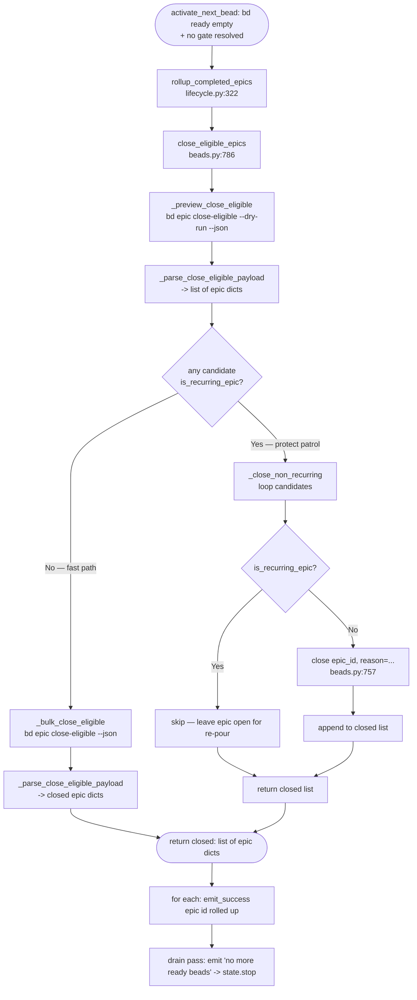

# SessionEndEpicRollup

## What Happens

When bead-chain's ready queue finally drains (no claimable child bead left,
even after the gate probe), it runs **one** courtesy sweep that auto-closes any
epic whose children are now all complete. It does this exactly once per session
— deliberately *not* after every individual child close — because `bd epic
close-eligible` runs a server-side cascade (closing A's last child makes A
eligible, which can make A's parent B eligible, and so on) that, if fired
per-bead, can sweep up unrelated epics. Before letting `bd` cascade, the sweep
**previews** the eligible set with a non-destructive `--dry-run` and partitions
it: if any candidate is a recurring molecule epic (a poured `patrol`), it
bypasses the bulk cascade and closes only the safe, non-recurring epics one at a
time, leaving recurring epics open for re-pour. Every step soft-fails — a
flaky/old/missing `bd epic` logs a warning and the chain still ends cleanly,
because rollup is cleanup, not bead-chain's core mission.

## Trigger

`lifecycle.rollup_completed_epics()` (`lifecycle.py:322`) is called from exactly
one site: the **drain pass** inside `lifecycle.activate_next_bead`
(`lifecycle.py:617`). That branch is reached only when `pick_next_bead` returns
`None` *twice* — once on the first probe, and again after
`probe_resolved_gates()` failed to re-open any gate target — i.e. there is
genuinely no ready work and no gate about to release some. The per-bead rollup
that used to live in `register_callbacks._on_interactive_turn_end`
(`register_callbacks.py:336`) was deliberately removed (the `bead_chain-tfn`
fix); that call site now only documents *why* rollup is session-scoped and
defers to `activate_next_bead`.

> [!IMPORTANT]
> A **drain is not a session boundary** for durability. This flow closes epics
> but never pushes/pulls/exports bead state — `bd dolt push` lives in
> session-close, not here (see
> [SessionCloseDurability](../Concepts/SessionCloseDurability.md) and
> [QueueDriverNotGoalEngine](../Concepts/QueueDriverNotGoalEngine.md)). The
> only mutation this flow performs is closing eligible epics.

## Outcome

Zero or more epics transition to closed in the bd database, each announced with
an `epic <id> rolled up (all children complete)` success line (the live
source string is emoji-prefixed; emojis are omitted here per project
convention). The function
returns `None` (it is a side-effecting cleanup, not a value producer); the
drain pass then emits the final `no more ready beads … Good boy!` line, calls
`state.stop()`, and returns `None` to end the chain. No child beads, no
`current_bead`, and no source files are touched — only epic *containers* get
closed. Recurring (`patrol`) epics are intentionally left open.



## Step-by-Step

| # | What | Where (file:symbol) | Failure mode |
|---|------|---------------------|--------------|
| 1 | Reach the drain branch: `pick_next_bead` returned `None`, `probe_resolved_gates()` re-opened nothing, second `pick_next_bead` still `None` | `lifecycle.py:activate_next_bead` | `bd ready` raising `BeadsError` short-circuits earlier with a "bd ready failed" warning + `state.stop()` — rollup is never reached |
| 2 | Invoke the once-per-session rollup | `lifecycle.py:rollup_completed_epics` → `beads.close_eligible_epics` | Any `BeadsError` from the close path is caught here → `emit_warning("bead-chain: epic rollup failed (continuing)")` and `return` (chain still ends cleanly) |
| 3 | Preview the eligible set non-destructively | `beads.py:close_eligible_epics` → `beads.py:_preview_close_eligible` → `_run_bd("epic","close-eligible","--dry-run","--json")` | Empty / non-JSON output → `_parse_close_eligible_payload` returns `[]` (nothing to close); real infra failure (bd missing, non-zero exit) raises `BeadsError`, caught at step 2 |
| 4 | Normalise the dry-run payload into epic dicts (so `labels` are visible) | `beads.py:_parse_close_eligible_payload` (`_is_closed_epic`, `_normalise_closed_epic`) | Unrecognised JSON shape → `[]` |
| 5 | Decide path: is **any** candidate a recurring molecule epic? | `beads.py:close_eligible_epics` → `beads.py:is_recurring_epic` | `is_recurring_epic` treats non-dict/missing markers as *not recurring* (safe default — an ordinary epic still rolls up) |
| 6a | **Fast path** (no recurring epic): run bd's native one-shot cascade | `beads.py:_bulk_close_eligible` → `_run_bd("epic","close-eligible","--json")` → `_parse_close_eligible_payload` | Unparseable-but-successful output → `[]` (rollup *still happened*, just unlogged); real failure raises `BeadsError` |
| 6b | **Protect path** (≥1 recurring epic): close each non-recurring candidate individually, skip recurring ones | `beads.py:_close_non_recurring` → `beads.py:close` (`reason="all children complete (bead-chain rollup)"`) | Per-epic `BeadsError` is swallowed (`continue`) so one stubborn epic can't strand the rest; the next session retries it |
| 7 | Log every closed epic | `lifecycle.py:rollup_completed_epics` (`emit_success`) | None — pure formatting of `id` / `title` (`<unknown>` / empty-title fallbacks) |
| 8 | Emit the drain-complete line and stop the chain | `lifecycle.py:activate_next_bead` (`emit_success`, `state.stop`) | None |

## Data Transformations

The whole flow consumes bd's `epic close-eligible` JSON and produces a list of
closed-epic dicts plus log lines. The hops:

- **`bd epic close-eligible --dry-run --json` → candidate epic dicts.** bd emits
  a list of `{"epic": {…full record incl labels…}, "eligible_for_close": true}`
  envelopes. `_normalise_closed_epic` unwraps each nested `epic` key so
  `is_recurring_epic` can read the inner `labels` / `metadata` /
  `mol_type` fields.
- **candidate dict → recurrence verdict.** `is_recurring_epic(epic)` inspects
  three signals: the forward-compat `mol_type` / `mol-type` / `molecule_type`
  field (top-level *and* nested under `metadata`) against
  `RECURRING_MOL_TYPES = ("patrol",)`, and the epic's `labels` list (lowercased)
  against `RECURRING_EPIC_LABELS = ("patrol", "mol-type:patrol", "recurring")`.
  Either positive signal → `True` (protect); otherwise `False`.
- **fast path: `bd epic close-eligible --json` → closed epic dicts.** Several
  shapes are tolerated and flattened by `_parse_close_eligible_payload`:
  - bd 1.0.4 wraps bare string ids: `{"closed": ["abc-1","abc-2"], "count": 2}`
    → each id normalised to `{"id": "abc-1"}`.
  - older bd: a bare top-level `list` of epic dicts.
  - alt envelope: `{"epics": [...]}`.
  - per-item envelope: `{"epic": {...}}` → unwrapped to the inner dict.
- **protect path: candidate list → close calls.** For each non-recurring
  candidate, `str(epic.get("id","")).strip()` yields the id passed to
  `close(epic_id, reason="all children complete (bead-chain rollup)")`, which
  shells out `bd close <id> --reason <reason>`.
- **closed list → log lines.** Each closed epic's `id`
  (`str(epic.get("id","<unknown>"))`) and `title`
  (`str(epic.get("title","")).strip()`) render
  `epic <id> rolled up (all children complete) — <title>` (the `— <title>`
  suffix is dropped when the title is empty).

```json
{
  "epic": {
    "id": "bead_chain-mol-bps",
    "title": "FlowDoc maintainer: discover & scaffold",
    "issue_type": "epic",
    "labels": ["docs", "flowdoc"]
  },
  "eligible_for_close": true
}
```

```json
{ "closed": ["bead_chain-mol-bps", "bead_chain-2p3"], "count": 2 }
```

## Performance Characteristics

- **Synchronous, in-process, once per session.** The sweep runs on the calling
  thread inside the drain branch of `activate_next_bead`, exactly once per chain
  run (never per-bead). There is no async or threading.
- **Bounded `bd` subprocess round-trips.** Always one `epic close-eligible
  --dry-run` (the preview). Then **either** one `epic close-eligible` (fast
  path) **or** *N* `close` calls — one per non-recurring eligible epic (protect
  path). In the common case (nothing recurring) the whole flow is **2** bd
  spawns: dry-run + bulk close. Every spawn goes through the single chokepoint
  `beads.py:_run_bd` and carries its retry/timeout policy
  (`DEFAULT_TIMEOUT = 15.0`, `MAX_ATTEMPTS = 3`) — see
  [BdSubprocessTransport](../Concepts/BdSubprocessTransport.md).
- **The cascade lives server-side.** The fast path's single
  `bd epic close-eligible` does bd's full parent-chain cascade in one call, so a
  deep epic→parent→grandparent chain rolls up without bead-chain looping.
- **No N+1 in the common case.** Only the protect path is O(N) in eligible
  epics, and it is taken solely when a recurring epic is present — the price of
  not trusting bd's bulk cascade not to sweep the patrol epic.

## Failure Handling

- **Soft-fail at the lifecycle boundary.** `rollup_completed_epics` wraps the
  entire close path in `try/except BeadsError`; any infra failure (bd missing,
  non-zero exit, timeout exhausted) is logged as a warning and swallowed so the
  drain still finishes and `state.stop()` runs. Rollup is courtesy cleanup, not
  the core mission.
- **Silent-success on unparseable output.** `_parse_close_eligible_payload`
  returns `[]` for empty / non-JSON / unexpected-shape payloads rather than
  raising — an older bd that prints non-JSON even under `--json` *did* still run
  the rollup; we just can't enumerate what closed, which only means quieter logs.
- **Per-epic isolation on the protect path.** `_close_non_recurring` catches
  `BeadsError` per epic and `continue`s, so one stubborn epic can't strand the
  rest of the rollup; the next session's pass retries it.
- **No retries here; no compensation.** Transient-timeout retries live one layer
  down in `_run_bd`. There is nothing to roll back — closing an epic is the
  terminal cleanup; a failed close simply means the epic stays open for the next
  session to retry.
- **Recurring epics are never closed.** Detected by `is_recurring_epic` and
  skipped on the protect path; on the fast path the protect path is taken
  *instead of* the bulk cascade precisely so a `patrol` epic is never swept up
  (see [RecurringMoleculeProtection](../Concepts/RecurringMoleculeProtection.md)).

## Key Log Messages

> [!NOTE]
> The live source log strings are emoji-prefixed (e.g. a target emoji on the
> rollup lines, an hourglass on the gate line). Emojis are omitted from this
> doc per the project's no-emoji-in-writes convention; the text after the
> prefix is verbatim.

| Log line | Where | Means |
|----------|-------|-------|
| `epic <id> rolled up (all children complete) — <title>` | `lifecycle.py:rollup_completed_epics` (`emit_success`) | An eligible epic was closed (suffix `— <title>` omitted when the epic has no title). |
| `bead-chain: epic rollup failed (continuing): <exc>` | `lifecycle.py:rollup_completed_epics` (`emit_warning`) | `close_eligible_epics` raised `BeadsError`; the rollup was skipped but the chain ends cleanly. |
| `bead-chain: no more ready beads. Closed <n> this run. Good boy!` | `lifecycle.py:activate_next_bead` (`emit_success`) | The drain pass completed (rollup ran, then the chain stopped). |
| `<n> gate(s) resolved on the empty-queue probe …` | `lifecycle.py:probe_resolved_gates` (`emit_success`) | A gate re-opened a target *before* this rollup ran, so the chain re-probed `bd ready` and did **not** reach the rollup this pass. |

## Common Issues

| Symptom | Likely cause | Fix |
|---------|--------------|-----|
| A `patrol` epic got auto-closed | The epic carries none of the recurrence markers `is_recurring_epic` checks (no `patrol`/`recurring` label, no `mol_type` field) | Tag the poured molecule's epic with a `patrol` (or `recurring` / `mol-type:patrol`) label — that's the contract that fires today, since bd 1.0.x doesn't surface `mol_type` on `epic close-eligible --json`. |
| Eligible epics didn't close this session | `bd epic close-eligible` errored (caught → warning), or returned unparseable output (`[]`), or the queue never actually drained | Confirm `bd epic close-eligible --dry-run --json` returns valid JSON; the rollup only runs on a genuinely empty queue after the gate probe, and a parse failure is treated as silent success. |
| A parent epic closed one session later than expected | Per `bead_chain-tfn`, rollup is once-per-session; bd's cascade is limited to a single pass to avoid sweeping unrelated epics | Expected trade-off (data safety over single-pass cascade). The next session's drain rolls up the newly-eligible parent. |
| Rollup logged success but no epic shows closed | Unparseable-but-successful bd output → the close happened, the enumeration didn't | Verify with `bd show <epic_id>`; the empty return is a deliberate degrade, not a failed close. |
| One epic in a batch stayed open while others closed | That epic's individual `close` raised `BeadsError` on the protect path and was swallowed per-epic | Inspect that epic (`bd show <id>`); the next session's rollup retries it. |

## Related

- [EpicRollup](../Features/EpicRollup.md) — the user-facing feature this flow
  implements.
- [ChainIterationLoop](ChainIterationLoop.md) — the outer loop whose drain pass
  triggers this flow.
- [NextBeadSelectionWaterfall](NextBeadSelectionWaterfall.md) — returns `None`
  (empty queue), the precondition that hands control to this rollup.
- [StrandedBeadRecovery](StrandedBeadRecovery.md) — tier 0 of that same
  waterfall; both are consulted before the drain pass reaches this rollup.
- [RecurringMoleculeProtection](../Concepts/RecurringMoleculeProtection.md) —
  the preview-then-partition guard that keeps `patrol` epics open.
- [ContainerTypeExclusion](../Concepts/ContainerTypeExclusion.md) — why epics
  are containers bead-chain closes here but never *drives* as work.
- [SessionCloseDurability](../Concepts/SessionCloseDurability.md) — why this
  drain-time flow closes epics but never pushes bead state.
- [QueueDriverNotGoalEngine](../Concepts/QueueDriverNotGoalEngine.md) — the SRP
  boundary: a drain is not a session boundary.
- [BdSubprocessTransport](../Concepts/BdSubprocessTransport.md) — the transport
  behind the `epic close-eligible` / `close` spawns.
- [ChainStateSingleton](../Concepts/ChainStateSingleton.md) — holds
  `completed_count` reported in the drain line and the `active` flag flipped by
  `state.stop()` at the end of this flow.
- [BeadChaining](../Features/BeadChaining.md) — the queue driver whose drain
  pass triggers this once-per-session rollup.
- [BeadClaimAndBlockerRecheck](BeadClaimAndBlockerRecheck.md) — the activation
  gauntlet whose `None` (empty queue) result hands control to this drain.
- [Flows Index](index.md)
- [Architecture](../Architecture.md)
- [FlowDoc Manifest](../_Manifest.md)
