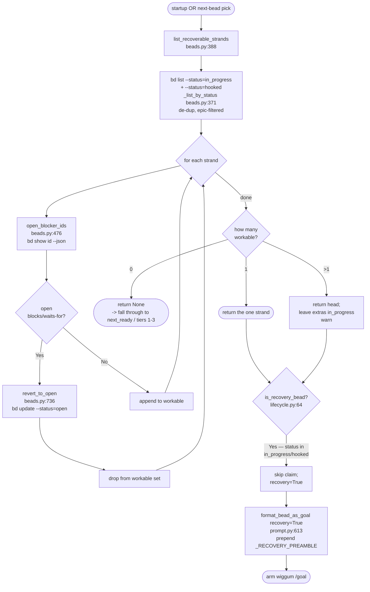

# StrandedBeadRecovery

## What Happens

A previous bead-chain run claimed a bead (flipped it to `in_progress`), did
some real work on disk, then died before the LLM judges could close it — a
`Ctrl+C`, a runtime cancel, a hard crash (SIGKILL / power loss / OS reboot), a
`bd close` failure, or another agent flipping the bead to `hooked` mid-flight.
That bead is now **stranded**: it's invisible to `bd ready` (claimed/hooked
beads are off the ready frontier) yet it carries partial work that must not be
orphaned or redone from scratch.

Stranded-bead recovery is the rule that **finds that bead first and re-drives
it before any fresh work**. It runs at two moments — chain startup and at the
top of every next-bead pick — and is the highest-priority tier (tier 0) of the
selection waterfall. When it finds a stranded bead it does **not** re-claim it
(it's already `in_progress`); instead it re-prompts the agent with a *recovery
preamble* that says "assess what's already on disk before doing anything new —
the bead may already be satisfied." Crucially, before recovering, it checks the
bead's work-time blockers: a stranded bead that got re-blocked is **reverted to
`open`** (sent back behind its blockers) rather than re-driven — that is the
`bdboard-oals` fix, because the recovery query bypasses the ready frontier and
would otherwise run blocked work to completion and only trip at `bd close`.

> [!IMPORTANT]
> The one-bead-at-a-time discipline means there should be **at most one**
> stranded bead. If recovery finds more than one (residue from a hard crash or
> a pre-fix session), it recovers the **head** and leaves the rest
> `in_progress`; they get picked up one at a time on subsequent iterations via
> this same tier-0 branch. It never bulk-reverts the extras — every
> `in_progress` bead is real partial work paired with its bead.

## Trigger

Recovery is consulted at two distinct sites, both reading the same recoverable
set:

1. **Chain startup.** `register_callbacks.handle_bead_chain_command`
   (`register_callbacks.py:169`) calls `enforce_single_in_progress()`
   (`lifecycle.py:138`) *before* `next_ready()` — the recovery check beats the
   ready queue, so a half-finished bead from a prior run is resumed before any
   new bead is claimed (`register_callbacks.py:192`).
2. **Every next-bead pick.** `lifecycle.pick_next_bead` (`lifecycle.py:460`)
   makes the stranded set tier 0 of its four-tier waterfall — it runs
   `_unblocked_strands()` (`lifecycle.py:88`) and returns the head before even
   looking at blocking bugs, epic affinity, or the global ready queue.

The *upstream* cause is one of bead-chain's exit paths leaving a bead claimed:
the `Ctrl+C` / cancel hook `_on_interactive_turn_cancel`
(`register_callbacks.py:360`) deliberately leaves the in-flight bead
`in_progress`, and a `bd close` failure in `close_current_bead_success`
(`lifecycle.py:201`) likewise leaves it `in_progress` and stops the chain. A
hard crash bypasses both handlers but lands in the same observable state.

## Outcome

Exactly one of three things happens to each stranded bead the recovery set
sees:

- **Recovered.** A workable (unblocked) stranded bead is returned to the runner
  and armed as the current `/goal` with `format_bead_as_goal(bead,
  recovery=True)` (`prompt.py:613`), which prepends `_RECOVERY_PREAMBLE`
  (`prompt.py:47`). The bead is **not** re-claimed (`claim` is skipped because
  it's already `in_progress` — `register_callbacks.py:260`). The agent assesses
  on-disk state and either reports "already done" or continues from where the
  prior run stopped; the LLM judges then rule and close it.
- **Reverted to open.** A stranded bead with open work-time blockers is pushed
  back to `open` via `revert_to_open(bead_id)` (`beads.py:736` →
  `bd update <id> --status=open`) and dropped from the workable set, re-entering
  the ready queue *behind* its blockers. Best-effort: if the revert itself
  fails, the bead is still dropped from this pass so it's never driven.
- **Left in place.** When more than one stranded bead exists, only the head is
  recovered; the extras stay `in_progress` for later one-at-a-time recovery.

No source files are touched by this flow — it only changes bead *status*
(recover = leave `in_progress` + re-prompt; revert = `in_progress`/`hooked` →
`open`).



## Step-by-Step

| # | What | Where (file:symbol) | Failure mode |
|---|------|---------------------|--------------|
| 1 | Enumerate the recoverable set: union of `in_progress` and `hooked` non-epic beads, de-duped (first occurrence wins), `in_progress` first | `beads.py:list_recoverable_strands` → `beads.py:_list_by_status` (`bd list --status=<s> --exclude-type=epic --json`) | Infra failure (bd missing, timeout, non-list/bad JSON) raises `BeadsError`; at startup `enforce_single_in_progress` catches it → warn + `return None`; in `pick_next_bead` it propagates to `activate_next_bead`, which stops the chain |
| 2 | For each strand, fetch live work-time blockers (`blocks` + `waits-for` edges that aren't `closed`) | `lifecycle.py:_unblocked_strands` → `beads.py:open_blocker_ids` (`bd show <id> --json`) | `open_blocker_ids` soft-fails to `[]` (treated as unblocked) on any `bd show` blip — close-time guard is the backstop |
| 3 | If blocked: revert the strand to `open` and drop it from the workable set | `lifecycle.py:_unblocked_strands` → `beads.py:revert_to_open` (`bd update <id> --status=open`) | Revert raises `BeadsError` → warn (`also couldn't revert …`) but the bead is **still dropped** from this pass, so it's never driven |
| 4 | If unblocked: keep it in the workable list | `lifecycle.py:_unblocked_strands` (`workable.append`) | None — pure list build |
| 5a | **Startup path:** 0 workable → `return None` (fall back to `next_ready`); 1 → return it; >1 → return head, leave extras `in_progress`, warn | `lifecycle.py:enforce_single_in_progress` | Listing raised at step 1 → caught → `return None` so the normal startup probe handles whatever it can see |
| 5b | **Pick path (tier 0):** if workable non-empty, return `workable[0]` and warn `found stranded in_progress bead … recovering before picking new work`; else fall through to tiers 1-3 | `lifecycle.py:pick_next_bead` | `BeadsError` from `_unblocked_strands` propagates → `activate_next_bead` warns + `state.stop()` |
| 6 | Classify the picked bead as a recovery bead (status ∈ `{in_progress, hooked}`, case-insensitive) | `lifecycle.py:is_recovery_bead` (`_RECOVERY_STATUSES`, sourced from `beads.RECOVERABLE_STATUSES`) | None — pure dict read; missing/empty status → `False` (treated as fresh) |
| 7 | Skip `claim` for recovery beads (already `in_progress`); re-claiming is a no-op at best, a bd error at worst | `register_callbacks.py:handle_bead_chain_command` (`if not recovery: claim(...)`) | Fresh beads only: `claim` raising `BeadsError` → warn + `state.stop()` |
| 8 | Arm `/goal` with the recovery preamble so the agent assesses on-disk state before any new work | `prompt.py:format_bead_as_goal(recovery=True)` → `prompt.py:_RECOVERY_PREAMBLE` | None — pure string assembly |

## Data Transformations

The flow consumes bd's `list` and `show` JSON and produces either one bead dict
to drive (recovery), a status mutation (revert), or `None`. The hops:

- **`bd list --status=in_progress …` + `bd list --status=hooked …` → merged
  strand dicts.** `_list_by_status` runs each query in `RECOVERABLE_STATUSES`
  (`beads.py:198` — `(in_progress, hooked)`), parses the list via
  `_parse_json_list`, and re-filters epics client-side with `is_excluded_type`
  (the server-side `--exclude-type=epic` flag has leaked epics in the wild).
  `list_recoverable_strands` merges them, de-duping on `str(bead["id"]).strip()`
  so a version-drift echo can't make recovery see the same id twice.
- **strand dict → blocker id list.** `open_blocker_ids` re-fetches the bead with
  `bd show <id> --json` (only `show` carries each dependency's `status` +
  `dependency_type`), then walks `bead["dependencies"]`: for each edge whose
  `dependency_type` ∈ `BLOCKING_DEP_TYPES` (`("blocks", "waits-for")`) and whose
  `status` ∉ `SATISFIED_BLOCKER_STATUSES` (`frozenset({"closed"})`), it collects
  `dep["id"]`. A non-empty list ⇒ revert; empty ⇒ workable.
- **blocked strand → `open` status.** `revert_to_open(str(bead["id"]))` shells
  `bd update <id> --status=open`; the bead leaves the `in_progress`/`hooked`
  set and re-enters `bd ready` behind its blockers.
- **workable strand → recovery verdict.** `is_recovery_bead` lowercases
  `bead["status"]` and tests membership in `_RECOVERY_STATUSES`
  (`{"in_progress", "hooked"}`); `True` ⇒ skip claim + `recovery=True`.
- **recovery bead → goal prompt.** `format_bead_as_goal(bead, recovery=True)`
  prepends `_RECOVERY_PREAMBLE` to the standard
  `Complete beads issue <id>: <title> …` body.

A representative `bd show <id> --json` dependency record that `open_blocker_ids`
inspects (only `dependency_type`, `status`, and `id` are read):

```json
{
  "id": "bead_chain-mol-bps.13",
  "status": "in_progress",
  "issue_type": "task",
  "title": "FlowDoc maintainer: Flow: StrandedBeadRecovery",
  "dependencies": [
    { "id": "bead_chain-bu5", "dependency_type": "blocks", "status": "open" },
    { "id": "bead_chain-x3g", "dependency_type": "waits-for", "status": "closed" }
  ]
}
```

A representative `bd list --status=in_progress --exclude-type=epic --json`
element (the strand list `_list_by_status` returns):

```json
{
  "id": "bead_chain-mol-bps.13",
  "status": "in_progress",
  "issue_type": "task",
  "title": "FlowDoc maintainer: Flow: StrandedBeadRecovery",
  "parent": "bead_chain-mol-bps"
}
```

## Performance Characteristics

- **Synchronous, in-process, every pick.** Tier 0 runs on the calling thread
  inside `pick_next_bead`, which `activate_next_bead` calls on every iteration
  (plus once at startup via `enforce_single_in_progress`). There is no async or
  threading.
- **Bounded `bd` round-trips per pass.** The strand enumeration is **2**
  `bd list` spawns (one per status in `RECOVERABLE_STATUSES`). Then it's **1**
  `bd show` per strand (`open_blocker_ids`), plus **1** `bd update` per *blocked*
  strand (`revert_to_open`). In the steady-state common case — at most one
  stranded bead, unblocked — that's `2 list + 1 show = 3` spawns, then the bead
  is recovered with **no** `claim` call (recovery beads skip it).
- **O(N) in stranded beads, but N is ≈1 by design.** The per-strand `bd show`
  blocker check is the only N-dependent cost; the one-bead-at-a-time discipline
  keeps N at 1 in practice, so there is no realistic N+1 explosion. A >1 set
  only appears after a hard crash and is drained one bead per iteration.
- **Every spawn rides the single chokepoint.** `bd list`, `bd show`, and
  `bd update` all flow through `beads.py:_run_bd` with its retry/timeout policy
  (`DEFAULT_TIMEOUT = 30.0`, `MAX_ATTEMPTS = 3`) — see
  [BdSubprocessTransport](../Concepts/BdSubprocessTransport.md).
- **No persistence here.** Recovery reads status and at most flips it; it never
  pushes/pulls/exports bead state. Durability is a session-close concern — see
  [SessionCloseDurability](../Concepts/SessionCloseDurability.md).

## Failure Handling

- **Soft-fail at the startup boundary.** `enforce_single_in_progress` wraps the
  enumeration in `try/except BeadsError`; a bd outage there warns
  (`couldn't enumerate in_progress beads …; continuing without invariant
  check`) and returns `None`, so startup falls through to the normal
  `next_ready` probe rather than halting.
- **Hard-fail at the pick boundary (deliberately).** In `pick_next_bead`, a
  `BeadsError` from `_unblocked_strands` is *not* swallowed — it propagates to
  `activate_next_bead`, which warns `bd ready failed` and calls `state.stop()`.
  Mid-chain, an unreadable bd means we cannot safely pick, so we stop cleanly.
- **Blocker check is fail-open, backstopped at close.** `open_blocker_ids`
  returns `[]` on any `bd show` blip, so a transient failure can't strand the
  chain by mis-flagging a workable bead; the close-time guard
  (`close_guard.py`) remains the final net that refuses to close a bead with
  open blockers.
- **Revert is best-effort, never blocking.** If `revert_to_open` raises, the
  blocked strand is still dropped from the workable set for this pass, so it is
  never re-driven; the next pass retries the revert.
- **No re-claim, no re-run of done work.** Recovery beads skip `claim` (avoiding
  a bd error on an already-claimed bead) and carry the `_RECOVERY_PREAMBLE`,
  which instructs the agent to report "already satisfied" instead of churning —
  the compensation for a crash is *assessment*, not blind redo.
- **No compensation/rollback.** There is nothing to undo: recovery either
  resumes in place or unwinds the claim with `revert_to_open` (the clean
  inverse of `claim`).

## Key Log Messages

> [!NOTE]
> The live source log strings are emoji-prefixed (chain-link, warning, and
> bookmark glyphs). Emojis are omitted from this doc per the project's
> no-emoji-in-writes convention; the text after the prefix is verbatim.

| Log line | Where | Means |
|----------|-------|-------|
| `Recovering stranded in_progress bead <id> -- agent will assess current state before doing new work.` | `register_callbacks.py:handle_bead_chain_command` (`emit_warning`) | Startup found a single recoverable strand and is resuming it instead of claiming fresh work. |
| `bead-chain: found stranded in_progress bead <id> -- recovering before picking new work.` | `lifecycle.py:pick_next_bead` (`emit_warning`) | Tier-0 mid-chain recovery: a strand was picked ahead of blocking bugs / epic affinity / the ready queue. |
| `bead-chain: stranded in_progress bead <id> is blocked by open issue(s) [<ids>] -- refusing to re-drive it and reverting to open (work-time blocks must be respected, not just at close-time).` | `lifecycle.py:_unblocked_strands` (`emit_warning`) | A stranded bead got re-blocked; it's being unwound to `open` rather than recovered (the `bdboard-oals` fix). |
| `reverted blocked <id> to open` | `lifecycle.py:_unblocked_strands` (`emit_info`) | The blocked-strand revert succeeded; the bead is back behind its blockers. |
| `also couldn't revert <id> (still dropping it from this pass): <exc>` | `lifecycle.py:_unblocked_strands` (`emit_warning`) | The revert failed, but the bead is still dropped so it's never driven this pass. |
| `bead-chain: found <n> in_progress beads (residue from a hard crash or pre-fix session). Recovering <head_id> first; the rest will be picked up one-at-a-time via the recovery tier: <ids>` | `lifecycle.py:enforce_single_in_progress` (`emit_warning`) | More than one strand exists; the head is recovered and the extras are left `in_progress` for later. |
| `bead-chain: couldn't enumerate in_progress beads (<exc>); continuing without invariant check.` | `lifecycle.py:enforce_single_in_progress` (`emit_warning`) | The startup strand query hit a bd outage; recovery soft-fails and startup falls through to `next_ready`. |
| `Bead <id> left in_progress — the next /bead-chain run will resume it with a recovery preamble so the agent assesses the current state before doing new work.` | `register_callbacks.py:_on_interactive_turn_cancel` (`emit_system_message`) | The *upstream* of recovery: `Ctrl+C`/cancel left a bead stranded for the next run to pick up. |

## Common Issues

| Symptom | Likely cause | Fix |
|---------|--------------|-----|
| A crashed-on bead got re-run from scratch instead of resuming | The agent ignored `_RECOVERY_PREAMBLE` and redid work, or the bead was reverted to `open` (so it came back as a *fresh* claim) because it had open blockers | Confirm the bead's status when re-picked: `bd show <id>`. If it's `open` it was reverted (it was blocked); the redo is correct. If `in_progress`, the preamble fired — the agent should have assessed first. |
| A `hooked` bead never gets recovered | Running an old bead-chain that queried only `--status=in_progress` (pre-FB-12) | Recovery now enumerates `RECOVERABLE_STATUSES = (in_progress, hooked)` via `list_recoverable_strands`; ensure you're on the fixed build (`beads.py:198`). |
| Two beads stuck `in_progress` and only one moves per run | Residue from a hard crash; recovery deliberately recovers the head and leaves extras `in_progress` | Expected — the extras drain one-at-a-time on subsequent iterations via tier 0. Let the chain run; don't bulk-revert them (each is real partial work). |
| A stranded bead with a closed blocker still got reverted | Stale `bd show` dependency cache, or the blocker isn't actually `closed` | `bd show <id> --json` and inspect `dependencies[].status`; only `closed` satisfies a blocker (`SATISFIED_BLOCKER_STATUSES`). `in_progress`/`blocked`/`open` blockers all gate. |
| A blocked stranded bead ran to completion and only failed at `bd close` | The `bdboard-oals` regression — recovery bypassed the ready frontier without a blocker recheck | This is exactly what `_unblocked_strands` + `open_blocker_ids` prevent; verify the revert path is present (`lifecycle.py:88`, `beads.py:476`). The close-guard is the last net if it ever slips. |
| Recovery silently did nothing on startup | The strand query hit a bd outage and soft-failed to `None` | Check for the `couldn't enumerate in_progress beads` warning; fix bd connectivity and re-run — startup fell through to `next_ready` rather than halting. |

## Related

- [NextBeadSelectionWaterfall](NextBeadSelectionWaterfall.md) — the four-tier
  pick; this flow **is** its tier 0, ahead of blocking bug / epic affinity /
  global ready.
- [BeadClaimAndBlockerRecheck](BeadClaimAndBlockerRecheck.md) — the claim-time
  blocker recheck that recovery skips (recovery beads are already claimed) but
  shares with `open_blocker_ids`.
- [ChainIterationLoop](ChainIterationLoop.md) — the outer loop that calls
  `pick_next_bead` (and thus this tier) on every iteration.
- [GoalPromptConstruction](GoalPromptConstruction.md) — consumes the recovery
  beads this flow surfaces and renders `_RECOVERY_PREAMBLE`.
- [SessionEndEpicRollup](SessionEndEpicRollup.md) — the opposite end of the
  loop: what runs when recovery and every other tier return `None`.
- [RecoveryMode](../Features/RecoveryMode.md) — the user-facing feature this
  flow implements.
- [BugDiscoveryProtocol](../Features/BugDiscoveryProtocol.md) — triaged bugs and
  recovery beads can collide; the recovery preamble wins precedence over the
  triage preamble.
- [BlockingBugPriority](../Features/BlockingBugPriority.md) — tier 1, the next
  tier this flow (tier 0) outranks: a stranded bug is recovered before it can
  escalate as a blocking bug.
- [WorkTimeBlockerGate](../Features/WorkTimeBlockerGate.md) — the feature that
  reverts+drops a blocked stranded bead here (`_unblocked_strands`) instead of
  re-driving it; this flow is one of its enforcement sites.
- [BdSubprocessTransport](../Concepts/BdSubprocessTransport.md) — the transport
  behind the `bd list` / `bd show` / `bd update` spawns this flow makes.
- [ContainerTypeExclusion](../Concepts/ContainerTypeExclusion.md) — why epics
  are filtered out of the recoverable set (a stranded epic is reverted, never
  recovered).
- [ChainStateSingleton](../Concepts/ChainStateSingleton.md) — holds
  `current_bead` / `current_bead_id`, the field the cancel hook reads when it
  leaves a bead stranded.
- [QueueDriverNotGoalEngine](../Concepts/QueueDriverNotGoalEngine.md) — the SRP
  boundary: recovery re-drives a strand but never owns durability.
- [SessionCloseDurability](../Concepts/SessionCloseDurability.md) — why this
  flow flips status but never pushes bead state.
- [Flows Index](index.md)
- [Architecture](../Architecture.md)
- [FlowDoc Manifest](../_Manifest.md)
