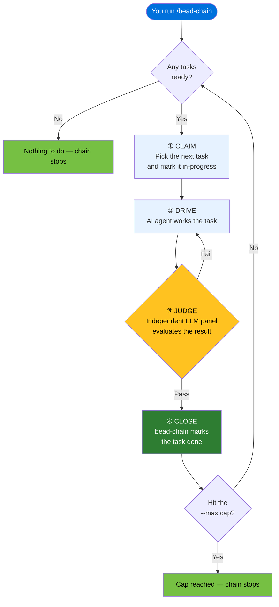

# How Bead Chaining Works

## What Is It

Bead chaining is the core automation loop that powers bead-chain. When you
run `/bead-chain`, the plugin takes over your task queue and drives it
end-to-end: it claims a task, hands it to an AI agent under independent
judge supervision, waits for the judges to approve the work, closes the task,
and grabs the next one. This cycle — **claim → drive → judge → close** —
repeats until the queue is empty or you tell it to stop.

You don't pick tasks, assign them, or close them. bead-chain does all of that
for you, one task at a time, in a steady, predictable loop.

## Why It Matters

Without bead chaining, every task in your queue requires manual intervention.
You'd need to find a ready task, claim it, kick off the AI work loop, wait for
the result, check it yourself, close it, and then go hunting for the next one.
Multiply that by dozens — or hundreds — of tasks and you've got a full-time job
just babysitting the queue.

Bead chaining eliminates that overhead:

- **Hands-off throughput.** Start the chain and walk away. Come back to find a
  pile of completed, judge-verified work.
- **Consistent quality.** Every single task goes through the same independent
  judge panel before it's marked done. No shortcuts, no rubber-stamping, no
  "looks good to me" closures.
- **Smart ordering.** The chain doesn't just blindly follow queue position —
  it prioritises blocking bugs that hold up other work and keeps related tasks
  under the same epic together for coherent output.
- **Safe interruption.** If the chain is interrupted — power loss, network blip,
  or you press Ctrl+C — nothing is lost. The next run picks up exactly where
  you left off and assesses the current state before doing anything new.

> [!TIP]
> Think of bead chaining as a reliable assistant who works through your to-do
> list while you sleep. You set the list, walk away, and come back to find items
> crossed off — each one verified by someone other than the assistant who did the
> work.

## How It Works

### The Assembly Line

The easiest way to understand bead chaining is to picture an assembly line in a
factory:

| Assembly line | bead-chain |
|---------------|------------|
| **Conveyor belt** | Your task queue (`bd ready`) |
| **The next item on the belt** | The next ready task (bead) |
| **Factory worker** | The AI agent that does the actual work |
| **Quality inspector** | The panel of independent LLM judges |
| **Foreman** | bead-chain itself — keeps the line moving |
| **Emergency stop button** | Ctrl+C or the `--max` safety cap |

The foreman (bead-chain) pulls the next item off the conveyor belt (your task
queue), hands it to the factory worker (the AI agent), and waits. When the
worker says "done," the quality inspector (the LLM judges) checks the result
against the task's acceptance criteria. If it passes, the foreman marks the
item complete and pulls the next one. If it fails, the worker goes back and
tries again. The line keeps moving until the belt is empty or someone hits the
emergency stop.

### The Four-Step Cycle

Every task goes through the same four steps, every time, no exceptions:

**1. Claim**

bead-chain looks at the queue and picks the next task to work on. It marks that
task as in-progress so nothing else grabs it at the same time. If the task
belongs to a parent epic that isn't already active, the epic gets marked
in-progress too — this keeps your status views accurate at every level of the
hierarchy.

> [!NOTE]
> The chain doesn't just grab the first thing it sees. It follows a strict
> priority order:
>
> 1. **Stranded work** — if a previous run was interrupted, that unfinished
>    task is recovered first.
> 2. **Blocking bugs** — any bug that holds up other tasks jumps to the front.
> 3. **Same-epic siblings** — if the just-completed task had siblings under the
>    same epic, the chain finishes that family before moving on.
> 4. **Global queue** — whatever's next in the general ready list.
>
> For the full breakdown of each tier, see
> [Bead Selection Order](../Reference/BeadSelectionOrder.md).

**2. Drive**

bead-chain hands the claimed task to the AI work loop. The agent receives a
detailed prompt built from the task's title, description, acceptance criteria,
and any relevant context. From this point, the agent works the task as if you'd
assigned it directly — reading files, writing code, running tests, whatever the
task requires.

During this phase, bead-chain steps back and lets the agent cook. It only
intervenes if the agent tries to do something it shouldn't — like closing the
task itself (see [The Close Guard](TheCloseGuard.md)).

**3. Judge**

When the agent believes the work is done, it summarises what it did. A panel of
independent LLM judges then evaluates the result against the task's acceptance
criteria. These judges are separate from the agent that did the work — they
provide an unbiased second opinion.

- **Pass** → the judges agree the work meets the criteria. Move to step 4.
- **Fail** → the judges identify gaps. The agent goes back to step 2 and keeps
  working, informed by the judges' feedback.

This judge loop can repeat multiple times until the work genuinely satisfies the
acceptance criteria. There's no way to skip it.

> [!IMPORTANT]
> The agent doing the work **never** decides whether the work is done. Only the
> independent judges can make that call. This separation of "doer" and
> "evaluator" is bead-chain's core quality guarantee. See
> [The Close Guard](TheCloseGuard.md) for how this is enforced.

**4. Close**

Once the judges pass the work, bead-chain closes the task with a record of
what was accomplished. The completed count for the current run ticks up by one,
and the chain immediately loops back to step 1 to claim the next task.

If the queue is now empty, bead-chain performs one final sweep: it checks
whether any parent epics have had all their children completed, and if so,
rolls them up (closes them automatically). Then the chain stops and reports
how many tasks it completed.

### The Full Cycle — Visualised

### What Happens When Things Go Wrong

The chain is designed to handle interruptions gracefully:

- **You press Ctrl+C.** The chain stops immediately, but the current task stays
  marked as in-progress on purpose. The next time you run `/bead-chain`, it
  finds that stranded task, loads a recovery prompt, and the agent assesses
  what's already been done before picking up where it left off.

- **A task fails to close.** If something goes wrong with the close step (a
  database issue, a permission problem), the chain halts and tells you what
  happened. The task stays in-progress so the next run can recover it — no work
  is orphaned or lost.

- **The queue has blocked tasks.** If a task can't be worked because it's waiting
  on another task to finish first, the chain skips it and moves on. Blocked
  tasks are never driven — they re-enter the queue once their blockers are
  resolved.

- **A task gets pinned mid-flight.** If someone (a human or another tool) pins a
  task while the agent is working on it, bead-chain respects the pin. It drops
  the task without closing it and moves on to the next one. The pinned task
  stays pinned until someone explicitly unpins it.

> [!WARNING]
> Recovery works because interrupted tasks stay in-progress. If you manually
> revert a task's status to open after an interruption, you'll lose the recovery
> prompt that tells the agent to check what's already done. Let the chain
> recover naturally.

### Controlling the Run

You have two levers to control a chain run:

- **`/bead-chain`** starts the chain with no limit — it runs until the queue
  is empty.
- **`/bead-chain --max=N`** starts the chain but stops after closing N tasks.
  This is useful for bounded sessions where you want predictable, controlled
  progress without committing to draining the entire queue.

When the cap is reached, the chain stops cleanly — the just-completed task is
closed, the count is reported, and you're back in control.

### Epic Rollup

Tasks often belong to a parent epic — a container that groups related work.
bead-chain is aware of this hierarchy:

- When a task is claimed, its parent epic is marked in-progress (if it isn't
  already).
- When the chain finishes (the queue is empty or the cap is hit), bead-chain
  checks whether any epics now have all their children completed. If so, it
  closes those epics automatically — you don't have to do it by hand.

> [!NOTE]
> Epic rollup happens once at the end of a session, not after every individual
> task close. This is a deliberate design choice to avoid accidentally closing
> unrelated epics through cascading side effects.

## Related

- [Overview](../Overview.md) — what bead-chain is, who it’s for, and its key
  features.
- [Tutorial: Automate a Sprint Backlog](../Tutorials/AutomateASprintBacklog.md)
  — an end-to-end walkthrough of the chaining loop in action, including
  interruption, recovery, and epic rollup.
- [The Close Guard](TheCloseGuard.md) — how the separation of "doer" and
  "evaluator" is enforced during a chain.
- [Recovery Mode](RecoveryMode.md) — a deeper look at how interrupted work is
  detected, recovered, and resumed.
- [Bead Selection Order](../Reference/BeadSelectionOrder.md) — the four-tier
  priority waterfall that decides which task is picked next.
- [How to Handle Bugs Discovered During Work](../Guides/HandleBugsDuringWork.md)
  — what happens when the agent spots an unrelated bug during the "drive" phase
  and how filed bugs feed back into the chain.
- [Status Messages](../Reference/StatusMessages.md) — what every emoji-prefixed
  message means and what to do when you see it.
- [Configuration](../Reference/Configuration.md) — environment variables,
  timeout/retry behavior, and excluded container types.

---

[← Back to Concepts](index.md) · [← Back to User Docs](../index.md)
