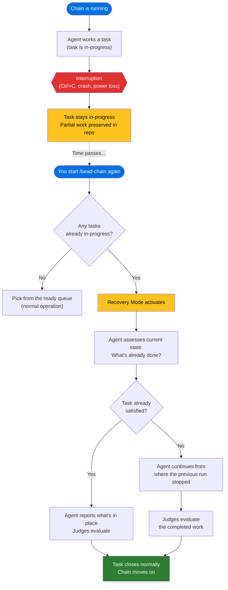

# Recovery Mode

## What Is It

Recovery Mode is bead-chain's mechanism for resuming interrupted work. If a
chain run is cut short — you press Ctrl+C, your machine loses power, the
network drops, or anything else stops the run mid-task — the work in progress
isn't lost. The next time you start a chain, bead-chain detects the unfinished
task, loads a special recovery prompt, and the agent assesses what's already
been done before deciding what to do next.

No manual cleanup. No lost progress. No duplicated effort. The chain picks up
exactly where it left off.

## Why It Matters

Automated chains can run for hours — processing dozens or hundreds of tasks
while you're away. In a run that long, interruptions aren't just possible,
they're inevitable:

- **You press Ctrl+C** to stop a run that's gone long enough.
- **Your laptop sleeps** or reboots for an update.
- **A network blip** disconnects the AI agent mid-task.
- **A power outage** kills everything without warning.

Without recovery, any of these would leave orphaned, half-done work: a task
marked as in-progress with no one driving it, partial changes sitting in the
repo, and no way for the next run to know what already happened. You'd have to
manually inspect the state, figure out what was done, and either finish it by
hand or reset the task and start over.

Recovery Mode eliminates that overhead entirely. It guarantees a simple
invariant: **every task that was being worked on will be resumed, not
restarted.** The agent reads the current state before touching anything, so
completed work is recognized and reported — not blindly redone.

> [!IMPORTANT]
> Recovery Mode is fully automatic. You don't need to turn it on, configure it,
> or trigger it manually. It activates whenever the chain detects unfinished
> work from a prior run.

## How It Works

### What Happens When a Chain Is Interrupted

When a chain is running, the current task is marked as in-progress. If the
chain stops unexpectedly — for any reason — that task stays in-progress. This
is intentional: the in-progress status is the chain's breadcrumb. It tells the
next run "this task was being worked on, and the work wasn't finished cleanly."

Any changes the agent already made (code written, files modified, tests added)
remain in the repository exactly as they were. Nothing is rolled back, nothing
is cleaned up. The partial work is preserved in place.

### How the Next Run Detects It

When you start a new chain with `/bead-chain`, the very first thing the chain
does — before looking at the ready queue — is check whether any tasks are
already in-progress. If it finds one, that task becomes the chain's first
priority. Recovery beats everything else: blocking bugs, epic siblings, the
global queue. The unfinished task always goes first.

> [!TIP]
> Think of it like coming back to your desk after lunch and finding a half-done
> task on top of the pile. You don't shove it aside and start something new —
> you pick it up, see where you left off, and finish it. That's exactly what
> bead-chain does.

### How the Agent Resumes

When a recovery task is detected, the agent receives a special prompt that
tells it: "This task was started by a previous run that didn't finish. Assess
the current state before doing anything new."

The agent then follows a structured assessment:

1. **Check what's already done.** The agent looks at the repository — files
   changed, tests written, build output — to understand how far the previous
   run got.

2. **Decide if the task is already complete.** If all acceptance criteria are
   met by the existing state, the agent reports what's in place and lets the
   judges evaluate it. No new work needed.

3. **Continue from where it left off.** If the task is partially done, the
   agent picks up from the current state and finishes the remaining work. It
   doesn't start over.

The key insight is that the agent **never blindly redoes work**. Whether the
previous run got 10% done or 99% done, the agent starts with an honest
assessment of where things stand. If everything is already in place, it simply
reports that fact and lets the independent judges verify it.

> [!NOTE]
> The agent never re-claims a recovered task. It's already marked as
> in-progress, so claiming it again would be redundant. The chain skips
> straight to the assessment phase.

### The Interrupt–Resume Flow

### What About Blocked Tasks?

Sometimes a task that was in-progress when the chain was interrupted has since
become blocked — another task now needs to finish first. Recovery Mode handles
this gracefully: before resuming any stranded task, the chain checks whether
it has open blockers. If it does, the task is moved back to the open queue
(behind its blockers) rather than being recovered. You'll see a warning
explaining what happened.

This ensures the chain never drives work that can't be completed — even in
recovery.

### What If Multiple Tasks Are Stranded?

Under normal operation, the chain works one task at a time, so at most one task
should be in-progress at any moment. But hard crashes (the kind that bypass
every cleanup handler) or unusual circumstances can leave more than one.

When the chain finds multiple in-progress tasks, it recovers them **one at a
time**, in order. The first one is recovered immediately. The rest stay
in-progress and are picked up on subsequent iterations within the same run —
each one gets its own recovery prompt and full assessment before any new work
begins.

> [!WARNING]
> Don't manually reset a stranded task's status to open after an interruption.
> Doing so erases the recovery signal — the chain will treat it as brand-new
> work, and the agent won't know to check what's already been done. Let
> recovery handle it naturally.

### Pinned Tasks

If a task is pinned (locked by a human or another tool) while the agent is
working on it, the chain drops that task without closing it and moves on.
The pinned task stays pinned until someone explicitly unpins it — recovery
won't override a deliberate pin.

## Related

- [How Bead Chaining Works](HowBeadChainingWorks.md) — the core
  claim→drive→judge→close loop that recovery protects.
- [Tutorial: Automate a Sprint Backlog](../Tutorials/AutomateASprintBacklog.md)
  — a hands-on walkthrough of interrupting a chain with Ctrl+C and watching
  Recovery Mode resume the work.
- [The Close Guard](TheCloseGuard.md) — the safety rail that keeps agents from
  closing tasks themselves; the Close Guard still applies during recovery.
- [Bead Selection Order](../Reference/BeadSelectionOrder.md) — the full
  four-tier priority waterfall; recovery is tier 0 and always goes first.
- [Overview](../Overview.md) — bead-chain’s crash recovery feature at a glance.
- [Status Messages](../Reference/StatusMessages.md) — what the recovery-related
  messages (&#x1F516; bookmark, &#x26A0;&#xFE0F; multi-strand warning) mean and
  what to do.
- [How to Resume After an Interruption](../Guides/ResumeAfterInterruption.md)
  — step-by-step instructions for what to do when a run is cut short.
- [How to Upgrade or Uninstall bead-chain](../Guides/UpgradeOrUninstall.md)
  — upgrading after an interrupted run; Recovery Mode picks up the stranded
  task automatically after the restart.
- [Configuration](../Reference/Configuration.md) — timeout/retry defaults that
  affect how bead-chain communicates with `bd` during recovery.

---

[← Back to Concepts](index.md) · [← Back to User Docs](../index.md)
