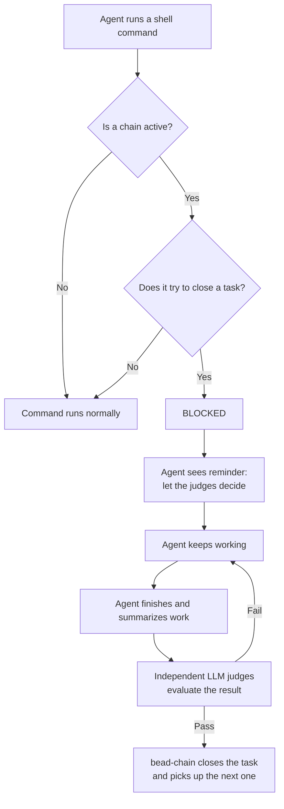

# The Close Guard

## What Is It

The Close Guard is bead-chain's built-in safety rail that prevents the AI agent
doing the work from also being the one who marks that work as done. While a
chain is running, any attempt by the agent to close a task — whether by running
`bd close` or by setting a task's status to closed — is silently blocked. The
agent sees a reminder that it should keep working and let the independent judges
make the call.

Think of it like a classroom rule: **the student doesn't grade their own
homework — the teacher does.** The AI agent is the student. The LLM judges are
the teacher. The Close Guard is the rule that keeps it that way.

## Why It Matters

Without the Close Guard, an agent could short-circuit the entire quality process
in a single command. It could decide "yep, looks done to me" and close the task
before anyone else weighs in. That would mean:

- **No independent review.** The same intelligence that wrote the code would
  also approve it — the fox guarding the henhouse.
- **No completion verdict.** bead-chain relies on wiggum's `/goal` judges — a
  panel of independent LLMs — to verify that every task actually meets its
  acceptance criteria. A self-close bypasses that verdict entirely.
- **Silent quality erosion.** The chain would happily advance to the next task
  as if the previous one were done, when it may not be. Over a long automated
  run, unchecked closures compound into real gaps.

The Close Guard exists because **trust, but verify** is the whole point of
automated chaining. The agent does the work; the judges decide whether the work
is good enough. Separating those two roles is the foundation bead-chain is
built on.

> [!IMPORTANT]
> The Close Guard only activates while a chain is running. Outside of a
> `/bead-chain` session — when you're working manually — `bd close` works
> normally. The guard protects the in-flight contract, not general usage.

## How It Works

Every time the agent tries to run a shell command during a chain, bead-chain
checks two things:

1. **Is a chain currently active?** If not, the command runs normally — no guard
   needed.
2. **Does the command try to close a task?** bead-chain looks for close
   attempts like `bd close` or setting a task's status to closed.

If both conditions are true, the command is blocked before it ever executes.
The agent sees a stop message explaining exactly what happened and why:

> [STOP] bead-chain blocked `bd close`.
>
> Direct `bd close` bypasses the LLM judges. bead-chain is currently driving
> the active task through wiggum's /goal mode. The task will be closed
> automatically once the LLM judges sign off — do NOT close it yourself.
>
> Keep working on the task. If you believe it is complete, summarize what you
> did and let the judges decide.

The agent can then continue working. When it genuinely finishes, it summarizes
its work, and the independent LLM judges evaluate whether the acceptance
criteria are met. If the judges agree the task is done, bead-chain itself
closes the task through its own internal path — one that is never subject to the
guard — and moves on to the next item in the queue.

> [!TIP]
> You don't need to do anything special to trigger or configure the Close Guard.
> It activates automatically whenever you start a `/bead-chain` run and
> deactivates when the chain stops. It's invisible until something tries to
> break the rules.

### The Analogy in Full

Imagine a classroom where students submit homework and a teacher grades it:

| Role | In bead-chain |
|------|---------------|
| **Student** | The AI agent doing the work |
| **Homework** | The task (bead) being worked on |
| **Teacher** | The panel of independent LLM judges |
| **Classroom rule** | The Close Guard |
| **Submitting homework** | The agent summarizing its work for the judges |
| **Grading** | The judges evaluating against acceptance criteria |

A student who grades their own homework isn't being checked. A student who hands
it to the teacher and waits for a grade *is*. The Close Guard is the rule
that says: "Hand it in. Don't write your own grade on it."

> [!NOTE]
> The guard catches both direct closes (`bd close`) and indirect ones (updating
> a task's status to closed). It doesn't matter how the agent tries — if the
> intent is to close a task during a chain, it's blocked.

### What Happens to Legitimate Closes?

bead-chain's own mechanism for closing tasks — the one that fires after the
judges sign off — uses a separate internal path that is never intercepted by the
guard. This means:

- **Agent closes → blocked.** The guard catches it and reminds the agent.
- **Judge-approved closes → allowed.** bead-chain's own close path bypasses the
  guard entirely.
- **Manual closes outside a chain → allowed.** When no chain is running, the
  guard is dormant.

> [!WARNING]
> The Close Guard protects the quality contract during automated runs. It
> doesn't prevent you from closing tasks manually when you're not running a
> chain. If you need to close something by hand, just make sure no chain is
> active.

## Related

- [Overview](../Overview.md) — introduces the Close Guard as one of
  bead-chain's safety guardrails.
- [Commands](../Reference/Commands.md) — the `/bead-chain` command and Ctrl+C
  behavior; the Close Guard is active during a running chain.
- [Tutorial: Automate a Sprint Backlog](../Tutorials/AutomateASprintBacklog.md)
  — see the Close Guard in context during a full end-to-end chain run.
- [How Bead Chaining Works](HowBeadChainingWorks.md) — the core
  claim→drive→judge→close loop that the Close Guard protects.
- [Recovery Mode](RecoveryMode.md) — what happens when a chain is interrupted;
  the Close Guard still applies when the recovered task resumes.
- [How to Resume After an Interruption](../Guides/ResumeAfterInterruption.md)
  — step-by-step instructions for resuming after Ctrl+C or a crash; the Close
  Guard stays active during recovery.
- [Status Messages](../Reference/StatusMessages.md) — what the &#x1F6D1;
  close-block messages look like and what the agent sees when the guard fires.
- [Configuration](../Reference/Configuration.md) — environment variables,
  timeout/retry behavior, and excluded container types.

---

[← Back to Concepts](index.md) · [← Back to User Docs](../index.md)
