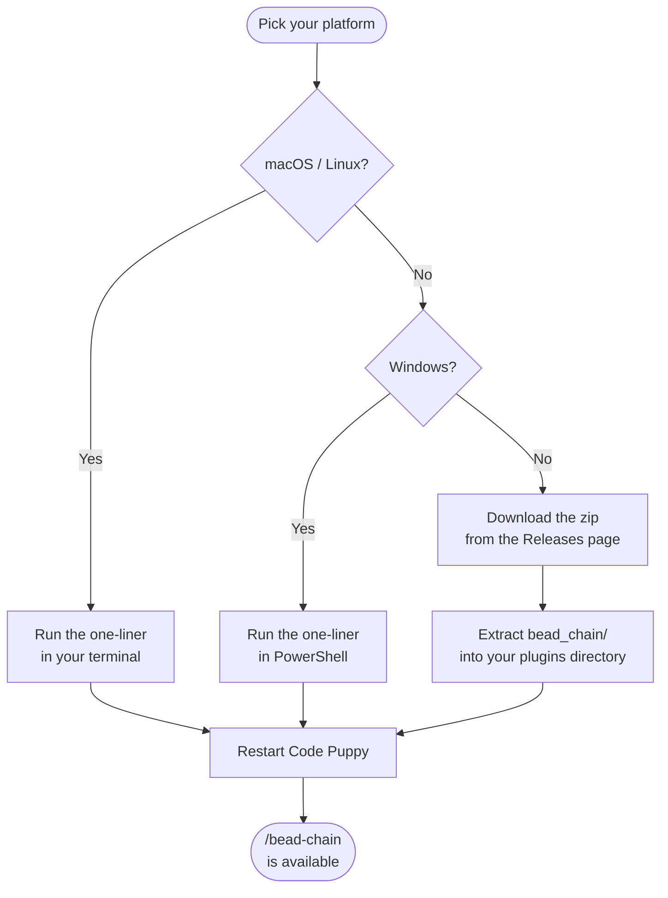

# Quick Start: Install bead-chain

## What You'll Achieve

A working bead-chain installation — the plugin downloaded, placed in the right
directory, and ready to run its first chain.

## Prerequisites

- **Code Puppy** (or wiggum) with `/goal` mode available. bead-chain delegates
  AI-judged work to this mode, so it must be installed and working before you
  add the plugin.
- **beads (`bd`)** installed and on your PATH. bead-chain drives the beads
  issue tracker — without `bd`, there's nothing to chain. If your `bd` binary
  lives somewhere non-standard, you can point bead-chain at it via the
  `BEADS_BIN` environment variable (see
  [Configuration](../Reference/Configuration.md)).

> [!TIP]
> Not sure whether you have the prerequisites? Open a terminal and run
> `bd ready`. If you see a task list (even an empty one), you're good to go.
> If the command isn't found, install beads first.

## Step 1: Download and Install the Plugin

Pick the method that matches your platform. All three do the same thing:
download the latest release zip and extract the `bead_chain/` folder into your
Code Puppy plugins directory.



### Option A: macOS / Linux

Open your terminal and run:

```bash
curl -fsSL https://github.com/weegens-aaron/bead-chain/releases/latest/download/bead-chain.zip \
  -o /tmp/bead-chain.zip \
  && unzip -o /tmp/bead-chain.zip -d ~/.code_puppy/plugins/
```

**What you should see:** The zip downloads silently (`-fsSL` suppresses
progress bars), then `unzip` lists the extracted files. No errors, no prompts.

> [!NOTE]
> The plugins directory is `~/.code_puppy/plugins/`. If the directory doesn't
> exist yet, the `unzip` command creates it automatically.

### Option B: Windows (PowerShell)

Open PowerShell and run:

```powershell
Invoke-WebRequest `
  -Uri https://github.com/weegens-aaron/bead-chain/releases/latest/download/bead-chain.zip `
  -OutFile $env:TEMP\bead-chain.zip
Expand-Archive -Force $env:TEMP\bead-chain.zip `
  -DestinationPath ~\.code_puppy\plugins\
```

**What you should see:** A progress bar while the zip downloads, then silent
extraction. No errors.

> [!NOTE]
> The plugins directory is `~\.code_puppy\plugins\`
> (i.e. `%USERPROFILE%\.code_puppy\plugins\`). The `-Force` flag overwrites any
> existing installation, making this safe to run on a fresh machine or as an
> upgrade.

### Option C: Manual Download (Any Platform)

Prefer the browser? No command line required.

1. Go to the
   [Releases page](https://github.com/weegens-aaron/bead-chain/releases/latest).
2. Download **bead-chain.zip** from the latest release's assets.
3. Extract the zip so that the `bead_chain/` folder lands directly inside your
   plugins directory:
   - macOS / Linux: `~/.code_puppy/plugins/bead_chain/`
   - Windows: `~\.code_puppy\plugins\bead_chain\`

**What you should see:** A `bead_chain/` folder inside your plugins directory
containing the plugin files.

> [!WARNING]
> The zip contains a single top-level `bead_chain/` folder. Extract it
> directly — don't nest it. The correct result is
> `…/plugins/bead_chain/`, **not** `…/plugins/bead-chain/bead_chain/`.

## Step 2: Restart Code Puppy

Code Puppy loads plugins at startup. After extracting the files, **restart
Code Puppy** so it picks up the new plugin.

**What you should see:** Code Puppy starts normally. No errors about the plugin
directory, no missing-dependency warnings.

## Step 3: Verify the Installation

Type `/bead-chain` in Code Puppy.

- **If you have ready tasks:** The chain starts claiming and working them. Press
  **Ctrl+C** to stop it for now — you'll do a proper run in the next guide.
- **If your queue is empty:** You'll see a message that there's nothing to work.
  That's fine — the plugin is installed and responding.

**What you should see:** bead-chain either starts processing tasks or reports
an empty queue. Either way, the `/bead-chain` command is recognised and
running.

> [!TIP]
> If `/bead-chain` isn't recognised, double-check that the `bead_chain/` folder
> is directly inside `~/.code_puppy/plugins/` (not nested in a subfolder), and
> that you restarted Code Puppy after extracting.

## Common Issues

| Symptom | What to do |
|---------|------------|
| `/bead-chain` isn't recognised after installing | Restart Code Puppy. It only loads plugins at startup. |
| `curl` or `Invoke-WebRequest` fails with a network error | The download URL points to GitHub Releases. If your network blocks GitHub, download the zip manually from a machine with access (Option C) and transfer it to your plugins directory. |
| `unzip` says the directory doesn't exist | The plugins directory (`~/.code_puppy/plugins/`) should be created automatically. If it isn't, create it manually: `mkdir -p ~/.code_puppy/plugins/` (macOS / Linux) or `New-Item -ItemType Directory -Force ~\.code_puppy\plugins\` (PowerShell). |
| `bd ready` returns "command not found" | beads (`bd`) isn't installed or isn't on your PATH. Install beads first, then come back to install bead-chain. |
| The plugin installs but `/bead-chain` errors out | Make sure both Code Puppy and `bd` meet the prerequisites. bead-chain needs `/goal` mode and a working beads installation. |
| You see a nested `bead-chain/bead_chain/` folder | You extracted the zip one level too deep. Move the inner `bead_chain/` folder up so it sits directly inside `plugins/`, then delete the empty outer folder. |

## What You Learned

- bead-chain is a single-directory plugin — no package manager, no registry,
  no background service. Just files in a folder.
- Installation is a three-step process: download, extract to the plugins
  directory, restart Code Puppy.
- The install URL always points to the latest release — you never need to edit
  version numbers.
- bead-chain requires Code Puppy with `/goal` mode and `bd` on your PATH.

## Next Steps

You're installed — now put it to work:

- [Run Your First Chain](RunYourFirstChain.md) — go from zero to watching tasks
  close themselves.
- [Tutorial: Automate a Sprint Backlog](../Tutorials/AutomateASprintBacklog.md)
  — a full end-to-end walkthrough: set up tasks, run the chain, interrupt and
  recover, and watch the parent epic close itself.
- [How to Upgrade or Uninstall bead-chain](../Guides/UpgradeOrUninstall.md) —
  keep the plugin current or remove it cleanly. Upgrading is just re-running the
  same install command.
- [Commands Reference](../Reference/Commands.md) — every command and option at a
  glance.
- [Overview](../Overview.md) — what bead-chain is, its key features, and
  requirements.
- [How Bead Chaining Works](../Concepts/HowBeadChainingWorks.md) — understand
  the claim → drive → judge → close loop that powers bead-chain.

---

[← Back to Getting Started](index.md) · [← Back to User Docs](../index.md)
