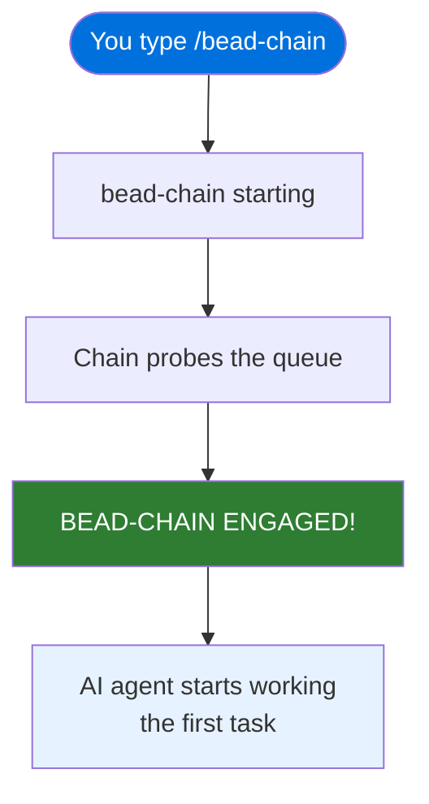
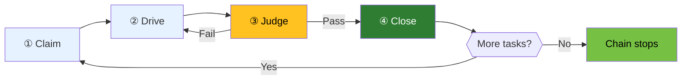

# Quick Start: Run Your First Chain

## What You'll Achieve

A complete bead-chain run — you'll start the chain, watch it pick up a task
from your queue, hand it to the AI agent, wait for the independent judges to
approve the work, close the task, and either drain the queue or stop the chain
yourself.

## Prerequisites

- **bead-chain installed.** If you haven't done this yet, follow
  [Installation](Installation.md) first — it takes about two minutes.
- **Code Puppy** (or wiggum) running with `/goal` mode available.
- **beads (`bd`)** installed and on your PATH.
- **At least one ready task in your queue.** bead-chain needs something to
  work. If your queue is empty, create a task or two with `bd create` before
  proceeding.

> [!TIP]
> Not sure whether you have ready work? Run `bd ready` in your terminal. If you
> see tasks listed, you're good. If you see an empty list, add a task first.

## Step 1: Check Your Queue

Before starting the chain, confirm there's work waiting. Run:

```
bd ready
```

**What you should see:** A list of tasks with their IDs, titles, and
priorities. Something like:

```
◯ abc-123 · Fix the login timeout                [● P1 · OPEN]
◯ abc-456 · Add retry logic to the upload flow    [● P2 · OPEN]
◯ abc-789 · Update the README examples            [● P3 · OPEN]
```

Each line is a task the chain can pick up. The order here is roughly what the
chain will follow, though bead-chain applies its own
[priority logic](../Reference/BeadSelectionOrder.md) — blocking bugs jump
ahead, and sibling tasks under the same epic stay together.

> [!NOTE]
> If `bd ready` shows nothing, the chain will have nothing to fetch. Create at
> least one task before continuing.

## Step 2: Start the Chain

Type the following in Code Puppy:

```
/bead-chain
```

**What you should see — immediately:**

An emoji-prefixed acknowledgement (all bead-chain messages carry a small icon
prefix — see [Status Messages](../Reference/StatusMessages.md) for the
complete list):

```
bead-chain starting…
```

This appears right away so you know the command registered. Behind the scenes,
the chain is probing your queue for the first task to work.

**What you should see — a moment later:**

```
BEAD-CHAIN ENGAGED!
First bead: abc-123 — Fix the login timeout
Will claim → /goal → close → repeat until `bd ready` is empty.
Press Ctrl+C to halt.
```

The chain has claimed the first task and handed it to the AI work loop. The
assembly line is moving.



> [!TIP]
> If you see **"No ready beads — bead-chain has nothing to fetch"** instead,
> your queue is empty. Add a task with `bd create` and try again.

## Step 3: Watch the First Task Get Worked

Once the chain is engaged, the AI agent takes over. You'll see it working in
your terminal — reading files, writing code, running tests, whatever the task
requires. This is the **drive** phase: the agent is doing the actual work while
bead-chain stays in the background, keeping the assembly line moving.

**What you should see:** The agent's activity streams in your terminal just
like a normal `/goal` session. You'll see file reads, edits, shell commands,
and reasoning — all directed at completing the claimed task.

During this phase, bead-chain enforces one important rule: the agent **cannot**
close the task itself. If it tries to run a close command, the
[close guard](../Concepts/TheCloseGuard.md) blocks it with a reminder:

> bead-chain blocked `bd close`. The bead will be closed automatically once
> the LLM judges sign off — do NOT close it yourself.

This separation of "doer" and "evaluator" is how bead-chain guarantees
consistent quality. The agent does the work; the judges decide when it's done.

## Step 4: Watch the Judges Evaluate

When the agent believes the work is finished, it summarises what it did. A panel
of independent LLM judges then evaluates the result against the task's
acceptance criteria.

**What you should see:** The judges provide feedback in the terminal. If the
work passes, you'll see progress move to the close step. If the judges identify
gaps, the agent goes back and keeps working — informed by the judges' feedback —
and resubmits when ready. This cycle can repeat until the work genuinely
satisfies the criteria.

> [!IMPORTANT]
> The judges are independent from the agent that did the work. They provide an
> unbiased second opinion — there's no way to skip or override this check.

## Step 5: Watch the Task Close

Once the judges approve the work, bead-chain closes the task automatically.

**What you should see:**

```
bead-chain closed abc-123 (#1 completed this run)
```

The `#1` counter tells you how many tasks have been completed in this run. If
more tasks are waiting in the queue, the chain immediately claims the next one
and you'll see:

```
bead-chain claimed abc-456 — Add retry logic to the upload flow
```

The cycle starts again: drive → judge → close → next.



## Step 6: Stop or Let It Drain

You have two choices at this point:

### Option A: Let the Chain Finish

Do nothing. The chain keeps claiming, working, and closing tasks until the queue
is empty. When it runs out of work, you'll see:

```
bead-chain: no more ready beads. Closed 3 this run. Good boy!
```

The chain stops and you're back in control.

### Option B: Press Ctrl+C

If you want to stop early — maybe you want to review the work so far, or you
need the terminal for something else — press **Ctrl+C**.

**What you should see:**

```
bead-chain halted due to cancelled.
Bead abc-456 left in_progress — the next /bead-chain run will resume it
  with a recovery preamble so the agent assesses the current state before
  doing new work.
```

The current task stays in-progress **on purpose**. The next time you run
`/bead-chain`, the chain detects it, loads a recovery prompt, and the agent
checks what's already been done before picking up where it left off. Nothing is
lost or orphaned.

> [!WARNING]
> Don't manually revert a task's status to open after pressing Ctrl+C. If you
> do, you'll lose the recovery prompt that tells the agent to check existing
> work before starting fresh. Let the chain recover naturally.

## Common Issues

| Symptom | What to do |
|---------|------------|
| "No ready beads" when you expected tasks | Run `bd ready` to check your queue. If it's empty, create tasks with `bd create`. If tasks exist but show as blocked, their blockers need to be resolved first. |
| "bead-chain is already running" | You already have an active chain. Wait for it to finish or press Ctrl+C to stop it, then start a new one. |
| "bead-chain can't reach `bd`" | The `bd` command failed or isn't on your PATH. Run `bd ready` manually to diagnose. |
| The chain claimed a task but seems stuck | The AI agent is working — give it time. Complex tasks can take several minutes. If it genuinely stalls, press Ctrl+C and re-run `/bead-chain` to trigger recovery. |
| The judges keep rejecting the work | The judges found gaps against the task's acceptance criteria. The agent will keep iterating. If you think the criteria are unreasonable, press Ctrl+C, revise the task's description or acceptance criteria with `bd update`, and re-run. |
| You pressed Ctrl+C but the task didn't close | That's intentional. The task stays in-progress so the next run can recover it. See [Recovery Mode](../Concepts/RecoveryMode.md). |

## What You Learned

- Starting a chain is one command: `/bead-chain`.
- The chain follows a steady cycle — claim, drive, judge, close — for every
  task in your queue.
- You see clear status messages at every stage: startup, claiming, closing, and
  stopping.
- The agent does the work; independent judges decide when it's done.
- Pressing Ctrl+C stops the chain cleanly and leaves the current task ready for
  recovery on the next run.
- The chain handles its own task management — you don't need to pick, assign,
  or close anything manually.

## Next Steps

You've run your first chain — now explore what else bead-chain can do:

- [How to Run a Capped Session](../Guides/RunACappedSession.md) — limit how
  many tasks process in one run with `--max=N`, for predictable, bounded
  progress.
- [Tutorial: Automate a Sprint Backlog](../Tutorials/AutomateASprintBacklog.md)
  — a full end-to-end walkthrough: set up a batch of tasks, run the chain,
  interrupt and recover, and watch the parent epic close itself.
- [How to Resume After an Interruption](../Guides/ResumeAfterInterruption.md)
  — a deeper look at what happens when things get cut short.
- [How to Handle Bugs Discovered During Work](../Guides/HandleBugsDuringWork.md)
  — what the agent does when it finds an unrelated bug mid-task.
- [How Bead Chaining Works](../Concepts/HowBeadChainingWorks.md) — understand
  the claim → drive → judge → close engine under the hood.
- [Recovery Mode](../Concepts/RecoveryMode.md) — how interrupted work is
  detected, recovered, and resumed.
- [The Close Guard](../Concepts/TheCloseGuard.md) — how the separation of
  "doer" and "evaluator" is enforced.
- [Commands Reference](../Reference/Commands.md) — every command and option at
  a glance.
- [Status Messages](../Reference/StatusMessages.md) — what every emoji-prefixed
  message means and what to do when you see it.
- [Configuration](../Reference/Configuration.md) — environment variables and
  built-in defaults.
- [Overview](../Overview.md) — what bead-chain is, who it's for, and its key
  features.

---

[← Back to Getting Started](index.md) · [← Back to User Docs](../index.md)
