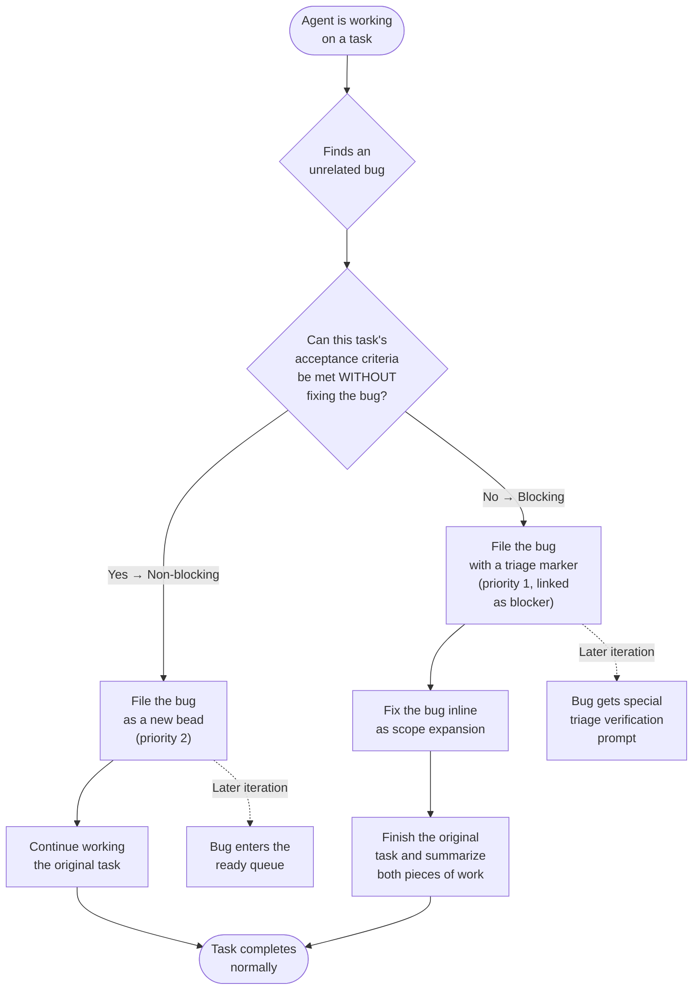

# How to Handle Bugs Discovered During Work

## What You'll Learn

How bead-chain handles the situation where an AI agent discovers an unrelated
bug while working on a completely different task. You'll understand the two
paths — non-blocking and blocking — and what you'll see in your terminal for
each one. You'll also learn how filed bugs get picked up and verified in later
chain iterations.

## Prerequisites

- bead-chain installed and working.
- A chain run started with `/bead-chain`.
- Familiarity with how the chaining loop works (see
  [How Bead Chaining Works](../Concepts/HowBeadChainingWorks.md)).

## Overview

During a chain run, the AI agent is laser-focused on one task at a time. But
code is messy — sometimes the agent stumbles across a bug that has nothing to
do with the task it's working on. Maybe it's a broken utility function, a
typo in a config, or an edge case that slipped through testing.

bead-chain handles this with a built-in protocol that every task prompt
includes automatically. The agent doesn't need to remember special rules or
decide how to handle it from scratch — the protocol is right there in its
instructions, every single iteration. The key principle: **file first, then
decide whether to fix inline or move on.**

## Step 1: Recognise What's Happening

During a chain run, you may notice the agent suddenly create a new bead mid-task
using `bd create --type=bug`. This means the agent has spotted something wrong
that isn't part of its current assignment.

**What you'll see:** A `bd create` command in the agent's output, creating a
bug-type bead with a short title and description of the issue. The agent does
this immediately upon discovery — it doesn't wait until the end of the task.

> [!NOTE]
> Every task the agent works on includes the bug discovery protocol in its
> prompt. The agent doesn't have to recall these rules from memory — they're
> right there every time. This costs a few extra tokens per task, but it
> guarantees consistent behavior across the entire chain.

## Step 2: Understand the Blocking Decision

The agent makes a judgment call for each bug it finds: **can it finish the
current task's acceptance criteria without fixing this bug?**

| If the answer is… | The bug is… | What the agent does |
|-------|------|------|
| **Yes** — the current task can be completed regardless | **Non-blocking** | Files the bug and moves on. The original task continues uninterrupted. |
| **No** — the current task cannot pass its acceptance criteria without a fix | **Blocking** | Files the bug with a special triage marker, fixes it inline, and reports both the original work and the fix. |

> [!IMPORTANT]
> "Blocking" is defined relative to **this task's acceptance criteria**, not
> in the abstract. A serious bug that doesn't affect the current task is still
> non-blocking in this context. The question is always: "Can I finish what I
> was asked to do?"

## Step 3: Follow the Non-Blocking Path

When the bug doesn't prevent the current task from completing:

1. The agent files a new bug bead with a description of what it found, steps to
   reproduce, and a suspected cause.
2. The bug is filed at priority 2.
3. The agent immediately returns to its original task and finishes it as if
   nothing happened.

**What you'll see:** A brief `bd create` command creating the bug bead, followed
by the agent continuing its normal work. The chain doesn't pause, restart, or
change course. The current task completes and is judged normally.

**What happens to the bug later:** The filed bug enters the ready queue like any
other work item. If another task depends on it, it gets
[tier 1 priority](../Reference/BeadSelectionOrder.md#tier-1--blocking-bugs) and
jumps to the front of the line in a future iteration. If nothing depends on it,
it waits its turn in the
[global queue](../Reference/BeadSelectionOrder.md#tier-3--global-ready-queue).

> [!TIP]
> You don't need to do anything when you see a non-blocking bug get filed. The
> chain handles everything — the bug is recorded, the current task finishes, and
> a future iteration picks it up automatically.

## Step 4: Follow the Blocking Path

When the bug prevents the current task from meeting its acceptance criteria:

1. The agent files a new bug bead, but this time with two differences:
   - It includes a **triage marker** (`[bead-chain:triaged]`) in the
     description, which tells future iterations that this bug was already
     spotted and inline-fixed.
   - It links the bug as a **blocker** of the current task, making the
     dependency relationship explicit.
2. The bug is filed at priority 1.
3. The agent fixes the bug **right there**, as part of the current task's work.
   This is called **scope expansion** — the task's scope grows to include both
   the original goal and the bug fix.
4. The agent finishes the original task and presents both pieces of work in its
   summary so the judges can evaluate the full scope.

**What you'll see:** The `bd create` command (with the triage marker and
`--blocks` flag visible), followed by the agent fixing the bug, then completing
the original task, then a combined summary covering both the fix and the
original deliverable.

> [!WARNING]
> The filed bug bead stays **open** even after the agent fixes it inline. This
> is intentional. The inline fix was done under time pressure as scope expansion
> — it needs proper verification. A future chain iteration will pick up the bug
> bead and verify the fix with a dedicated triage-verification prompt.

## Step 5: Watch the Triage Verification (Later)

When a future `/bead-chain` run claims a bug that carries the triage marker,
something special happens. Instead of the normal task prompt, the agent receives
a **triage verification** preamble that tells it:

1. This bug was discovered and inline-fixed by a previous task's agent.
2. The agent should check what the prior fix actually did.
3. The agent needs to decide one of three things:

| Scenario | What the agent does |
|----------|---------------------|
| The inline fix is correct and complete | Adds or verifies tests, then summarizes for the judges. The bead closes normally. |
| The inline fix is a band-aid — a proper fix is needed | Implements the proper fix and summarizes the upgrade. |
| The fix was backed out or never landed | Implements the fix from scratch as ordinary work. |

**What you'll see:** The agent reading the bug description, checking recent
changes (via the commit history), and then either confirming the fix, upgrading
it, or doing it fresh. The triage marker is a breadcrumb, not a guarantee — the
agent doesn't assume the fix is good just because the marker is present.

> [!NOTE]
> If a triaged bug also happens to be stranded in-progress (the verifying agent
> crashed mid-work), the recovery prompt takes precedence over the triage
> verification prompt. "Assess current state" naturally subsumes "verify a prior
> fix." See [Recovery Mode](../Concepts/RecoveryMode.md).

## Step 6: Multiple Bugs — One Per Bead

If the agent discovers more than one unrelated bug during a single task, it
files each one as a **separate bead**. One bug, one bead — always. This keeps
each issue trackable, independently claimable, and separately verifiable.

**What you'll see:** Multiple `bd create --type=bug` commands during a single
task, each with its own title and description. Each bug follows the same
blocking/non-blocking decision independently.

## Troubleshooting

| Problem | Fix |
|---------|-----|
| The agent filed a bug but didn't continue working the original task | This shouldn't happen — the protocol tells the agent to keep working after filing a non-blocking bug. If it does, the task likely ended for another reason (timeout, error). Check the chain's status messages. |
| A blocking bug was filed but the agent didn't fix it inline | The agent may have misjudged the blocking/non-blocking boundary. The bug is still filed and tracked — a future iteration will pick it up. The current task's judges will flag any gaps in their verdict. |
| The triage verification accepted a bad fix | The triage verification prompt is thorough — it tells the agent to check, not assume. If a bad fix does slip through, the judges provide the safety net. Report persistent quality issues as a new bug. |
| A filed bug never gets picked up | Check that the bug bead is in the ready queue (`bd ready`). If it has unresolved blockers of its own, it won't appear until those are cleared. If it's ready but low priority, it will be reached when higher-priority work drains. |
| The agent keeps finding the same bug on every task | The bug is likely non-blocking each time, so it gets filed but never rises high enough in the queue to be worked. Consider manually claiming and fixing it, or adjusting its priority so the chain picks it up sooner. |

## Related Guides

- [How Bead Chaining Works](../Concepts/HowBeadChainingWorks.md) — the
  claim→drive→judge→close loop where bug discovery happens during the "drive"
  phase.
- [Bead Selection Order](../Reference/BeadSelectionOrder.md) — how filed bugs
  get prioritised in future iterations, especially the
  [tier 1 blocking-bug fast lane](../Reference/BeadSelectionOrder.md#tier-1--blocking-bugs).
- [Recovery Mode](../Concepts/RecoveryMode.md) — what happens when a triaged
  bug is also stranded in-progress (recovery wins).
- [The Close Guard](../Concepts/TheCloseGuard.md) — why the agent can't close
  the bug bead itself; only the judges can.
- [Tutorial: Automate a Sprint Backlog](../Tutorials/AutomateASprintBacklog.md)
  — a full walkthrough of a chain run that shows how tasks flow from start to
  finish.
- [Status Messages](../Reference/StatusMessages.md) — what every emoji-prefixed
  message means, including messages related to bug filing and triage.
- [Configuration](../Reference/Configuration.md) — environment variables and
  defaults that affect chain behavior.

---

[← Back to Guides](index.md) · [← Back to User Docs](../index.md)
