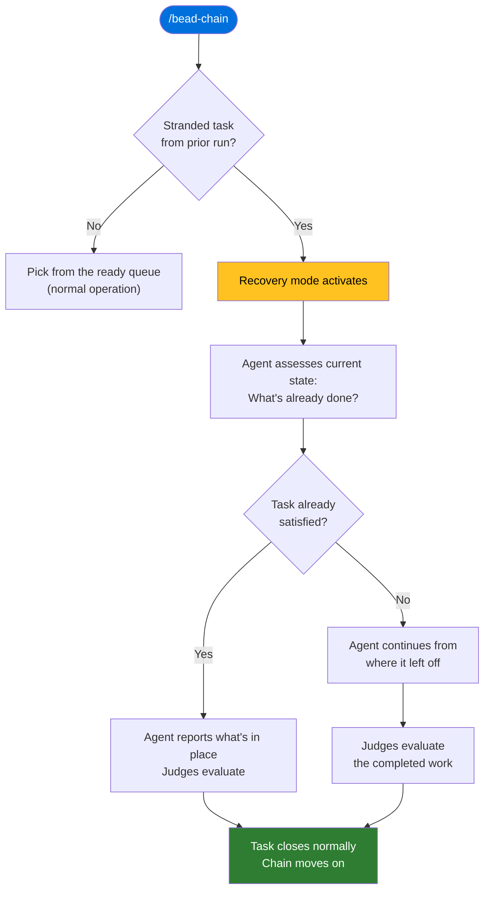

# How to Resume After an Interruption

## What You'll Learn

How to get back to work after a chain run is cut short — whether you pressed
Ctrl+C intentionally, your machine went to sleep, or a crash stopped things
mid-task. You'll see what the chain does automatically to protect your
in-progress work, what you see when recovery kicks in, and what to avoid so the
recovery stays clean.

## Prerequisites

- bead-chain installed and working
  ([Installation](../GettingStarted/Installation.md)).
- Familiarity with the basic chaining loop
  ([Run Your First Chain](../GettingStarted/RunYourFirstChain.md)).

## Overview

When a chain run stops before a task finishes — for any reason — the current
task stays in-progress on purpose. The next time you start a chain, bead-chain
detects that unfinished task, loads a special recovery prompt, and the agent
checks what's already been done before it touches anything new. You don't need
to clean up, reset anything, or re-assign the task. Just run the chain again.

## Step 1: Understand What Happens When the Chain Stops

There are several ways a chain run can be interrupted. In every case, the
outcome is the same: the task that was being worked stays marked as in-progress,
and any changes the agent already made remain in the repository exactly as they
were.

| Interruption | What you experience |
|--------------|---------------------|
| **Ctrl+C** | You see a halt message followed by a bookmark confirming the task is parked for recovery. This is the cleanest way to stop. |
| **Machine sleep or reboot** | The chain process dies. The task's in-progress status is already saved, so the state is preserved even though no goodbye message appeared. |
| **Network drop** | The AI agent loses connectivity. Same result — the task stays in-progress in the local database. |
| **Power loss or hard crash** | Everything stops instantly. No cleanup handler runs, but the task's status was written when it was claimed, so it's still in-progress when you boot back up. |

When you press Ctrl+C, you'll see two messages:

> bead-chain halted due to cancelled.

> Bead *\<id\>* left in\_progress — the next /bead-chain run will resume it
> with a recovery preamble so the agent assesses the current state before doing
> new work.

The bookmark message is your signal that everything is safe. The task is parked,
the partial work is preserved, and recovery will handle the rest.

> [!TIP]
> The bookmark message is specific to Ctrl+C — the deliberate, clean stop.
> If the interruption was a crash or power loss, you won't see it (nothing had
> a chance to print), but the recovery behavior on the next run is identical.

## Step 2: Start the Chain Again

When you're ready to continue, start the chain the same way you always do:

```
/bead-chain
```

No special flags, no recovery command, no manual cleanup. The chain handles
recovery automatically as part of its normal startup.

**What you'll see — immediately:**

> bead-chain starting…

**What you'll see — a moment later:**

> Recovering stranded in\_progress bead *\<id\>* — agent will assess current
> state before doing new work.

That warning tells you recovery has activated. The chain found the unfinished
task from your previous run and is about to resume it.

> [!IMPORTANT]
> Recovery always goes first. Even if new, higher-priority tasks have appeared
> in your queue since the interruption, the stranded task takes priority. The
> chain's rule is simple: finish what you started before picking up anything
> new.

## Step 3: Watch the Agent Assess the Work

The agent receives a recovery prompt that says, in effect: "This task was
started by a previous run that didn't finish. Figure out what's already done
before you do anything new."

The agent then works through a structured assessment:

1. **Checks what's already in place.** The agent looks at the current state of
   the repository — files changed, tests added, build output — to understand
   how far the previous run got.

2. **Decides if the task is already complete.** If the existing state satisfies
   the task's requirements, the agent reports what's in place and lets the
   judges evaluate it. No new work is done — just an honest summary of what's
   there.

3. **Continues from where the previous run stopped.** If the task is only
   partially done, the agent picks up from the current state and finishes the
   remaining work. It doesn't start over.



**What you should see after the assessment:**

- If the task was nearly done, you'll see the agent summarise the existing work
  and the judges evaluate it — this can be very fast.
- If the task had barely started, you'll see the agent do the remaining work
  just like a normal task, then submit for judging.

Either way, once the judges approve, the task closes normally:

> bead-chain closed *\<id\>* (#1 completed this run)

After recovery, the chain continues with the rest of your queue as usual —
claiming the next ready task and trotting along.

## Step 4: Know What to Avoid

Recovery works automatically, but there are a few things that can interfere
with it.

> [!WARNING]
> **Don't manually reset the task's status to open.** If you use `bd update` to
> flip a stranded task back to open, you erase the recovery signal. The chain
> will treat it as brand-new work, and the agent won't know to check what's
> already been done — risking duplicated effort or conflicting changes.

> [!WARNING]
> **Don't manually close the task.** If you close it yourself, the chain
> won't see it at all on the next run. Any partial work sits in the repo
> disconnected from its task. Let the chain and the judges handle the close.

> [!TIP]
> **Ctrl+C is always safe.** It's the recommended way to stop a chain early.
> The task is parked cleanly, the halt is acknowledged with a message, and
> recovery is seamless on the next run. You can also use
> [`--max=N`](RunACappedSession.md) to plan a clean stop in advance.

## Step 5: Handle Edge Cases

### Multiple Stranded Tasks

Under normal operation, only one task can be in-progress at a time. But a hard
crash (one that bypasses all cleanup) or unusual circumstances can leave more
than one. When the chain finds multiple stranded tasks, it recovers them **one
at a time** — each gets its own recovery prompt and full assessment. You'll see
a warning like:

> Found *N* in\_progress beads (residue from a hard crash…). Recovering
> *\<id\>* first; the rest will be picked up one-at-a-time via the recovery
> tier.

No action needed. The chain works through them methodically.

### A Stranded Task That Became Blocked

Sometimes a task that was in-progress when the chain stopped has since become
blocked — another task now needs to finish first. When the chain finds a
blocked stranded task, it moves it back to the open queue (behind its blockers)
instead of recovering it. You'll see a message explaining the revert. Once the
blockers are resolved, the task re-enters the ready queue and gets picked up
normally.

### A Stranded Task That Was Pinned

If someone pinned a stranded task (locking it to stay open), the chain respects
the pin. It drops the task and moves on. The pinned task stays pinned until
you explicitly unpin it — recovery won't override a deliberate pin.

## Troubleshooting

| Problem | Fix |
|---------|-----|
| **No recovery happened — the chain picked a different task.** | The stranded task may have been manually reset to open or closed between runs. Check its status with `bd show <id>`. If it's open, the chain treats it as new work (no recovery prompt). If it's closed, it's done. |
| **The agent redid work that was already complete.** | This usually means the task's status was manually reverted to open, erasing the recovery signal. On future interruptions, leave the task's status alone and let recovery handle it. |
| **"Found N in\_progress beads" warning.** | Multiple tasks were stranded — likely from a hard crash. This is handled automatically; the chain recovers each one in order. No action needed unless you see this repeatedly, which could indicate an underlying stability issue. |
| **A stranded task was reverted to open instead of recovered.** | The task acquired a blocker between runs. Resolve the blocking task first, then the reverted task will appear in the ready queue normally. |
| **The chain shows no stranded tasks but I expected recovery.** | Someone (or another tool) may have closed or reverted the task between the interruption and this run. Check with `bd show <id>`. |

## Related Guides

- [Recovery Mode](../Concepts/RecoveryMode.md) — the concept behind this
  guide: how recovery is designed, why tasks stay in-progress, and how blocked
  and multi-stranded cases are handled under the hood.
- [Run Your First Chain](../GettingStarted/RunYourFirstChain.md) — the
  quick-start walkthrough that introduces Ctrl+C and the recovery message.
- [How to Run a Capped Session](RunACappedSession.md) — an alternative to
  Ctrl+C: use `--max=N` to plan a clean stop after a set number of tasks.
- [How Bead Chaining Works](../Concepts/HowBeadChainingWorks.md) — the
  claim→drive→judge→close loop that recovery protects and resumes.
- [Bead Selection Order](../Reference/BeadSelectionOrder.md) — the four-tier
  priority waterfall; recovery is tier 0 and always goes first, ahead of
  blocking bugs, epic siblings, and the global queue.
- [Commands](../Reference/Commands.md) — full reference for `/bead-chain` and
  Ctrl+C behavior.
- [Status Messages](../Reference/StatusMessages.md) — what the bookmark,
  multi-strand warning, and every other chain message means.
- [The Close Guard](../Concepts/TheCloseGuard.md) — the safety rail that keeps
  agents from closing tasks themselves; still active during recovery.
- [Configuration](../Reference/Configuration.md) — environment variables and
  defaults that affect chain and recovery behavior.
- [How to Handle Bugs Discovered During Work](HandleBugsDuringWork.md) — what
  happens when the agent finds an unrelated bug mid-task; the bug protocol
  works identically whether the task is fresh or recovered.
- [Tutorial: Automate a Sprint Backlog](../Tutorials/AutomateASprintBacklog.md)
  — a hands-on walkthrough that includes interrupting a chain with Ctrl+C and
  watching Recovery Mode resume the work.
- [How to Upgrade or Uninstall bead-chain](UpgradeOrUninstall.md) — upgrading
  after an interrupted run; Recovery Mode picks up the stranded task after the
  restart.
- [Overview](../Overview.md) — bead-chain at a glance.

---

[← Back to Guides](index.md) · [← Back to User Docs](../index.md)
