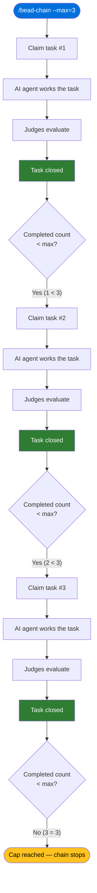

# How to Run a Capped Session

## What You'll Learn

How to use the `--max` flag to limit how many tasks bead-chain processes in a
single run. You'll understand when and why bounded sessions are useful, what
happens when the cap is reached, and how to chain several capped runs together
for incremental progress through a large queue.

## Prerequisites

- bead-chain installed and working
  ([Installation](../GettingStarted/Installation.md)).
- At least one ready task in your queue — run `bd ready` to confirm.
- Familiarity with the basic chaining loop
  ([How Bead Chaining Works](../Concepts/HowBeadChainingWorks.md)).

## Overview

By default, `/bead-chain` runs until the task queue is empty. That's great for
overnight burn-downs, but sometimes you want a shorter, more controlled session
— process a handful of tasks, review the output, then decide whether to keep
going. The `--max` flag gives you exactly that: a clean, automatic stopping
point after a set number of tasks have been closed.

## Step 1: Decide How Many Tasks to Process

Before starting a capped run, think about how many tasks make sense for this
sitting:

- **Exploring a new backlog?** Start with `--max=1`. You'll see the full
  claim→drive→judge→close cycle once and can inspect the output before
  committing to more.
- **Reviewing incrementally?** Try `--max=3` or `--max=5`. Process a small
  batch, check what changed, then start another run.
- **Time-boxing?** Estimate how long your tasks take on average and pick a
  number that fits your available time. Five quick documentation tasks might
  take the same wall-clock time as one complex refactoring task.

> [!TIP]
> You can always press Ctrl+C to stop early if you change your mind mid-run.
> The cap is a maximum, not a commitment — see
> [How to Resume After an Interruption](ResumeAfterInterruption.md) for what
> happens when you cancel.

## Step 2: Start the Chain with `--max`

Run the command with your chosen cap. The flag accepts two forms:

| What you type | Example |
|---------------|---------|
| `--max=N` (equals sign) | `/bead-chain --max=5` |
| `--max N` (space) | `/bead-chain --max 5` |

Both forms do the same thing. Pick whichever reads better to you.

**What you'll see:** The startup messages appear just like a normal chain run,
plus one extra line confirming the cap. After the usual "BEAD-CHAIN ENGAGED!"
banner and the first-task identification, you'll see:

> Safety cap: stopping after 5 bead(s).

That confirmation line tells you the chain will stop after five tasks,
regardless of how many remain in the queue.

> [!NOTE]
> The cap must be a positive integer. If you pass zero, a negative number, or
> something that isn't a number, the chain refuses to start and tells you why.
> Nothing is claimed — you can fix the value and try again immediately.

## Step 3: Watch the Chain Work

Once started, the capped chain works identically to an uncapped one. For each
task:

1. The chain picks a task from the queue following the
   [priority waterfall](../Reference/BeadSelectionOrder.md).
2. The AI agent works the task.
3. The independent judges evaluate the result.
4. If the judges approve, the task closes and you see a progress message
   that includes a running counter — for example, "#1 completed this run" or
   "#2 completed this run." That counter tells you where you are relative to
   your cap.

> [!TIP]
> Only successfully closed tasks (judge-approved) count toward the cap. Tasks
> that are skipped because they're blocked or are container types don't consume
> any of your budget. Your cap measures actual completed work.

## Step 4: See the Cap Stop the Chain

When the completed count reaches your `--max` value, the chain stops cleanly
with a message confirming how many tasks were closed — something like
"--max=5 cap reached (closed 5 bead(s) this run). Stopping." At this point:

- **No task is left half-done.** The cap only fires between tasks — after one
  closes and before the next one is claimed. You'll never have a task abandoned
  mid-work because the counter ticked over.
- **Your queue is unchanged.** Any remaining ready tasks stay in the queue
  exactly as they were, ready for the next run.
- **You're back in control.** The terminal returns to normal Code Puppy input.

## Step 5: Review and Continue

After the chain stops, decide what to do next:

1. **Check what was done.** Review the files changed, tests added, or issues
   closed during the run.
2. **Check what's left.** Run `bd ready` to see the remaining queue.
3. **Run another batch.** Start a new `/bead-chain --max=N` to process the
   next set of tasks.
4. **Switch to uncapped.** If you're happy with what you've seen, run
   `/bead-chain` without `--max` to drain the rest of the queue.

> [!TIP]
> Each `/bead-chain` run starts its completed counter from zero. If you run
> `--max=3` twice in a row, you'll process up to six tasks total — three per
> run. The cap is per-run, not cumulative.

## Troubleshooting

| Problem | Fix |
|---------|-----|
| **"--max requires a positive integer"** — the chain refused to start. | You passed a non-numeric, zero, or negative value. Use a positive whole number: `/bead-chain --max=5`. |
| **The chain stopped before reaching the cap.** | The queue ran out of ready tasks, or the chain encountered an error. Check `bd ready` — if the queue is empty, the chain simply finished early. If it's not empty, check the last status message for the reason (see [Status Messages](../Reference/StatusMessages.md)). |
| **The chain processed more tasks than I expected.** | Verify you used `--max` and not a different flag. Without `--max`, the chain runs until the queue is empty. Check the startup messages for the "Safety cap" confirmation line. |
| **I want to change the cap mid-run.** | You can't change the cap while the chain is running. Press Ctrl+C to stop, then start a new run with a different `--max` value. |
| **I pressed Ctrl+C instead of waiting for the cap.** | That's fine — Ctrl+C is always safe. The current task stays in-progress for recovery. See [Recovery Mode](../Concepts/RecoveryMode.md). |

## Related Guides

- [How Bead Chaining Works](../Concepts/HowBeadChainingWorks.md) — the
  claim→drive→judge→close cycle that `--max` caps by count.
- [Commands Reference](../Reference/Commands.md) — full syntax for
  `/bead-chain --max=N` and all other commands.
- [Status Messages](../Reference/StatusMessages.md) — what the cap-reached
  message and every other chain message means.
- [Bead Selection Order](../Reference/BeadSelectionOrder.md) — how the chain
  picks which task to work next within a capped (or uncapped) run.
- [Recovery Mode](../Concepts/RecoveryMode.md) — what happens if you press
  Ctrl+C before the cap is reached.
- [Configuration](../Reference/Configuration.md) — environment variables,
  timeout behavior, and excluded container types.
- [Tutorial: Automate a Sprint Backlog](../Tutorials/AutomateASprintBacklog.md)
  — a full walkthrough that demonstrates `--max` in the context of a real
  sprint.
- [How to Handle Bugs Discovered During Work](HandleBugsDuringWork.md) — what
  happens when the agent finds an unrelated bug during a capped run (the bug
  protocol works identically whether or not a cap is set).
- [How to Upgrade or Uninstall bead-chain](UpgradeOrUninstall.md) — keeping
  the plugin current.
- [Overview](../Overview.md) — bead-chain at a glance.

---

[← Back to Guides](index.md) · [← Back to User Docs](../index.md)
