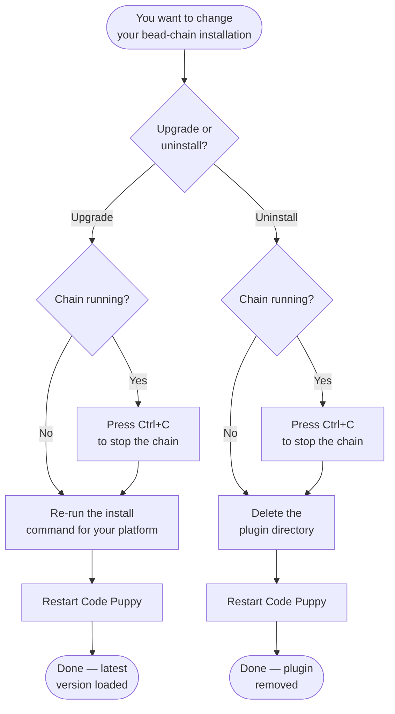

# How to Upgrade or Uninstall bead-chain

## What You'll Learn

How to keep bead-chain up to date by upgrading to the latest release, and how
to remove it completely if you no longer need it. Both operations are quick —
upgrading means re-running the same install command, and uninstalling means
deleting a single directory. You'll also learn what to watch out for on each
platform and what to do if a chain run was in progress when you made the change.

## Prerequisites

- bead-chain already installed and working (see the
  [Installation](../GettingStarted/Installation.md) guide or the install steps
  in the project README).
- Access to your terminal (macOS / Linux) or PowerShell (Windows).

## Overview

bead-chain lives in a single directory inside your Code Puppy plugins folder.
There's no package manager, no registry, no background service — just files in a
folder. That makes both upgrading and uninstalling straightforward: overwrite the
folder to upgrade, or delete it to uninstall.



## Step 1: Stop Any Active Chain

Before upgrading or uninstalling, make sure no chain run is in progress.

If `/bead-chain` is running, press **Ctrl+C** to stop it. The current task stays
in progress — it won't be lost. The next time you start a chain (after the
upgrade), [Recovery Mode](../Concepts/RecoveryMode.md) will detect the
unfinished task and resume it automatically.

**What you should see:** The chain stops and the current task remains listed as
in-progress when you check with `bd list --status=in_progress`.

> [!WARNING]
> Don't upgrade or uninstall while a chain run is active. Modifying the plugin
> files mid-run can lead to unpredictable behavior because Code Puppy has
> already loaded the plugin into memory. Always stop the chain first.

## Step 2: Upgrade (Re-Run the Install Command)

Upgrading is just installing again. The install command always pulls the latest
release and overwrites the existing files in place. You don't need to uninstall
first.

### macOS / Linux

```bash
curl -fsSL https://github.com/weegens-aaron/bead-chain/releases/latest/download/bead-chain.zip -o /tmp/bead-chain.zip && unzip -o /tmp/bead-chain.zip -d ~/.code_puppy/plugins/
```

### Windows (PowerShell)

```powershell
Invoke-WebRequest -Uri https://github.com/weegens-aaron/bead-chain/releases/latest/download/bead-chain.zip -OutFile $env:TEMP\bead-chain.zip; Expand-Archive -Force $env:TEMP\bead-chain.zip -DestinationPath ~\.code_puppy\plugins\
```

### Manual Download (Any Platform)

1. Go to the [Releases page](https://github.com/weegens-aaron/bead-chain/releases/latest).
2. Download **bead-chain.zip** from the latest release's assets.
3. Extract it so the `bead_chain/` folder replaces the existing one inside your
   plugins directory.

**What you should see:** The zip downloads and extracts without errors. The
plugin directory now contains the latest version's files.

> [!TIP]
> The install URL always points to `/releases/latest/download/bead-chain.zip` —
> a stable asset name on the latest release. You never need to edit the URL for
> new versions. Bookmark it and re-run whenever you want to update.

> [!NOTE]
> The `-o` flag (macOS / Linux) and `-Force` flag (Windows) tell the extractor
> to overwrite existing files without asking. New files are added, existing files
> are replaced, but files that were in the old version and removed in the new
> version are **not** automatically deleted. This is harmless in practice — if
> you want a perfectly clean upgrade, delete the plugin directory first (see
> Step 3) and then install fresh.

## Step 3: Uninstall (Delete the Plugin Directory)

Uninstalling bead-chain means deleting a single directory. There are no
background services to stop, no registry entries to clean up, no configuration
files scattered elsewhere. Everything lives in one place.

### macOS / Linux

```bash
rm -rf ~/.code_puppy/plugins/bead_chain
```

### Windows (PowerShell)

```powershell
Remove-Item -Recurse -Force ~\.code_puppy\plugins\bead_chain
```

**What you should see:** The directory is gone. No errors, no leftover files.

> [!CAUTION]
> This permanently deletes the plugin. If you change your mind later, you'll
> need to reinstall from scratch using the install command — no undo.

## Step 4: Restart Code Puppy

After upgrading or uninstalling, **restart Code Puppy** for the change to take
effect. Code Puppy loads plugins at startup, so it won't pick up the new version
(or notice the removal) until you restart.

**After an upgrade:** The `/bead-chain` command works as before, now running the
latest version.

**After an uninstall:** The `/bead-chain` command is no longer recognized. Your
beads database and task history are unaffected — they live in the repository, not
in the plugin directory. You can still use `bd` directly.

> [!TIP]
> If you interrupted a chain run before upgrading (Step 1), the next
> `/bead-chain` run after restarting will automatically enter
> [Recovery Mode](../Concepts/RecoveryMode.md) and pick up where you left off.
> Your in-progress task isn't lost.

## Troubleshooting

| Problem | Fix |
|---------|-----|
| `/bead-chain` still shows old behavior after upgrading | Restart Code Puppy. It loads plugins at startup — a running session won't see the new files until restarted. |
| `/bead-chain` still works after uninstalling | Same fix — restart Code Puppy. The old plugin is still loaded in the current session's memory. |
| The download fails with a network error | The download URL points to GitHub Releases. If your network blocks GitHub, download the zip manually from a machine with access and transfer it to your plugins directory. |
| Old files remain after upgrading | The install command overwrites matching files but doesn't delete files removed between versions. This is harmless. For a clean slate, delete the plugin directory first, then install fresh. |
| A task was in progress when you upgraded | [Recovery Mode](../Concepts/RecoveryMode.md) handles this automatically. Start `/bead-chain` after restarting Code Puppy — it will detect the stranded task and resume it. |
| You uninstalled but want to reinstall later | Run the install command again. No prior cleanup is needed — the plugin directory was fully removed. |

## Related Guides

- [Recovery Mode](../Concepts/RecoveryMode.md) — how interrupted tasks are
  detected and resumed after an upgrade or restart.
- [How to Resume After an Interruption](ResumeAfterInterruption.md) —
  step-by-step instructions for resuming after an interruption; relevant when
  upgrading mid-chain since Recovery Mode picks up the stranded task.
- [How Bead Chaining Works](../Concepts/HowBeadChainingWorks.md) — the
  claim→drive→judge→close loop that `/bead-chain` automates.
- [Configuration](../Reference/Configuration.md) — the `BEADS_BIN` environment
  variable and built-in defaults; these survive upgrades since they're set in
  your shell, not in the plugin directory.
- [Overview](../Overview.md) — what bead-chain is, its requirements, and key
  features.
- [Tutorial: Automate a Sprint Backlog](../Tutorials/AutomateASprintBacklog.md)
  — a full walkthrough of a chain run from start to finish.
- [Status Messages](../Reference/StatusMessages.md) — what every emoji-prefixed
  chain message means and what to do when you see it.
- [How to Handle Bugs Discovered During Work](HandleBugsDuringWork.md) — how
  filed bugs feed back into the chain across iterations.

---

[← Back to Guides](index.md) · [← Back to User Docs](../index.md)
