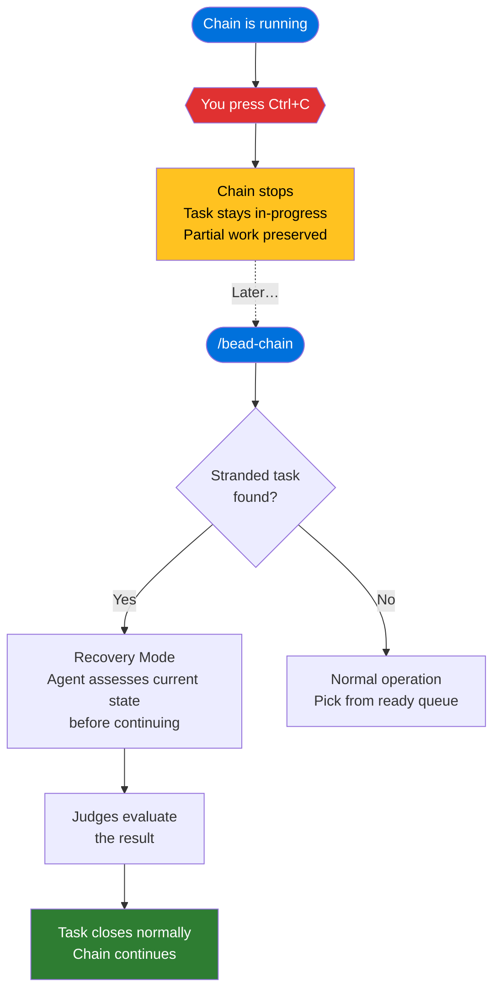

# Commands Reference

## Overview

bead-chain has exactly one command you type — `/bead-chain` — plus one keyboard
shortcut — Ctrl+C. Everything else happens automatically inside the chain.
Outside a running chain, two `bd` commands are useful for checking what the
chain did or will do next.

This page is a quick-lookup table for every command, option, and control you
interact with. For what the chain does internally once you start it, see
[How Bead Chaining Works](../Concepts/HowBeadChainingWorks.md).

---

## Starting a Chain

| What you type | What happens |
|---------------|--------------|
| `/bead-chain` | Start the chain with no limit. It claims the next ready task, hands it to the AI work loop, waits for the judges to sign off, closes it, and grabs the next one — repeating until the queue is empty. |
| `/bead-chain --max=N` | Start the chain but stop after closing **N** tasks. The chain runs the same claim→drive→judge→close cycle, but halts cleanly once the completed count reaches **N**. |

### The `--max` Option

The `--max` flag accepts a positive integer and caps how many tasks the chain
will close in a single run. It's useful when you want predictable, bounded
sessions — process a few tasks, review the results, then decide whether to
keep going.

| Syntax | Example | Meaning |
|--------|---------|---------|
| `--max=N` | `/bead-chain --max=5` | Stop after closing 5 tasks. |
| `--max N` | `/bead-chain --max 3` | Same thing — the space-separated form works too. |

**What counts toward the cap:** Only successfully closed tasks (judge-approved)
count. Recovery assessments that confirm a task is already complete count as a
close. Tasks that are skipped (blocked, excluded type) do not count.

**What happens when the cap is reached:** The chain stops cleanly — the
just-completed task is closed, the total is reported, and you're back in
control. No task is left half-done.

> [!WARNING]
> The value must be a positive integer. Zero, negative numbers, and non-numeric
> values are rejected and the chain refuses to start. You'll see a message
> like: **"--max requires a positive integer."**

---

## Stopping a Chain

| Control | What happens |
|---------|--------------|
| **Ctrl+C** | Halt the chain immediately. The current task stays marked as in-progress on purpose — it's a breadcrumb for the next run. |
| **`--max` cap reached** | The chain stops automatically once the specified number of tasks have been closed. |
| **Queue empty** | The chain stops on its own when there are no more ready tasks. |

### What Happens After Ctrl+C

When you press Ctrl+C mid-chain:

1. The chain stops — no new tasks are claimed.
2. The task the agent was working on stays **in-progress**. Any changes already
   made (code written, files modified) remain in the repository exactly as they
   were.
3. You see a bookmark message confirming the task ID and that the next run
   will resume it (see [Status Messages](StatusMessages.md) for the full
   message catalog).
4. The next time you run `/bead-chain`, the chain detects the stranded task and
   enters [Recovery Mode](../Concepts/RecoveryMode.md) — the agent assesses
   what's already been done before continuing.

> [!IMPORTANT]
> Don't manually reset a stranded task's status to open after pressing Ctrl+C.
> That erases the recovery signal and the agent won't know to check what's
> already done. Let recovery handle it naturally.

### The Ctrl+C Recovery Flow

---

## Checking the Queue

These `bd` commands aren't part of bead-chain itself, but they're the ones
you'll reach for most often when inspecting what the chain is doing or planning
to do.

| Command | What it shows | When to use it |
|---------|---------------|----------------|
| `bd ready` | The list of tasks available for the chain to pick up next, in priority order. | Before starting a chain — to preview the work. After a chain finishes — to see what's left. |
| `bd list --status=in_progress` | Any tasks currently marked as in-progress. During a chain, this is the task being worked. After a Ctrl+C, this is the stranded task that recovery will resume. | To check whether a previous run left unfinished work. To confirm the chain is working the task you expect. |

> [!TIP]
> **Predict the next pick.** The chain follows a strict
> [four-tier priority waterfall](BeadSelectionOrder.md): stranded in-progress
> tasks first, then blocking bugs, then epic siblings, then whatever `bd ready`
> shows. Check `bd list --status=in_progress` before `bd ready` to see the
> chain's actual next move.

> [!NOTE]
> These commands work whether or not a chain is running. They're standard `bd`
> commands — bead-chain just happens to be the most common reason you'd use
> them.

---

## Command Summary

| Command / Control | Purpose | Stops the chain? |
|-------------------|---------|------------------|
| `/bead-chain` | Start an unlimited chain run | — |
| `/bead-chain --max=N` | Start a capped chain run | After N closes |
| Ctrl+C | Halt immediately, preserve current task for recovery | Yes |
| `bd ready` | Preview the task queue | No (read-only) |
| `bd list --status=in_progress` | Check for in-progress or stranded tasks | No (read-only) |

---

## Tips

> [!TIP]
> **Start simple.** Your first run should be a plain `/bead-chain` with no
> flags. The defaults are sensible — it'll run until the queue is empty. Add
> `--max` later when you want bounded sessions.

> [!TIP]
> **Ctrl+C is safe.** Pressing Ctrl+C doesn't lose work. The current task
> stays in-progress and partial changes stay on disk. The next
> `/bead-chain` run recovers it automatically. Use Ctrl+C freely — it's the
> designed way to stop a chain early.

> [!TIP]
> **Use `--max=1` for a test drive.** Want to see what bead-chain does without
> committing to a long run? `/bead-chain --max=1` processes exactly one task
> and stops. Great for learning the flow or testing a new backlog.

> [!TIP]
> **`bd ready` is your preview.** Before starting a chain, run `bd ready` to
> see what's in the queue. This is the same list the chain will draw from
> (after checking for recovery and blocking bugs first — see
> [Bead Selection Order](BeadSelectionOrder.md)).

---

## See Also

- [How Bead Chaining Works](../Concepts/HowBeadChainingWorks.md) — the
  claim→drive→judge→close cycle that `/bead-chain` kicks off.
- [Recovery Mode](../Concepts/RecoveryMode.md) — how interrupted runs (Ctrl+C,
  crashes) are detected and resumed automatically.
- [The Close Guard](../Concepts/TheCloseGuard.md) — the safety rail that
  prevents AI agents from closing tasks during a chain.
- [Bead Selection Order](BeadSelectionOrder.md) — the four-tier priority
  waterfall that decides which task the chain picks next.
- [Configuration](Configuration.md) — the `BEADS_BIN` environment variable,
  timeout/retry behavior, and excluded container types.
- [Status Messages](StatusMessages.md) — what every emoji-prefixed message
  means, including the startup, cap-reached, and recovery messages you'll see
  when using these commands.
- [How to Handle Bugs Discovered During Work](../Guides/HandleBugsDuringWork.md)
  — what happens when the agent finds an unrelated bug mid-task.
- [How to Run a Capped Session](../Guides/RunACappedSession.md) — step-by-step
  guide to using `--max=N` for bounded, predictable runs.
- [Installation](../GettingStarted/Installation.md) — download and set up
  the plugin.
- [Overview](../Overview.md) — bead-chain at a glance.

---

[← Back to Reference](index.md) · [← Back to User Docs](../index.md)
