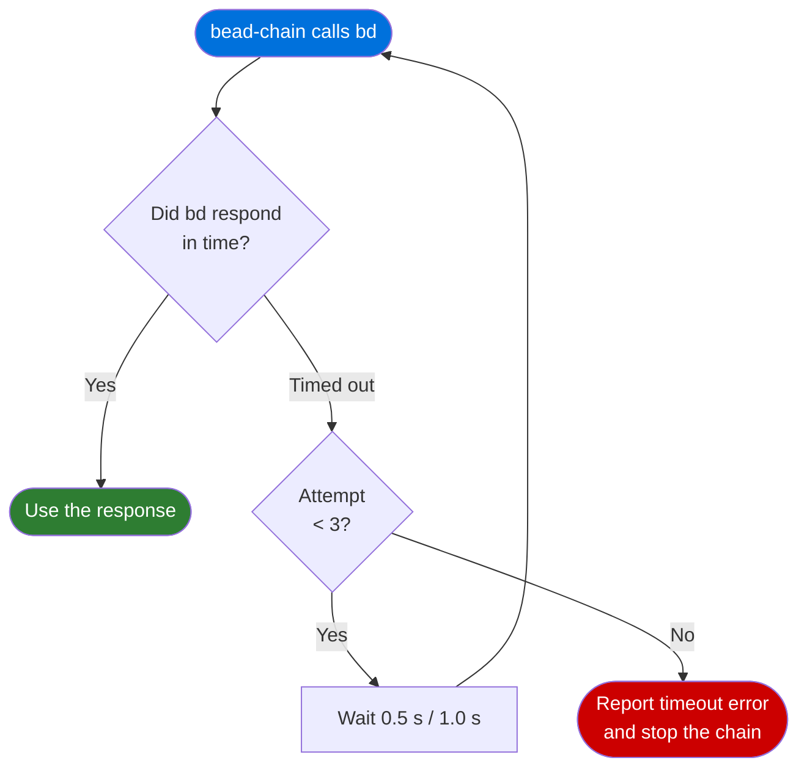

# Configuration Reference

## Overview

bead-chain ships with sensible defaults and requires zero configuration for most
setups. If `bd` is on your PATH and you have ready work in your queue,
`/bead-chain` works out of the box.

There are three areas where bead-chain's behavior is shaped by configuration or
built-in defaults: where to find the `bd` binary, how long to wait when talking
to `bd` (and what to do when it's slow), and which bead types the chain skips
over rather than trying to drive as work.

> [!NOTE]
> bead-chain has exactly **one** configurable setting — the `BEADS_BIN`
> environment variable. Everything else described here (timeouts, retries,
> excluded types) is built-in behavior you should be aware of, but it isn't
> something you change.

---

## Environment Variables

| Variable | Default | Description |
|----------|---------|-------------|
| `BEADS_BIN` | `bd` | Path to the `bd` executable. Set this if your `bd` binary isn't on your PATH or is installed under a different name. |

### When to Set `BEADS_BIN`

Most users never need to touch this. Set it when:

- **`bd` is installed in a non-standard location** — for example, a local build
  in a project directory rather than a system-wide install.
- **You have multiple `bd` versions** and want bead-chain to use a specific one.
- **Your PATH doesn't include `bd`** in the environment where Code Puppy runs
  (some shell configurations strip PATH entries for non-interactive sessions).

### How to Set It

Set the variable in whatever way your shell and environment support before
starting Code Puppy:

```bash
export BEADS_BIN=/usr/local/bin/bd
```

Or for a one-off run:

```bash
BEADS_BIN=./my-local-bd /bead-chain
```

> [!TIP]
> If you see the error message **"bead-chain can't reach `bd`"** when
> starting a chain, the most common fix is either installing `bd` or setting
> `BEADS_BIN` to the correct path.

---

## Timeout & Retry Behavior

Every time bead-chain talks to `bd` (to check the queue, claim a task, close a
task, etc.), it applies a timeout-and-retry policy to handle transient slowness
gracefully.

### Defaults

| Setting | Value | Meaning |
|---------|-------|---------|
| Timeout | 30 seconds | How long bead-chain waits for a single `bd` command to finish before considering it timed out. |
| Maximum attempts | 3 | Total number of tries — one initial attempt plus up to two retries. |
| Backoff delays | 0.5 s, then 1.0 s | How long bead-chain pauses before the first and second retry. |

### What Gets Retried

Only **timeouts** are retried. If `bd` is simply slow (database lock contention,
cold-cache startup, etc.), bead-chain waits a moment and tries again.

These are **not** retried — they fail immediately:

- **`bd` not found** — the binary doesn't exist at the expected path. This is a
  permanent problem that retrying won't fix.
- **`bd` errors** — the command ran but returned an error (e.g. "bead not
  found", "already closed"). These are real responses, not transient glitches.

### The Retry Sequence



After three consecutive timeouts on the same command, bead-chain gives up and
reports the failure. You'll see this as a chain-stopping error message — see
[Status Messages](StatusMessages.md) for the full list of error messages and
what to do about them.

> [!WARNING]
> Three consecutive timeouts usually mean `bd` itself is stuck — not just slow.
> Check that `bd` is running correctly by trying `bd ready` in your terminal
> before restarting the chain.

---

## Excluded Container Types

bead-chain only drives **leaf work items** — tasks, bugs, and other beads that
represent actual doable work. It automatically skips over container and handle
types, which exist to organise or gate other work rather than to be worked
themselves.

### Excluded Types

| Type | What it is | Why it's excluded |
|------|-----------|-------------------|
| **epic** | A container that groups related child tasks. | Driving an epic as if it were a task produces work that can never be completed — the epic's job is to hold children, not to be worked directly. |
| **milestone** | A container or handle that marks a project checkpoint. | Like an epic, a milestone is a grouping or scheduling construct, not a unit of work. |
| **gate** | A handle that blocks downstream work until a condition is met (a timer, an external check, etc.). | Gates are resolved by their conditions being satisfied, not by an AI agent doing work on them. |
| **molecule** | A swarm container that orchestrates a group of spawned sub-tasks. | The molecule is the orchestrator — the sub-tasks are the actual work. Driving the molecule itself would bypass the orchestration. |

### How Filtering Works

bead-chain applies a **two-layer filter** to make sure container types never
reach the work loop:

1. **Queue filter** — when bead-chain asks `bd` for ready work, it tells `bd` to
   leave out the excluded types. Most containers never even appear in the
   results.
2. **Safety re-check** — bead-chain double-checks every bead it's about to work,
   just in case one slipped through the queue filter (which has been observed to
   happen during version transitions). If a container is caught at this stage,
   it's refused and the chain moves on.

If bead-chain refuses a bead because of its type, you'll see a refusal message in the output — see
[Status Messages](StatusMessages.md) for details.

> [!TIP]
> You don't need to worry about accidentally queuing an epic or gate in your
> backlog. bead-chain will simply skip it and move on to the next leaf task.
> Your containers are safe.

---

## Tips

> [!TIP]
> **Zero-config is the happy path.** If `bd` is on your PATH and your queue has
> ready leaf tasks, you don't need to configure anything. Just run `/bead-chain`.

> [!TIP]
> **Timeouts are self-healing.** A single slow `bd` response won't kill your
> chain — the retry policy absorbs brief database lock contention or cold starts
> automatically. You only need to investigate if you see the "timed out on each
> of 3 attempts" error.

> [!TIP]
> **Container types are filtered, not deleted.** Excluded types like epics and
> milestones stay in your issue database exactly as they are. bead-chain just
> skips over them when looking for work. Epics still get auto-closed at the end
> of a session when all their children are done — see
> [How Bead Chaining Works](../Concepts/HowBeadChainingWorks.md).

---

## See Also

- [Commands](Commands.md) — every command and option at a glance, including the
  `/bead-chain` command that uses these configuration values.
- [Status Messages](StatusMessages.md) — what every chain message means,
  including timeout errors and excluded-type refusals.
- [Bead Selection Order](BeadSelectionOrder.md) — how the four-tier waterfall
  decides which task to pick; excluded types are filtered at every tier.
- [How Bead Chaining Works](../Concepts/HowBeadChainingWorks.md) — the
  claim→drive→judge→close loop and how epic rollup works.
- [Recovery Mode](../Concepts/RecoveryMode.md) — how interrupted runs resume
  automatically.
- [The Close Guard](../Concepts/TheCloseGuard.md) — the safety mechanism that
  prevents AI agents from closing tasks directly.
- [How to Upgrade or Uninstall bead-chain](../Guides/UpgradeOrUninstall.md) —
  upgrading preserves your `BEADS_BIN` setting since it lives in your shell,
  not in the plugin directory.
- [Installation](../GettingStarted/Installation.md) — download and set up
  the plugin; covers setting `BEADS_BIN` as a prerequisite.
- [Overview](../Overview.md) — bead-chain at a glance.
- [How to Run a Capped Session](../Guides/RunACappedSession.md) — using the
  `--max` flag to limit how many tasks process in a single run.
- [How to Resume After an Interruption](../Guides/ResumeAfterInterruption.md)
  — what to do when a run is cut short; configuration defaults (timeouts,
  retries) affect how the chain communicates with `bd` during recovery.

---

[← Back to Reference](index.md) · [← Back to User Docs](../index.md)
