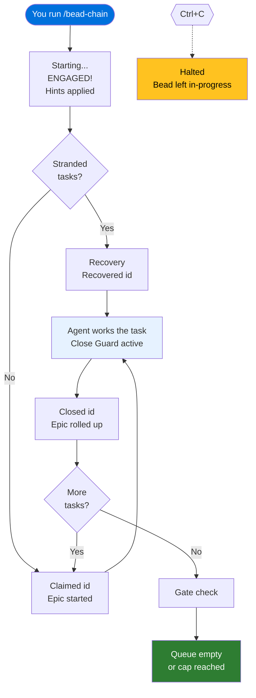

# Status Messages Reference

## Overview

While bead-chain runs, it keeps you informed with short, emoji-prefixed messages
in your terminal. Each emoji icon represents a category — chain lifecycle,
queue status, recovery, safety, epic management, or gate checks — so you can
tell at a glance what the chain is doing and whether anything needs your
attention.

Most messages are purely informational: the chain is trotting along and telling
you what it's up to. A few signal situations where the chain stopped or needs a
human look. The tables below cover every message you might see, what it means,
and what (if anything) you should do about it.

### Emoji Quick Reference

| Emoji | Category | At a glance |
|-------|----------|-------------|
| &#x1F517; | [Chain Lifecycle](#chain-lifecycle-messages-) | The chain itself — starting, engaged, closing, halting, errors |
| &#x1F9B4; | [Queue Status](#queue-status-messages-) | The task queue is empty |
| &#x1F516; | [Recovery](#recovery-messages-) | A task was left in-progress for the next run to resume |
| &#x1F6D1; | [Safety Controls](#safety-control-messages-) | The chain hit its cap or blocked a premature close |
| &#x1F6AB; | [Safety Controls](#safety-control-messages-) | The chain refused to work an invalid task type |
| &#x26A0;&#xFE0F; | [Recovery](#recovery-messages-) | Multiple stranded tasks found from a prior crash |
| &#x1F9EA; | [Execution Hints](#execution-hint-messages-) | Metadata-driven tuning applied to this task |
| &#x1F3AF; | [Epic Management](#epic-management-messages-) | Parent epic claimed, rolled up, or encountered an issue |
| &#x23F3; | [Gate Checks](#gate-check-messages-) | A gate was probed, resolved, or escalated |
| &#x1F504; | [Revert](#revert-messages-) | A task was moved back to the open queue |

---

## Chain Lifecycle Messages (&#x1F517;)

These messages track the chain's own lifecycle — from the moment you type
`/bead-chain` through each task close to the final stop.

### Startup

| Message | Meaning | What to do |
|---------|---------|------------|
| &#x1F517; bead-chain starting… | The chain received your command and is probing the queue. | Nothing — this is the immediate acknowledgement so you know the command registered. |
| &#x1F517; bead-chain is already running. | You tried to start a second chain while one is already active. | Wait for the current chain to finish, or press Ctrl+C to stop it first. |
| &#x1F517; BEAD-CHAIN ENGAGED! | The chain found work, claimed a task, and handed it to the AI work loop. The assembly line is moving. | Sit back and watch — or walk away. The chain is running. |
| First bead: *\<id\>* — *\<title\>* | Identifies the first task the chain picked up. | Informational. Confirm it's the task you expected. |
| Safety cap: stopping after *N* bead(s). | You passed `--max=N`, and the chain will stop after closing that many tasks. | Informational. The cap is set. |
| Will claim → /goal → close → repeat until `bd ready` is empty. | Confirms the chain's cycle. | Informational. |
| Press Ctrl+C to halt. | Reminds you how to stop the chain early. | Informational. |

### During the Run

| Message | Meaning | What to do |
|---------|---------|------------|
| &#x1F517; bead-chain claimed *\<id\>* — *\<title\>* | The chain picked up a new task and marked it in-progress. Normal chaining. | Informational — the chain is trotting to the next task. |
| &#x1F517; bead-chain recovered *\<id\>* — *\<title\>* | The chain found a task left over from a prior interrupted run and is resuming it with a recovery prompt. | Informational — the agent will assess what's already done before doing new work. See [Recovery Mode](../Concepts/RecoveryMode.md). |
| &#x1F517; bead-chain closed *\<id\>* (#*N* completed this run) | The judges approved the work and the task was closed. The running total is shown. | Informational — the chain is making progress. |

### Stopping

| Message | Meaning | What to do |
|---------|---------|------------|
| bead-chain: no more ready beads. Closed *N* this run. Good boy! | The queue is empty. The chain finished all available work and stopped. | Nothing — this is the happy ending. |
| &#x1F517; bead-chain halted due to *\<reason\>*. | You pressed Ctrl+C (or another cancellation happened). The chain stopped, but the current task stays in-progress for recovery. | See the &#x1F516; bookmark message that follows. The next `/bead-chain` run will resume the task. See [Recovery Mode](../Concepts/RecoveryMode.md). |

### Errors

| Message | Meaning | What to do |
|---------|---------|------------|
| &#x1F517; bead-chain can't reach \`bd\` | The `bd` command failed or isn't available. The chain can't operate without it. | Check that `bd` is installed and on your PATH. Try running `bd ready` manually to diagnose. |
| &#x1F517; bead-chain: --max requires a positive integer | You passed `--max` with an invalid value (not a number, zero, or negative). | Re-run with a valid positive integer, e.g. `/bead-chain --max=5`. |
| &#x1F517; bead-chain couldn't claim *\<id\>* | The chain tried to mark a task as in-progress but the `bd` command failed. | Check `bd` connectivity. The chain stops to avoid working unclaimed tasks. |
| &#x1F517; bead-chain couldn't close *\<id\>* | The task was worked and the judges approved, but the close command failed (database issue, permission problem, etc.). | The task stays in-progress — the next run will recover it. Investigate the error message before re-running. See [Recovery Mode](../Concepts/RecoveryMode.md). |
| &#x1F517; bead-chain stopping — \`bd ready\` failed | A mid-chain queue probe failed. Something is wrong with `bd`. | Check `bd` health. Any already-closed tasks are safe; the in-flight task stays in-progress for recovery. |

---

## Queue Status Messages (&#x1F9B4;)

| Message | Meaning | What to do |
|---------|---------|------------|
| &#x1F9B4; No ready beads — bead-chain has nothing to fetch. | You started `/bead-chain` but there are no tasks in the ready queue. | Add tasks to your queue (`bd create`) or check whether existing tasks are blocked by dependencies. |

---

## Recovery Messages (&#x1F516; / &#x26A0;&#xFE0F;)

These messages appear when the chain detects unfinished work from a prior run.
See [Recovery Mode](../Concepts/RecoveryMode.md) for the full explanation.

| Message | Meaning | What to do |
|---------|---------|------------|
| &#x1F516; Bead *\<id\>* left in\_progress — the next /bead-chain run will resume it with a recovery preamble… | A chain was interrupted (Ctrl+C, crash, etc.) and the current task was intentionally left in-progress. | Run `/bead-chain` again. The chain will find this task, load a recovery prompt, and the agent will assess what's already done before continuing. Don't manually reset the task's status. |
| Recovering stranded in\_progress bead *\<id\>* — agent will assess current state before doing new work. | The chain found a task from a prior interrupted run and is about to resume it. | Informational — recovery is happening automatically. |
| &#x26A0;&#xFE0F; bead-chain: found *N* in\_progress beads (residue from a hard crash…). Recovering *\<id\>* first… | Multiple tasks were left in-progress, likely from a hard crash that bypassed cleanup. The chain will recover them one at a time. | Informational — the chain handles this automatically. Each stranded task gets its own recovery pass before any new work begins. |

---

## Safety Control Messages (&#x1F6D1; / &#x1F6AB;)

These messages indicate that a safety mechanism activated — either the iteration
cap was reached or the Close Guard blocked a premature close attempt. See
[The Close Guard](../Concepts/TheCloseGuard.md) for how close-blocking works.

### Iteration Cap

| Message | Meaning | What to do |
|---------|---------|------------|
| &#x1F6D1; bead-chain: --max=*N* cap reached (closed *N* bead(s) this run). Stopping. Good boy! | The chain closed the number of tasks you specified with `--max` and stopped cleanly. | Nothing — this is the expected outcome of a capped run. Start another chain to keep going. |

### Close Guard

| Message | Meaning | What to do |
|---------|---------|------------|
| &#x1F6D1; bead-chain blocked \`bd close\`. | The AI agent tried to close a task directly. The command was blocked — the task is still open and the agent was reminded to let the judges decide. | Nothing — the guard handled it. The agent will continue working and the independent judges will close the task when it's ready. |
| &#x1F6D1; bead-chain blocked \`bd update --status=closed\`. | Same as above, but the agent tried to close a task by setting its status field rather than using the close command. Also blocked. | Nothing — same as above. The guard catches both forms. |

### Excluded Type Guard

| Message | Meaning | What to do |
|---------|---------|------------|
| &#x1F6AB; bead-chain refused to start with *\<id\>*: it's an excluded container type | The chain tried to work a container (like an epic), which is a grouping item — not a doable task. This shouldn't normally happen. | This indicates an internal filtering issue. The task was not started. Re-run the chain; if it recurs, report it. |
| &#x1F6AB; bead-chain refused to close *\<id\>*: it's an excluded container type | The chain was about to close a container that should never have been driven. The container was reverted to open. | Same as above — the chain stopped to prevent damage. Investigate before re-running. |
| &#x1F6AB; bead-chain refused to activate *\<id\>*: it's an excluded container type | Mid-chain, the next-task picker returned a container. The chain stopped. | Same as above. |

### Blocker Guard

| Message | Meaning | What to do |
|---------|---------|------------|
| bead-chain refused to start with *\<id\>*: it has open blocker(s) | The task can't be worked because it depends on other tasks that haven't been completed yet. | Resolve the blocking tasks first. The chain respects dependencies — it won't drive work that can't be finished. |
| bead-chain refused to activate *\<id\>*: it has open blocker(s) | Same as above, but detected mid-chain rather than at startup. | Same — resolve the blockers and re-run. |
| bead-chain refused to activate *\<id\>*: it has an unsatisfied fan-out gate | The task is waiting for a group of spawned sub-tasks to complete before it can proceed. | Wait for the sub-tasks to close. The gate will satisfy itself once they're done. |

### Pinned Task

| Message | Meaning | What to do |
|---------|---------|------------|
| bead *\<id\>* was pinned mid-flight — respecting the pin… | Someone (a human or another tool) pinned this task while the agent was working on it. The chain respects the pin: it drops the task without closing it and moves on. | Intentional. The pinned task stays pinned until you explicitly unpin it. The chain keeps trotting with the next task. |

---

## Execution Hint Messages (&#x1F9EA;)

| Message | Meaning | What to do |
|---------|---------|------------|
| &#x1F9EA; execution hints: *\<hint list\>* | The task carries metadata that tuned how the AI agent works on it (e.g. effort level, model preference). The hints were applied before the agent started. | Informational — the chain adapts its approach based on task metadata. No action needed. |

---

## Epic Management Messages (&#x1F3AF;)

These messages track parent epic operations — claiming an epic when its child
is picked up, and rolling up (auto-closing) epics when all their children are
done.

| Message | Meaning | What to do |
|---------|---------|------------|
| &#x1F3AF; bead-chain started epic *\<id\>* — *\<title\>* | The chain marked a parent epic as in-progress because one of its children was just claimed. This keeps your status views accurate at every level. | Informational — the epic status now reflects that work is happening under it. |
| &#x1F3AF; epic *\<id\>* rolled up (all children complete) — *\<title\>* | All children under this epic are now closed, so the epic was automatically closed too. | Informational — automatic cleanup. No manual close needed. |
| &#x1F3AF; bead-chain: epic rollup failed (continuing) | The end-of-session epic sweep encountered an error. The chain finished normally — only the automatic epic cleanup was affected. | Check `bd` health. You can close eligible epics manually with `bd` if needed. |
| &#x1F3AF; bead-chain: epic in-progress check failed (continuing) | The chain couldn't determine whether a parent epic was already in-progress. It continued with the child task anyway. | Informational — a cosmetic status check failed but work proceeds normally. |
| &#x1F3AF; bead-chain: couldn't start epic *\<id\>* (continuing) | The chain tried to mark a parent epic as in-progress but the claim failed. Work on the child task continues regardless. | Check `bd` health if this recurs. The child task is unaffected. |

---

## Gate Check Messages (&#x23F3;)

Gate checks happen once at the end of a chain run, when the queue appears empty.
The chain probes whether any waiting gates (timers, external checks, dependency
gates) have been satisfied since the run started.

| Message | Meaning | What to do |
|---------|---------|------------|
| &#x23F3; *N* gate(s) resolved on the empty-queue probe — re-opening their targets… | One or more gates were satisfied, releasing their gated tasks back into the ready queue. The chain will pick them up and keep going. | Informational — the chain just unlocked more work automatically. |
| &#x23F3; *N* gate(s) escalated (expired/failed) during the empty-queue probe — these need a human look. | One or more gates expired or failed. Their gated tasks remain blocked. | Investigate the escalated gates. They may represent external checks that didn't pass (failed CI runs, expired timers, etc.). |
| &#x23F3; bead-chain: gate check failed (continuing) | The gate probe itself failed (a `bd` error). The chain finishes normally — only the gate sweep was skipped. | Check `bd` health if you expected gates to resolve. |

---

## Revert Messages (&#x1F504;)

Revert messages appear when the chain moves a task back from in-progress to the
open queue. This happens when a task turns out to be blocked or is an invalid
type that shouldn't have been picked up.

| Message | Meaning | What to do |
|---------|---------|------------|
| &#x1F504; reverted *\<id\>* to open | A task was moved back to the open queue (usually because it's blocked by dependencies or is an invalid type). It will re-enter the ready queue once its blockers are resolved. | Informational — the chain is cleaning up and moving on. |
| reverted blocked *\<id\>* to open | A stranded in-progress task from a prior run turned out to have open blockers. It was sent back to the queue behind its blockers rather than being recovered. | Informational — the chain is correctly respecting dependencies. |
| also couldn't revert *\<id\>* | The chain tried to revert a task but the revert command also failed. The task may be in an inconsistent state. | Check `bd` health and the task's status manually with `bd show <id>`. |

---

## When Messages Appear — The Chain Lifecycle

The diagram below shows which message categories appear at each phase of a
chain run:

## Tips

> [!TIP]
> **Scan the emoji first.** The emoji prefix tells you the category instantly —
> you don't need to read the full message to know whether it's lifecycle
> (&#x1F517;), safety (&#x1F6D1;), or recovery (&#x1F516;).

> [!TIP]
> **Most messages need no action.** The vast majority of messages are
> informational progress updates. Only warnings that end with "Stopping chain"
> or "investigate before re-running" require your attention.

> [!TIP]
> **The &#x1F516; bookmark means "come back later."** When you see the bookmark
> emoji after a Ctrl+C, it's bead-chain telling you the task is safely parked.
> Just run `/bead-chain` again and recovery handles the rest — don't manually
> reset the task's status.

> [!WARNING]
> **Don't ignore &#x23F3; escalated gates.** Unlike most messages, escalated
> gates represent external checks that failed and won't resolve on their own.
> They need a human to investigate what went wrong (a failed CI run, an expired
> deadline, etc.).

## See Also

- [Commands](Commands.md) — every command, option, and control at a glance;
  the messages documented here are the output you see when using those commands.
- [How Bead Chaining Works](../Concepts/HowBeadChainingWorks.md) — the
  claim→drive→judge→close loop that generates these messages.
- [Recovery Mode](../Concepts/RecoveryMode.md) — deep dive into the &#x1F516;
  bookmark and &#x26A0;&#xFE0F; multi-strand recovery messages.
- [Bead Selection Order](BeadSelectionOrder.md) — the four-tier priority
  waterfall that determines which task is picked and which messages you see.
- [The Close Guard](../Concepts/TheCloseGuard.md) — how the &#x1F6D1;
  close-block messages are triggered and why.
- [Overview](../Overview.md) — bead-chain at a glance.
- [Configuration](Configuration.md) — environment variables, timeout/retry
  defaults, and excluded container types.
- [How to Run a Capped Session](../Guides/RunACappedSession.md) — the
  step-by-step guide for using `--max=N`, which produces the cap-reached
  message documented above.
- [How to Resume After an Interruption](../Guides/ResumeAfterInterruption.md)
  — step-by-step instructions for what to do when a run is cut short;
  pairs with the bookmark and multi-strand recovery messages above.
- [How to Handle Bugs Discovered During Work](../Guides/HandleBugsDuringWork.md)
  — what the agent does when it finds an unrelated bug mid-task, including how
  filed bugs and triage messages relate to the status output documented here.

---

[← Back to Reference](index.md) · [← Back to User Docs](../index.md)
