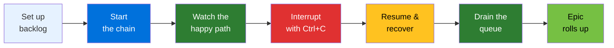
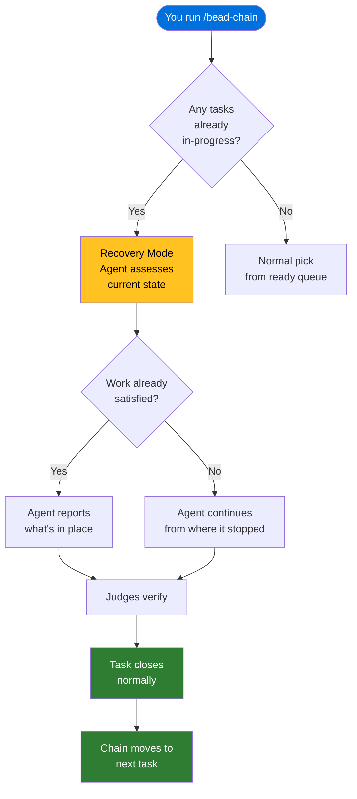

# Tutorial: Automate a Sprint Backlog

## What You'll Achieve

By the end of this tutorial you'll have set up a batch of tasks under a parent
epic, started a bead-chain run, watched the chain work through them hands-off,
interrupted a run mid-task with Ctrl+C, seen Recovery Mode resume the
interrupted work cleanly, and watched the parent epic close itself automatically
once every child task was done.

## Before You Begin

- **Code Puppy** (or wiggum) is installed with `/goal` mode available.
- **beads (`bd`)** is installed and on your PATH — confirm by running
  `bd --version`.
- **bead-chain** is installed and loaded — confirm by typing `/bead-chain` (if
  nothing is ready yet it will say so; that's fine).
- You have a repository with an initialised beads database (`bd init` has
  been run at least once).

> [!TIP]
> If you're brand new to bead-chain, start with the
> [Installation](../GettingStarted/Installation.md) and
> [Run Your First Chain](../GettingStarted/RunYourFirstChain.md) guides before
> diving into this tutorial. They'll get you from zero to a working setup in
> minutes.

## The Scenario

Imagine you're kicking off a sprint. You have five tasks — all related pieces
of work grouped under a single parent epic. Instead of babysitting each task
manually, you want bead-chain to claim them one by one, hand each to the AI
agent, let the independent judges verify the work, close the task, and move on
to the next — all while you're away from the keyboard.

Along the way you'll also:

- **Interrupt the chain mid-task** by pressing Ctrl+C, simulating a real-world
  disruption like a laptop going to sleep or a network blip.
- **Restart the chain** and see Recovery Mode detect the unfinished task and
  pick it up exactly where it left off.
- **Watch the epic roll up** at the end of the session when all five children
  are complete.

Here's the flow you'll walk through:



## Step 1: Create a Sprint Epic and Its Tasks

Open your terminal in the repository and create a parent epic to group the
sprint's work:

```
bd create --type=epic --title="Sprint 12: API Hardening"
```

You'll see a confirmation with the new epic's id — something like
`myproject-a1b`. Note that id; you'll use it as the parent for each child task.

Now create five tasks under that epic. Each one represents a concrete piece of
sprint work:

```
bd create --type=task --title="Add rate-limiting to /orders endpoint" --parent=myproject-a1b
bd create --type=task --title="Write integration tests for /orders" --parent=myproject-a1b
bd create --type=task --title="Add structured logging to payment service" --parent=myproject-a1b
bd create --type=task --title="Update API docs for rate-limit headers" --parent=myproject-a1b
bd create --type=task --title="Fix flaky timeout in checkout flow" --parent=myproject-a1b --priority=1
```

> [!NOTE]
> The fifth task is filed as priority 1 (the highest). If it blocks other tasks,
> bead-chain will promote it to the front of the queue automatically — see
> [Bead Selection Order](../Reference/BeadSelectionOrder.md) for how the
> priority waterfall works.

After creating all five, verify your backlog:

```
bd ready
```

You should see all five tasks listed as ready, each showing its id, title, and
the parent epic. The epic itself won't appear in the ready list — epics are
containers, not work items, and bead-chain never tries to "do" an epic.

## Step 2: Start the Chain

With your backlog in place, kick off the chain:

```
/bead-chain
```

You'll see a burst of startup messages:

```
bead-chain starting...
BEAD-CHAIN ENGAGED!
First bead: myproject-c2d — Fix flaky timeout in checkout flow
Will claim -> /goal -> close -> repeat until `bd ready` is empty.
Press Ctrl+C to halt.
```

Two things happened behind the scenes:

1. **The parent epic was marked in-progress.** bead-chain always sets the
   parent epic's status first so dashboards and status views stay accurate from
   the start.
2. **The first task was claimed.** bead-chain picked the highest-priority ready
   task, marked it in-progress, and handed it off to the AI agent via the
   `/goal` work loop.

> [!TIP]
> If you want to limit how many tasks the chain processes in this sitting, add
> `--max=N`. For example, `/bead-chain --max=3` stops after three tasks are
> closed, regardless of how many are left in the queue. See
> [How to Run a Capped Session](../Guides/RunACappedSession.md).

## Step 3: Watch the Happy Path

Now sit back and watch. For each task, the chain follows the same four-step
cycle:

1. **Claim** — the next task is picked and marked in-progress.
2. **Drive** — the AI agent reads the task's requirements and does the work
   (writing code, running tests, whatever the task calls for).
3. **Judge** — a panel of independent LLM judges evaluates the result against
   the task's acceptance criteria. If they identify gaps, the agent goes back
   and keeps working until the judges are satisfied.
4. **Close** — bead-chain marks the task done and reports the running tally.

After the first task completes, you'll see something like:

```
bead-chain closed myproject-c2d (#1 completed this run)
bead-chain claimed myproject-e3f — Add rate-limiting to /orders endpoint
```

The chain immediately grabbed the next task. Because the just-completed task
belonged to the same parent epic, bead-chain used **epic affinity** — it
prefers siblings under the same epic to keep related work together, producing
coherent commits and focused output.

> [!IMPORTANT]
> The agent doing the work **never** decides whether the work is done. Only the
> independent judges can make that call. This separation is enforced by
> [The Close Guard](../Concepts/TheCloseGuard.md), which blocks any attempt by
> the agent to close a task itself during a chain.

As the chain progresses, you'll see each task go through the same cycle.
Messages are emoji-prefixed so you can tell at a glance what's happening — see
the [Status Messages](../Reference/StatusMessages.md) reference for a full
breakdown.

## Step 4: Interrupt the Chain with Ctrl+C

Let's simulate a real-world interruption. While the chain is mid-task (say,
working on the third task), press **Ctrl+C**.

You'll see:

```
bead-chain halted due to cancelled.
Bead myproject-g4h left in_progress — the next /bead-chain run
  will resume it with a recovery preamble so the agent assesses
  the current state before doing new work.
```

Two things to notice:

- **The chain stopped immediately.** No more tasks will be claimed or worked
  until you start a new run.
- **The in-flight task stays in-progress on purpose.** Any partial work the
  agent already did (files changed, code written, tests added) is preserved
  exactly as-is in the repository. Nothing is rolled back or cleaned up.

> [!WARNING]
> Don't manually reset the stranded task's status to open. Doing so erases the
> recovery signal and the agent won't know to check what was already done. Let
> bead-chain's Recovery Mode handle it — that's what it's for.

You can verify the state of your backlog:

```
bd list
```

You'll see two tasks marked as closed (the ones the chain finished before you
interrupted), one marked as in-progress (the interrupted task), and two still
open and ready.

## Step 5: Resume — Recovery Mode Picks Up Where You Left Off

When you're ready to continue, start the chain again:

```
/bead-chain
```

This time, the startup sequence looks different:

```
Recovering stranded in_progress bead myproject-g4h --
  agent will assess current state before doing new work.
BEAD-CHAIN ENGAGED!
First bead: myproject-g4h — Add structured logging to payment service
Will claim -> /goal -> close -> repeat until `bd ready` is empty.
Press Ctrl+C to halt.
```

bead-chain detected the stranded in-progress task *before* looking at the ready
queue. Recovery always goes first — it's the top tier of the
[selection order](../Reference/BeadSelectionOrder.md).

The agent now receives a special recovery prompt instructing it to **assess
the current state before doing anything new**. It will:

1. Check what changes are already in the repository for this task.
2. Determine whether the work is partially done or already complete.
3. Either continue from where the previous run stopped, or — if the work is
   already finished — simply report what's in place and let the judges verify.



> [!TIP]
> Recovery is fully automatic. You don't configure it, trigger it, or tell the
> agent to do anything special. Just run `/bead-chain` and it figures out the
> rest. For a deeper dive into how this works, see
> [Recovery Mode](../Concepts/RecoveryMode.md).

Once the judges verify the recovered task, you'll see the familiar close
message:

```
bead-chain closed myproject-g4h (#1 completed this run)
```

And the chain immediately moves on to the remaining tasks.

## Step 6: Let the Chain Drain the Queue

With the recovered task closed, the chain continues through the remaining two
tasks in your sprint. Each one goes through the same claim → drive → judge →
close cycle. Because all five tasks share the same parent epic, the chain stays
inside that epic family for the entire run thanks to epic affinity.

You'll see the running tally tick up:

```
bead-chain closed myproject-j5k (#2 completed this run)
bead-chain claimed myproject-m6n — Update API docs for rate-limit headers
...
bead-chain closed myproject-m6n (#3 completed this run)
```

> [!NOTE]
> The "completed this run" counter resets with every `/bead-chain` invocation.
> Even though you closed two tasks in the first run (before interrupting), this
> second run counts from zero. The counters are per-session, not cumulative.

## Step 7: Epic Rollup — The Parent Closes Itself

Once the last child task is closed and `bd ready` comes back empty, the chain
performs a final sweep. It checks whether any parent epics now have all their
children completed — and if so, closes them automatically.

You'll see:

```
epic myproject-a1b rolled up (all children complete) — Sprint 12: API Hardening
bead-chain: no more ready beads. Closed 3 this run. Good boy!
```

Your parent epic — "Sprint 12: API Hardening" — is now closed, without you
ever having to touch it. bead-chain rolls up completed epics once at the end of
the session, after verifying the queue is truly empty.

> [!NOTE]
> Epic rollup happens **once at the end of the session**, not after every
> individual task close. This is a deliberate design choice to avoid
> accidentally closing unrelated epics through cascading side effects. The
> trade-off is that a parent epic may not close until the next session if the
> run is interrupted before the final sweep — but the data stays safe.

## Final Result

Here's what your backlog looks like now:

| Task | Status |
|------|--------|
| Fix flaky timeout in checkout flow | Closed (run 1) |
| Add rate-limiting to /orders endpoint | Closed (run 1) |
| Add structured logging to payment service | Closed (run 2, recovered) |
| Write integration tests for /orders | Closed (run 2) |
| Update API docs for rate-limit headers | Closed (run 2) |
| **Sprint 12: API Hardening** (epic) | Rolled up |

Five tasks completed and independently verified, one mid-run interruption
handled seamlessly, and a parent epic closed automatically — all from two
`/bead-chain` commands.

## What You Learned

- **How to set up a sprint backlog** with an epic and child tasks using `bd`,
  then let bead-chain work through them without manual intervention.
- **The happy-path flow** — claim → drive → judge → close, repeating
  until the queue is empty — and how epic affinity keeps related tasks together.
- **Ctrl+C is safe.** Interrupting a chain leaves partial work intact and the
  current task in-progress for recovery. Nothing is lost.
- **Recovery Mode is automatic.** The next `/bead-chain` run finds the stranded
  task, prompts the agent to assess what's already done, and continues from
  where the previous run stopped.
- **Epic rollup is hands-off.** When all children of a parent epic are complete,
  bead-chain closes the epic for you at the end of the session.

## Next Steps

- [How to Run a Capped Session](../Guides/RunACappedSession.md) — learn to use
  `--max=N` for bounded, predictable runs when you don't want to drain the
  entire queue.
- [How to Resume After an Interruption](../Guides/ResumeAfterInterruption.md)
  — step-by-step instructions for handling disruptions beyond what this
  tutorial covered.
- [How to Handle Bugs Discovered During Work](../Guides/HandleBugsDuringWork.md)
  — what to do when the agent finds an unrelated bug while working a task.
- [Bead Selection Order](../Reference/BeadSelectionOrder.md) — understand the
  full four-tier priority waterfall that decides which task is picked next.
- [How Bead Chaining Works](../Concepts/HowBeadChainingWorks.md) — a deeper
  look at the engine that powers everything you just saw.
- [Recovery Mode](../Concepts/RecoveryMode.md) — the full explanation of how
  interrupted work is detected, assessed, and resumed.
- [The Close Guard](../Concepts/TheCloseGuard.md) — how bead-chain enforces the
  separation between the agent doing the work and the judges approving it.
- [Configuration](../Reference/Configuration.md) — environment variables and
  defaults that shape bead-chain's behavior.
- [Status Messages](../Reference/StatusMessages.md) — what every emoji-prefixed
  message means and what to do when you see it.

---

[← Back to Tutorials](index.md) · [← Back to User Docs](../index.md)
